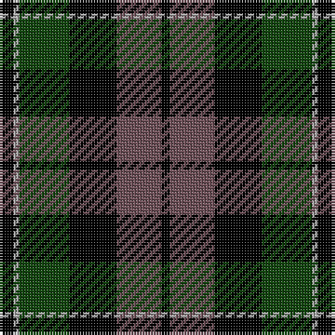

In pattern [KBKGYK](/stripes/kbkgyk/).

This was sourced from weddslist.  It is a [6 stripe tartan](/stripes/stripes6/).

Original link http://www.weddslist.com/cgi-bin/tartans/pg.pl?source=x

## Register references

External register numbers recorded for this tartan.

- Scottish Register of Tartans: [1166](https://www.tartanregister.gov.uk/tartanDetails.aspx?ref=1166)
- Scottish Register of Tartans: [1758](https://www.tartanregister.gov.uk/tartanDetails.aspx?ref=1758)
- Scottish Register of Tartans: [2307](https://www.tartanregister.gov.uk/tartanDetails.aspx?ref=2307)
- Scottish Register of Tartans: [2540](https://www.tartanregister.gov.uk/tartanDetails.aspx?ref=2540)
- Scottish Register of Tartans: [2625](https://www.tartanregister.gov.uk/tartanDetails.aspx?ref=2625)
- Scottish Register of Tartans: [2862](https://www.tartanregister.gov.uk/tartanDetails.aspx?ref=2862)
- Scottish Register of Tartans: [982](https://www.tartanregister.gov.uk/tartanDetails.aspx?ref=982)
- Scottish Tartans Authority (ITI): 1429
- Scottish Tartans Authority (ITI): 218
- Scottish Tartans World Register: 1042
- Scottish Tartans World Register: 127
- Scottish Tartans World Register: 1429
- Scottish Tartans World Register: 218
- Scottish Tartans World Register: 2218
- Scottish Tartans World Register: 737
- Scottish Tartans World Register: 897

## Thread count
K/5 Na2 DG18 K17 N16 K/3

## Palette
Each colour and its ΔE from the base-6 reference it is a variant of.

| Colour | Shade | Base | ΔE (OKLab) |
|---|---|---|---|
| DG | <code style="background-color:#11450D;">#11450D</code> `#11450D` | G <code style="background-color:#006100;">#006100</code> | 0.09 |
| K | <code style="background-color:#000000;">#000000</code> `#000000` | K <code style="background-color:#000000;">#000000</code> | 0.00 |
| N | <code style="background-color:#6E5058;">#6E5058</code> `#6E5058` | B <code style="background-color:#2A418A;">#2A418A</code> | 0.15 |
| Na | <code style="background-color:#AAAAAA;">#AAAAAA</code> `#AAAAAA` | Y <code style="background-color:#F2BF00;">#F2BF00</code> | 0.19 |

# Sample pattern

## Nearest tartans

The nearest existing variants by ΔTartan distance.

1. [Melville](/setts/s6/k5lr2dg18k17n16k3~x2/) — ΔT 0.00
1. [Graham W](/setts/s6/dg21lr2dg4k17n14k3~x2/) — ΔT 0.52
1. [Graham W](/setts/s6/dg21lr2dg4k17n14k3/) — ΔT 0.52
1. [Graham W](/setts/s6/dg21lb2dg4k17dp14k3/) — ΔT 0.61
1. [Melville](/setts/s6/k5lb2dg18k17dp16k3/) — ΔT 0.73
1. [Scottish Airports](/setts/s6/dt4g18dt3k17dt18dp4~x2/) — ΔT 0.89
1. [MacCallum](/setts/s7/dg8k2lb1dg4k6db6k1~x2/) — ΔT 0.90
1. [Wilson's, No 150 "Coburg"](/setts/s6/g18t2g4k14p12k3~x2/) — ΔT 0.97
1. [Fletcher](/setts/s7/db6k1db6k8r1g8k2~x2/) — ΔT 0.99
1. [Mowat](/setts/s7/db48k6db10k46ly4k22g43/) — ΔT 1.01

## Neighbour map

Every grey dot is one of 14299 variants placed by the first two principal components of the ΔTartan feature space (44% of its variance). Red is this tartan; blue dots are its nearest — click one to open its page.

<svg viewBox="0 0 640 380" role="img" style="max-width:100%;height:auto;border:1px solid #e0e0e0;border-radius:4px;display:block" xmlns="http://www.w3.org/2000/svg"><image href="/nn/cloud.v1.png" width="640" height="380"/><a href="/setts/s6/k5lr2dg18k17n16k3~x2/"><circle cx="195.4" cy="234.6" r="4" fill="#3465a4"><title>Melville</title></circle></a><a href="/setts/s6/dg21lr2dg4k17n14k3~x2/"><circle cx="212.0" cy="226.9" r="4" fill="#3465a4"><title>Graham W</title></circle></a><a href="/setts/s6/dg21lr2dg4k17n14k3/"><circle cx="212.0" cy="226.9" r="4" fill="#3465a4"><title>Graham W</title></circle></a><a href="/setts/s6/dg21lb2dg4k17dp14k3/"><circle cx="200.8" cy="222.2" r="4" fill="#3465a4"><title>Graham W</title></circle></a><a href="/setts/s6/k5lb2dg18k17dp16k3/"><circle cx="187.5" cy="231.6" r="4" fill="#3465a4"><title>Melville</title></circle></a><a href="/setts/s6/dt4g18dt3k17dt18dp4~x2/"><circle cx="162.3" cy="252.7" r="4" fill="#3465a4"><title>Scottish Airports</title></circle></a><a href="/setts/s7/dg8k2lb1dg4k6db6k1~x2/"><circle cx="194.4" cy="245.0" r="4" fill="#3465a4"><title>MacCallum</title></circle></a><a href="/setts/s6/g18t2g4k14p12k3~x2/"><circle cx="177.0" cy="220.1" r="4" fill="#3465a4"><title>Wilson's, No 150 &quot;Coburg&quot;</title></circle></a><a href="/setts/s7/db6k1db6k8r1g8k2~x2/"><circle cx="158.3" cy="232.2" r="4" fill="#3465a4"><title>Fletcher</title></circle></a><a href="/setts/s7/db48k6db10k46ly4k22g43/"><circle cx="192.7" cy="210.3" r="4" fill="#3465a4"><title>Mowat</title></circle></a><circle cx="195.4" cy="234.6" r="5" fill="#c00000"/></svg>

ID: /setts/s6/k5lr2dg18k17n16k3/
