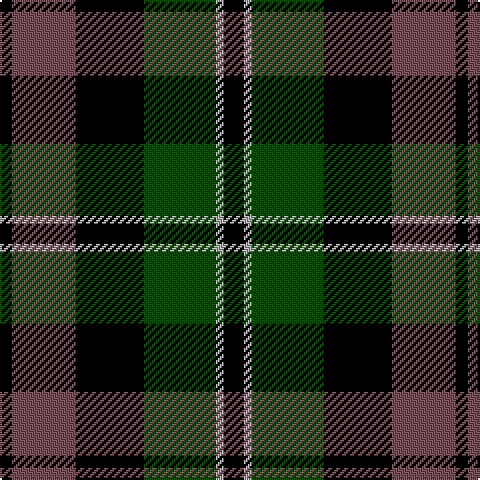

This page is one **sett** — a single exact thread-count. It belongs to the [tartan](/tartans/k5lr2dg18k17n16k3/)
(the same proportion at any scale), whose colour order is pattern [KBKGYK](/stripes/kbkgyk/).

Sourced from weddslist.  It is a [6 stripe tartan](/stripes/stripes6/).

Original link http://www.weddslist.com/cgi-bin/tartans/pg.pl?source=tinsel

## Thread count
K/10 Na4 DG36 K34 N32 K/6

## Palette

Palette: <strong>Ingles Buchan</strong> <small style="color:#888">(1 of 4 colours)</small>
<table><thead><tr><th>Colour</th><th>Threads</th><th>Shade</th><th>Base</th><th>OKLCh</th></tr></thead><tbody><tr><td>K/</td><td style="text-align:right;font-variant-numeric:tabular-nums">10</td><td><code style="background-color:#000000;">#000000</code> <small style="color:#888">#000000</small></td><td>K <code style="background-color:#000000;">#000000</code></td><td><small style="color:#888">oklch(0.0% 0.000 0.0)</small></td></tr><tr><td>Na</td><td style="text-align:right;font-variant-numeric:tabular-nums">4</td><td><code style="background-color:#AAAAAA;">#AAAAAA</code> <small style="color:#888">#AAAAAA</small></td><td>Y <code style="background-color:#F2BF00;">#F2BF00</code></td><td><small style="color:#888">oklch(73.8% 0.000 89.9)</small></td></tr><tr><td>DG</td><td style="text-align:right;font-variant-numeric:tabular-nums">36</td><td><code style="background-color:#11450D;">#11450D</code> <small style="color:#888">#11450D</small></td><td>G <code style="background-color:#006100;">#006100</code></td><td><small style="color:#888">oklch(34.4% 0.101 142.1)</small></td></tr><tr><td>K</td><td style="text-align:right;font-variant-numeric:tabular-nums">34</td><td><code style="background-color:#000000;">#000000</code> <small style="color:#888">#000000</small></td><td>K <code style="background-color:#000000;">#000000</code></td><td><small style="color:#888">oklch(0.0% 0.000 0.0)</small></td></tr><tr><td>N</td><td style="text-align:right;font-variant-numeric:tabular-nums">32</td><td><code style="background-color:#6E5058;">#6E5058</code> <small style="color:#888">#6E5058</small></td><td>B <code style="background-color:#2A418A;">#2A418A</code></td><td><small style="color:#888">oklch(46.6% 0.042 1.2)</small></td></tr><tr><td>K/</td><td style="text-align:right;font-variant-numeric:tabular-nums">6</td><td><code style="background-color:#000000;">#000000</code> <small style="color:#888">#000000</small></td><td>K <code style="background-color:#000000;">#000000</code></td><td><small style="color:#888">oklch(0.0% 0.000 0.0)</small></td></tr></tbody></table>

# Sample pattern

## Nearest tartans

The nearest existing variants by ΔTartan distance, with this tartan at the top so the swatches line up against it.

ΔTartan

Tartan

Sett

—

<a href="/ttd/edit/#slug=k5lr2dg18k17n16k3~x2">Melville</a> <a class="nn-out" href="/setts/s6/k5lr2dg18k17n16k3~x2/" title="open its dictionary page">↗</a>

0.00

<a href="/ttd/edit/#slug=k5lr2dg18k17n16k3">Melville</a> <a class="nn-out" href="/setts/s6/k5lr2dg18k17n16k3/" title="open its dictionary page">↗</a>

0.52

<a href="/ttd/edit/#slug=dg21lr2dg4k17n14k3~x2">Graham W</a> <a class="nn-out" href="/setts/s6/dg21lr2dg4k17n14k3~x2/" title="open its dictionary page">↗</a>

0.52

<a href="/ttd/edit/#slug=dg21lr2dg4k17n14k3">Graham W</a> <a class="nn-out" href="/setts/s6/dg21lr2dg4k17n14k3/" title="open its dictionary page">↗</a>

0.61

<a href="/ttd/edit/#slug=dg21lb2dg4k17dp14k3">Graham W</a> <a class="nn-out" href="/setts/s6/dg21lb2dg4k17dp14k3/" title="open its dictionary page">↗</a>

0.73

<a href="/ttd/edit/#slug=k5lb2dg18k17dp16k3">Melville</a> <a class="nn-out" href="/setts/s6/k5lb2dg18k17dp16k3/" title="open its dictionary page">↗</a>

0.89

<a href="/ttd/edit/#slug=dt4g18dt3k17dt18dp4~x2">Scottish Airports</a> <a class="nn-out" href="/setts/s6/dt4g18dt3k17dt18dp4~x2/" title="open its dictionary page">↗</a>

0.90

<a href="/ttd/edit/#slug=dg8k2lb1dg4k6db6k1~x2">MacCallum</a> <a class="nn-out" href="/setts/s7/dg8k2lb1dg4k6db6k1~x2/" title="open its dictionary page">↗</a>

0.97

<a href="/ttd/edit/#slug=g18t2g4k14p12k3~x2">Wilson's, No 150 &quot;Coburg&quot;</a> <a class="nn-out" href="/setts/s6/g18t2g4k14p12k3~x2/" title="open its dictionary page">↗</a>

0.99

<a href="/ttd/edit/#slug=db6k1db6k8r1g8k2~x2">Fletcher</a> <a class="nn-out" href="/setts/s7/db6k1db6k8r1g8k2~x2/" title="open its dictionary page">↗</a>

1.01

<a href="/ttd/edit/#slug=db48k6db10k46ly4k22g43">Mowat</a> <a class="nn-out" href="/setts/s7/db48k6db10k46ly4k22g43/" title="open its dictionary page">↗</a>

## Neighbour map

Every grey dot is one of 14299 variants placed by the first two principal components of the ΔTartan feature space (44% of its variance). Red is this tartan; blue dots are its nearest — click one to open its page.

<svg viewBox="0 0 640 380" role="img" style="max-width:100%;height:auto;border:1px solid #e0e0e0;border-radius:4px;display:block" xmlns="http://www.w3.org/2000/svg"><image href="/nn/cloud.v1.png" width="640" height="380"/><a href="/setts/s6/k5lr2dg18k17n16k3/"><circle cx="195.4" cy="234.6" r="4" fill="#3465a4"><title>Melville</title></circle></a><a href="/setts/s6/dg21lr2dg4k17n14k3~x2/"><circle cx="212.0" cy="226.9" r="4" fill="#3465a4"><title>Graham W</title></circle></a><a href="/setts/s6/dg21lr2dg4k17n14k3/"><circle cx="212.0" cy="226.9" r="4" fill="#3465a4"><title>Graham W</title></circle></a><a href="/setts/s6/dg21lb2dg4k17dp14k3/"><circle cx="200.8" cy="222.2" r="4" fill="#3465a4"><title>Graham W</title></circle></a><a href="/setts/s6/k5lb2dg18k17dp16k3/"><circle cx="187.5" cy="231.6" r="4" fill="#3465a4"><title>Melville</title></circle></a><a href="/setts/s6/dt4g18dt3k17dt18dp4~x2/"><circle cx="162.3" cy="252.7" r="4" fill="#3465a4"><title>Scottish Airports</title></circle></a><a href="/setts/s7/dg8k2lb1dg4k6db6k1~x2/"><circle cx="194.4" cy="245.0" r="4" fill="#3465a4"><title>MacCallum</title></circle></a><a href="/setts/s6/g18t2g4k14p12k3~x2/"><circle cx="177.0" cy="220.1" r="4" fill="#3465a4"><title>Wilson's, No 150 &quot;Coburg&quot;</title></circle></a><a href="/setts/s7/db6k1db6k8r1g8k2~x2/"><circle cx="158.3" cy="232.2" r="4" fill="#3465a4"><title>Fletcher</title></circle></a><a href="/setts/s7/db48k6db10k46ly4k22g43/"><circle cx="192.7" cy="210.3" r="4" fill="#3465a4"><title>Mowat</title></circle></a><circle cx="195.4" cy="234.6" r="5" fill="#c00000"/></svg>

ID: /setts/s6/k5lr2dg18k17n16k3~x2/
