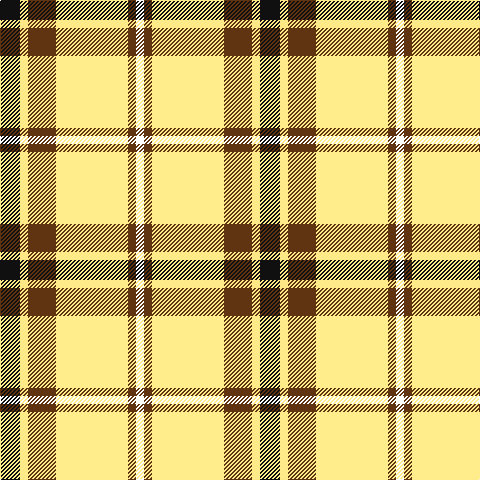

**Bands:** [KYGYGW](/stripes/kygygw/) · **Stripes:** [K LY DY LY DY W](/stripes/stripes6/) K LY DY LY DY W

This was sourced from register-of-tartans.  It is a [6 band tartan](/bands/bands6/).

Original link https://www.tartanregister.gov.uk/tartanDetails.aspx?ref=10160

## Attestations

This cloth appears in 2 source records; the oldest owns this page.

- 04/02/2010 — Shepherd, Derek (Piping) (register-of-tartans, [record](https://www.tartanregister.gov.uk/tartanDetails.aspx?ref=10160))
- 4th Feb. 2010 — Shepherd Piping (Personal) (tartans-authority, [record](http://www.tartansauthority.com/tartan-ferret/display/10160/))

## Register references

External register numbers recorded for this tartan.

- Scottish Register of Tartans: [10160](https://www.tartanregister.gov.uk/tartanDetails.aspx?ref=10160)

## Thread count
K/20 LYa8 T28 LY72 T8 W/8

## Palette
Each colour and its ΔE from the base-6 reference it is a variant of.

| Colour | Shade | Base | ΔE (OKLab) |
|---|---|---|---|
| K | <code style="background-color:#101010;">#101010</code> `#101010` | K <code style="background-color:#000000;">#000000</code> | 0.17 |
| LY | <code style="background-color:#FFEC8B;">#FFEC8B</code> `#FFEC8B` | Y <code style="background-color:#F2BF00;">#F2BF00</code> | 0.12 |
| LYa | <code style="background-color:#FEE885;">#FEE885</code> `#FEE885` | Y <code style="background-color:#F2BF00;">#F2BF00</code> | 0.11 |
| T | <code style="background-color:#603311;">#603311</code> `#603311` | G <code style="background-color:#006100;">#006100</code> | 0.17 |
| W | <code style="background-color:#FFFFFF;">#FFFFFF</code> `#FFFFFF` | W <code style="background-color:#F7F7F7;">#F7F7F7</code> | 0.02 |

# Sample pattern

## Nearest tartans

The nearest existing variants by ΔTartan distance.

1. [Fraser Yellow](/setts/s7/ly2db14ly2dg14ly27w2r2~x2/) — ΔT 1.21
1. [Fraser, Yellow](/setts/s7/ly2db14ly2g14ly27w2r2~x2/) — ΔT 1.27
1. [MacKintosh Dress (Dance)](/setts/s6/g3r9dg18dp8w33r3~x2/) — ΔT 1.42
1. [MacDuck (Corporate)](/setts/s6/k4r5k2ly21g8k2~x2/) — ΔT 1.43
1. [Cornish Christophers (Personal)](/setts/s8/g5lg5ly26k4ly6r5k15w4~x2/) — ΔT 1.52
1. [Orange Fanaticos](/setts/s7/lb12lo75k22w12k22w16lb8/) — ΔT 1.58
1. [Fraser Yellow #2](/setts/s6/ly1db3ly1dg3ly8w1~x4/) — ΔT 1.58
1. [Burberry Counterfeit](/setts/s5/o3w3k3lo10r1~x6/) — ΔT 1.59
1. [Barbour - Ancient](/setts/s7/w4k2w18k11db2y18ly2~x2/) — ΔT 1.63
1. [Reekie, Charlene (Personal)](/setts/s6/w43k5r3g5ly27dp5~x2/) — ΔT 1.63

## Neighbour map

Every grey dot is one of 14313 variants placed by the first two principal components of the ΔTartan feature space (44% of its variance). Red is this tartan; blue dots are its nearest — click one to open its page.

<svg viewBox="0 0 640 380" role="img" style="max-width:100%;height:auto;border:1px solid #e0e0e0;border-radius:4px;display:block" xmlns="http://www.w3.org/2000/svg"><image href="/nn/cloud.v1.png" width="640" height="380"/><a href="/setts/s7/ly2db14ly2dg14ly27w2r2~x2/"><circle cx="224.4" cy="142.2" r="4" fill="#3465a4"><title>Fraser Yellow</title></circle></a><a href="/setts/s7/ly2db14ly2g14ly27w2r2~x2/"><circle cx="229.2" cy="143.6" r="4" fill="#3465a4"><title>Fraser, Yellow</title></circle></a><a href="/setts/s6/g3r9dg18dp8w33r3~x2/"><circle cx="176.5" cy="158.1" r="4" fill="#3465a4"><title>MacKintosh Dress (Dance)</title></circle></a><a href="/setts/s6/k4r5k2ly21g8k2~x2/"><circle cx="228.3" cy="172.1" r="4" fill="#3465a4"><title>MacDuck (Corporate)</title></circle></a><a href="/setts/s8/g5lg5ly26k4ly6r5k15w4~x2/"><circle cx="129.2" cy="151.0" r="4" fill="#3465a4"><title>Cornish Christophers (Personal)</title></circle></a><a href="/setts/s7/lb12lo75k22w12k22w16lb8/"><circle cx="189.3" cy="160.9" r="4" fill="#3465a4"><title>Orange Fanaticos</title></circle></a><a href="/setts/s6/ly1db3ly1dg3ly8w1~x4/"><circle cx="272.7" cy="191.9" r="4" fill="#3465a4"><title>Fraser Yellow #2</title></circle></a><a href="/setts/s5/o3w3k3lo10r1~x6/"><circle cx="212.9" cy="186.3" r="4" fill="#3465a4"><title>Burberry Counterfeit</title></circle></a><a href="/setts/s7/w4k2w18k11db2y18ly2~x2/"><circle cx="130.6" cy="158.5" r="4" fill="#3465a4"><title>Barbour - Ancient</title></circle></a><a href="/setts/s6/w43k5r3g5ly27dp5~x2/"><circle cx="215.2" cy="119.1" r="4" fill="#3465a4"><title>Reekie, Charlene (Personal)</title></circle></a><circle cx="193.0" cy="150.9" r="5" fill="#c00000"/></svg>

ID: /setts/s6/k5ly2dy7ly18dy2w2~x4/
