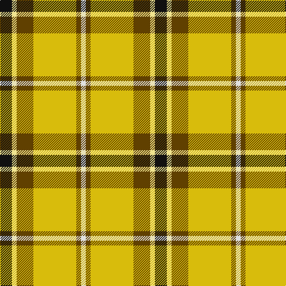

This page is one **sett** — a single exact thread-count. It belongs to the [tartan](/tartans/k5lyi2dy7ly18dy2w2/)
(the same proportion at any scale), whose colour order is pattern [KYGYGW](/stripes/kygygw/).

Sourced from tartans-authority.  It is a [6 stripe tartan](/stripes/stripes6/).

Original link http://www.tartansauthority.com/tartan-ferret/display/10160/

## Register references

External register numbers recorded for this tartan.

- Scottish Register of Tartans: [10160](https://www.tartanregister.gov.uk/tartanDetails?ref=10160)
- Scottish Tartans Authority (ITI): 10160

## Thread count
K/20 LY8 T28 Y72 T8 LN/8

## Palette

Palette: <strong>Tartan Register</strong> <small style="color:#888">(3 of 5 colours)</small>
<table><thead><tr><th>Colour</th><th>Threads</th><th>Shade</th><th>Base</th><th>OKLCh</th></tr></thead><tbody><tr><td>K/</td><td style="text-align:right;font-variant-numeric:tabular-nums">20</td><td><code style="background-color:#101010;">#101010</code> <small style="color:#888">#101010</small></td><td>K <code style="background-color:#000000;">#000000</code></td><td><small style="color:#888">oklch(17.3% 0.000 89.9)</small></td></tr><tr><td>LY</td><td style="text-align:right;font-variant-numeric:tabular-nums">8</td><td><code style="background-color:#F0E490;">#F0E490</code> <small style="color:#888">#F0E490</small></td><td>Y <code style="background-color:#F2BF00;">#F2BF00</code></td><td><small style="color:#888">oklch(91.0% 0.106 101.2)</small></td></tr><tr><td>T</td><td style="text-align:right;font-variant-numeric:tabular-nums">28</td><td><code style="background-color:#604000;">#604000</code> <small style="color:#888">#604000</small></td><td>G <code style="background-color:#006100;">#006100</code></td><td><small style="color:#888">oklch(39.8% 0.083 76.8)</small></td></tr><tr><td>Y</td><td style="text-align:right;font-variant-numeric:tabular-nums">72</td><td><code style="background-color:#D8BC0C;">#D8BC0C</code> <small style="color:#888">#D8BC0C</small></td><td>Y <code style="background-color:#F2BF00;">#F2BF00</code></td><td><small style="color:#888">oklch(79.5% 0.163 98.2)</small></td></tr><tr><td>T</td><td style="text-align:right;font-variant-numeric:tabular-nums">8</td><td><code style="background-color:#604000;">#604000</code> <small style="color:#888">#604000</small></td><td>G <code style="background-color:#006100;">#006100</code></td><td><small style="color:#888">oklch(39.8% 0.083 76.8)</small></td></tr><tr><td>LN/</td><td style="text-align:right;font-variant-numeric:tabular-nums">8</td><td><code style="background-color:#E0E0E0;">#E0E0E0</code> <small style="color:#888">#E0E0E0</small></td><td>W <code style="background-color:#F7F7F7;">#F7F7F7</code></td><td><small style="color:#888">oklch(90.7% 0.000 89.9)</small></td></tr></tbody></table>

# Sample pattern

## Nearest tartans

The nearest existing variants by ΔTartan distance, with this tartan at the top so the swatches line up against it.

ΔTartan

Tartan

Sett

—

<a href="/ttd/edit/#slug=k5lyi2dy7ly18dy2w2~x4">Shepherd Piping (Personal)</a> <a class="nn-out" href="/setts/s6/k5lyi2dy7ly18dy2w2~x4/" title="open its dictionary page">↗</a>

0.93

<a href="/ttd/edit/#slug=k5ly2dy7lyi18dy2w2~x4">Shepherd, Derek (Piping)</a> <a class="nn-out" href="/setts/s6/k5ly2dy7lyi18dy2w2~x4/" title="open its dictionary page">↗</a>

0.93

<a href="/ttd/edit/#slug=k4r5k2ly21g8k2~x2">MacDuck (Corporate)</a> <a class="nn-out" href="/setts/s6/k4r5k2ly21g8k2~x2/" title="open its dictionary page">↗</a>

1.01

<a href="/ttd/edit/#slug=r2w2ly27g14ly2db14ly2~x2">Fraser, Yellow</a> <a class="nn-out" href="/setts/s7/r2w2ly27g14ly2db14ly2~x2/" title="open its dictionary page">↗</a>

1.05

<a href="/ttd/edit/#slug=r2w2ly27dg14ly2db14ly2~x2">Fraser Yellow</a> <a class="nn-out" href="/setts/s7/r2w2ly27dg14ly2db14ly2~x2/" title="open its dictionary page">↗</a>

1.26

<a href="/ttd/edit/#slug=k4r5k2lo21g8k2~x2">MacDuck #2</a> <a class="nn-out" href="/setts/s6/k4r5k2lo21g8k2~x2/" title="open its dictionary page">↗</a>

1.34

<a href="/ttd/edit/#slug=k2ly30g4w2g14r13ly2~x2">Red Rum Commemorative Tartan Tartan Number: 1217. Earliest known date: 1982 Red Remony See products available Copyright © Blair Urquhart, Comrie, 2015</a> <a class="nn-out" href="/setts/s7/k2ly30g4w2g14r13ly2~x2/" title="open its dictionary page">↗</a>

1.36

<a href="/ttd/edit/#slug=do4g25lo10g3lo18r4~x2">Unidentfied (Ligioner Highland Games</a> <a class="nn-out" href="/setts/s6/do4g25lo10g3lo18r4~x2/" title="open its dictionary page">↗</a>

1.40

<a href="/ttd/edit/#slug=g5lg5ly26k4ly6r5k15w4~x2">Cornish Christophers (Personal)</a> <a class="nn-out" href="/setts/s8/g5lg5ly26k4ly6r5k15w4~x2/" title="open its dictionary page">↗</a>

1.48

<a href="/ttd/edit/#slug=dg1dy7dg7o2dy1ly15w1~x4">Regalia</a> <a class="nn-out" href="/setts/s7/dg1dy7dg7o2dy1ly15w1~x4/" title="open its dictionary page">↗</a>

1.48

<a href="/ttd/edit/#slug=o3w3k3lo10r1~x6">Burberry Counterfeit</a> <a class="nn-out" href="/setts/s5/o3w3k3lo10r1~x6/" title="open its dictionary page">↗</a>

## Neighbour map

Every grey dot is one of 14359 variants placed by the first two principal components of the ΔTartan feature space (44% of its variance). Red is this tartan; blue dots are its nearest — click one to open its page.

<svg viewBox="0 0 640 380" role="img" style="max-width:100%;height:auto;border:1px solid #e0e0e0;border-radius:4px;display:block" xmlns="http://www.w3.org/2000/svg"><image href="/nn/cloud.v1.png" width="640" height="380"/><a href="/setts/s6/k5ly2dy7lyi18dy2w2~x4/"><circle cx="191.4" cy="151.5" r="4" fill="#3465a4"><title>Shepherd, Derek (Piping)</title></circle></a><a href="/setts/s6/k4r5k2ly21g8k2~x2/"><circle cx="226.9" cy="172.7" r="4" fill="#3465a4"><title>MacDuck (Corporate)</title></circle></a><a href="/setts/s7/r2w2ly27g14ly2db14ly2~x2/"><circle cx="227.8" cy="144.0" r="4" fill="#3465a4"><title>Fraser, Yellow</title></circle></a><a href="/setts/s7/r2w2ly27dg14ly2db14ly2~x2/"><circle cx="223.1" cy="142.7" r="4" fill="#3465a4"><title>Fraser Yellow</title></circle></a><a href="/setts/s6/k4r5k2lo21g8k2~x2/"><circle cx="246.2" cy="182.3" r="4" fill="#3465a4"><title>MacDuck #2</title></circle></a><a href="/setts/s7/k2ly30g4w2g14r13ly2~x2/"><circle cx="193.8" cy="122.5" r="4" fill="#3465a4"><title>Red Rum Commemorative Tartan Tartan Number: 1217. Earliest known date: 1982 Red Remony See products available Copyright © Blair Urquhart, Comrie, 2015</title></circle></a><a href="/setts/s6/do4g25lo10g3lo18r4~x2/"><circle cx="221.5" cy="206.1" r="4" fill="#3465a4"><title>Unidentfied (Ligioner Highland Games</title></circle></a><a href="/setts/s8/g5lg5ly26k4ly6r5k15w4~x2/"><circle cx="128.1" cy="151.9" r="4" fill="#3465a4"><title>Cornish Christophers (Personal)</title></circle></a><a href="/setts/s7/dg1dy7dg7o2dy1ly15w1~x4/"><circle cx="210.4" cy="145.1" r="4" fill="#3465a4"><title>Regalia</title></circle></a><a href="/setts/s5/o3w3k3lo10r1~x6/"><circle cx="211.7" cy="187.1" r="4" fill="#3465a4"><title>Burberry Counterfeit</title></circle></a><circle cx="207.0" cy="162.8" r="5" fill="#c00000"/></svg>

ID: /setts/s6/k5lyi2dy7ly18dy2w2~x4/
