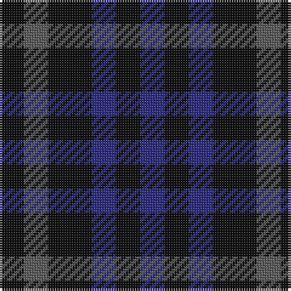

In pattern [BKBKBK](/stripes/bkbkbk/).

This was sourced from tartans-authority.  It is a [6 stripe tartan](/stripes/stripes6/).

Original link http://www.tartansauthority.com/tartan-ferret/display/10047/

## Thread count
K/10 N10 K18 DB10 K10 DB/10

## Palette
Each colour and its ΔE from the base-6 reference it is a variant of.

| Colour | Shade | Base | ΔE (OKLab) |
|---|---|---|---|
| DB | <code style="background-color:#2C2C80;">#2C2C80</code> `#2C2C80` | B <code style="background-color:#2A418A;">#2A418A</code> | 0.06 |
| K | <code style="background-color:#101010;">#101010</code> `#101010` | K <code style="background-color:#000000;">#000000</code> | 0.17 |
| N | <code style="background-color:#5C5C5C;">#5C5C5C</code> `#5C5C5C` | B <code style="background-color:#2A418A;">#2A418A</code> | 0.15 |

# Sample pattern

## Nearest tartans

The nearest existing variants by ΔTartan distance.

1. [Charles Rennie Mackintosh](/setts/s6/dt5dt5dt9b5dt5b5~x2/) — ΔT 0.92
1. [Wandering Shepherd (Personal)](/setts/s5/db2k2g2db1k1~x20/) — ΔT 1.97
1. [Sutherland 42nd](/setts/s6/k1dg3k3db3k1db1~x4/) — ΔT 2.22
1. [Sheffield High School](/setts/s6/dt12g8t4g8dt12t5/) — ΔT 2.40
1. [Daks (Black)](/setts/s5/r3k6dy4k6y3~x2/) — ΔT 2.46
1. [Unidentified No 63](/setts/s7/k3dg4k1dg4k3db4k1~x2/) — ΔT 2.49
1. [Wilson's No.209](/setts/s4/g4dp5g4t2~x2/) — ΔT 2.50
1. [Millarkie, Will (Personal)](/setts/s8/k15db10k15r7k15w5k15db10/) — ΔT 2.53
1. [Allen, Nicholas (Personal)](/setts/s3/dt1k2r1~x42/) — ΔT 2.65
1. [Barwell](/setts/s4/dg1db3dg3r1~x4/) — ΔT 2.65

## Neighbour map

Every grey dot is one of 14299 variants placed by the first two principal components of the ΔTartan feature space (44% of its variance). Red is this tartan; blue dots are its nearest — click one to open its page.

<svg viewBox="0 0 640 380" role="img" style="max-width:100%;height:auto;border:1px solid #e0e0e0;border-radius:4px;display:block" xmlns="http://www.w3.org/2000/svg"><image href="/nn/cloud.v1.png" width="640" height="380"/><a href="/setts/s6/dt5dt5dt9b5dt5b5~x2/"><circle cx="243.8" cy="366.0" r="4" fill="#3465a4"><title>Charles Rennie Mackintosh</title></circle></a><a href="/setts/s5/db2k2g2db1k1~x20/"><circle cx="154.9" cy="366.0" r="4" fill="#3465a4"><title>Wandering Shepherd (Personal)</title></circle></a><a href="/setts/s6/k1dg3k3db3k1db1~x4/"><circle cx="233.7" cy="348.8" r="4" fill="#3465a4"><title>Sutherland 42nd</title></circle></a><a href="/setts/s6/dt12g8t4g8dt12t5/"><circle cx="242.3" cy="364.1" r="4" fill="#3465a4"><title>Sheffield High School</title></circle></a><a href="/setts/s5/r3k6dy4k6y3~x2/"><circle cx="184.9" cy="348.2" r="4" fill="#3465a4"><title>Daks (Black)</title></circle></a><a href="/setts/s7/k3dg4k1dg4k3db4k1~x2/"><circle cx="235.4" cy="344.1" r="4" fill="#3465a4"><title>Unidentified No 63</title></circle></a><a href="/setts/s4/g4dp5g4t2~x2/"><circle cx="217.4" cy="366.0" r="4" fill="#3465a4"><title>Wilson's No.209</title></circle></a><a href="/setts/s8/k15db10k15r7k15w5k15db10/"><circle cx="262.7" cy="317.1" r="4" fill="#3465a4"><title>Millarkie, Will (Personal)</title></circle></a><a href="/setts/s3/dt1k2r1~x42/"><circle cx="207.6" cy="366.0" r="4" fill="#3465a4"><title>Allen, Nicholas (Personal)</title></circle></a><a href="/setts/s4/dg1db3dg3r1~x4/"><circle cx="334.1" cy="366.0" r="4" fill="#3465a4"><title>Barwell</title></circle></a><circle cx="254.3" cy="366.0" r="5" fill="#c00000"/></svg>

ID: /setts/s6/k5n5k9db5k5db5~x2/
