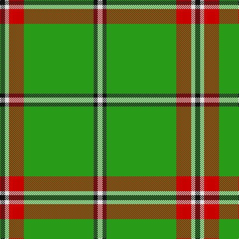

In pattern [KWRGKW](/stripes/kwrgkw/).

This was sourced from tartans-authority.  It is a [6 stripe tartan](/stripes/stripes6/).

Original link http://www.tartansauthority.com/tartan-ferret/display/10623/

## Thread count
K/10 LN8 R30 G140 K8 LN/10

## Palette
Each colour and the base-6 reference it is a variant of.

| Colour | Shade | Base |
|---|---|---|
| G | <code style="background-color:#289C18;">#289C18</code> `oklch(60.6% 0.191 141.6)` <small>#289C18</small> | G <code style="background-color:#006100;">#006100</code> |
| K | <code style="background-color:#101010;">#101010</code> `oklch(17.3% 0.000 89.9)` <small>#101010</small> | K <code style="background-color:#000000;">#000000</code> |
| LN | <code style="background-color:#E0E0E0;">#E0E0E0</code> `oklch(90.7% 0.000 89.9)` <small>#E0E0E0</small> | W <code style="background-color:#F7F7F7;">#F7F7F7</code> |
| R | <code style="background-color:#C80000;">#C80000</code> `oklch(52.3% 0.215 29.2)` <small>#C80000</small> | R <code style="background-color:#CC0000;">#CC0000</code> |

# Sample pattern

## Nearest tartans

The nearest existing variants by ΔTartan distance.

1. [Leach Htg (Name)](/setts/s6/k3lb1g21k2dr3lb2~x2/) — ΔT 0.79
1. [Leach Hunting](/setts/s7/k3lb1g15g6k2dr3lb2~x2/) — ΔT 1.29
1. [Tahrir (Liberation)](/setts/s6/k5w4r15lg70k4w5~x2/) — ΔT 1.33
1. [Instakilt, Green (Fashion)](/setts/s7/g8w4g50k12g4k15lo5~x2/) — ΔT 1.39
1. [Walterstrm (2014))](/setts/s8/g78db13ly6r3ly5g6db9ly6~x2/) — ΔT 1.45
1. [Sir Billi (Corporate)](/setts/s6/r8g12w5k11g42k3~x2/) — ΔT 1.52
1. [St. Christopher (Corporate)](/setts/s8/dg5r3dg3lo2dg1ly8dg24lo2~x2/) — ΔT 1.55
1. [St Patrick Trade or Fancy Tartan Tartan Number: 945. Earliest known date: 1977 An alternative source gives this sett as having been produced by Thomas Gordon of Glasgow around 1973. There is (c.1982) a pipe band in New York that wears this tartan. See products available Copyright © Blair Urquhart, Comrie, 2015](/setts/s10/g4w13g3w4g3w3g40w3g2ly4~x2/) — ΔT 1.59
1. [Skene, or Tribe of Mar](/setts/s5/r1k2g16k2ly1~x2/) — ΔT 1.63
1. [Welsh Assembly (Fashion)](/setts/s8/g5o9g4w5g30r2g4r2~x2/) — ΔT 1.63

## Neighbour map

Every grey dot is one of 14299 variants placed by the first two principal components of the ΔTartan feature space (44% of its variance). Red is this tartan; blue dots are its nearest — click one to open its page.

<svg viewBox="0 0 640 380" role="img" style="max-width:100%;height:auto;border:1px solid #e0e0e0;border-radius:4px;display:block" xmlns="http://www.w3.org/2000/svg"><image href="/nn/cloud.v1.png" width="640" height="380"/><a href="/setts/s6/k3lb1g21k2dr3lb2~x2/"><circle cx="387.5" cy="153.9" r="4" fill="#3465a4"><title>Leach Htg (Name)</title></circle></a><a href="/setts/s7/k3lb1g15g6k2dr3lb2~x2/"><circle cx="351.9" cy="179.7" r="4" fill="#3465a4"><title>Leach Hunting</title></circle></a><a href="/setts/s6/k5w4r15lg70k4w5~x2/"><circle cx="380.9" cy="141.7" r="4" fill="#3465a4"><title>Tahrir (Liberation)</title></circle></a><a href="/setts/s7/g8w4g50k12g4k15lo5~x2/"><circle cx="338.6" cy="176.7" r="4" fill="#3465a4"><title>Instakilt, Green (Fashion)</title></circle></a><a href="/setts/s8/g78db13ly6r3ly5g6db9ly6~x2/"><circle cx="424.7" cy="132.9" r="4" fill="#3465a4"><title>Walterstrm (2014))</title></circle></a><a href="/setts/s6/r8g12w5k11g42k3~x2/"><circle cx="373.7" cy="191.9" r="4" fill="#3465a4"><title>Sir Billi (Corporate)</title></circle></a><a href="/setts/s8/dg5r3dg3lo2dg1ly8dg24lo2~x2/"><circle cx="442.4" cy="158.4" r="4" fill="#3465a4"><title>St. Christopher (Corporate)</title></circle></a><a href="/setts/s10/g4w13g3w4g3w3g40w3g2ly4~x2/"><circle cx="408.6" cy="138.6" r="4" fill="#3465a4"><title>St Patrick Trade or Fancy Tartan Tartan Number: 945. Earliest known date: 1977 An alternative source gives this sett as having been produced by Thomas Gordon of Glasgow around 1973. There is (c.1982) a pipe band in New York that wears this tartan. See products available Copyright © Blair Urquhart, Comrie, 2015</title></circle></a><a href="/setts/s5/r1k2g16k2ly1~x2/"><circle cx="432.7" cy="174.8" r="4" fill="#3465a4"><title>Skene, or Tribe of Mar</title></circle></a><a href="/setts/s8/g5o9g4w5g30r2g4r2~x2/"><circle cx="434.0" cy="181.9" r="4" fill="#3465a4"><title>Welsh Assembly (Fashion)</title></circle></a><circle cx="406.3" cy="153.2" r="5" fill="#c00000"/></svg>

ID: /setts/s6/k5w4r15g70k4w5~x2/
