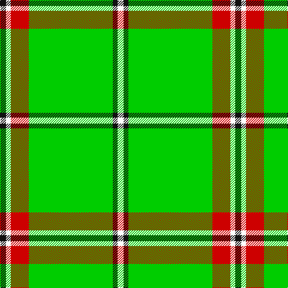

In pattern [KWRYKW](/stripes/kwrykw/).

This was sourced from register-of-tartans.  It is a [6 stripe tartan](/stripes/stripes6/).

Original link https://www.tartanregister.gov.uk/tartanDetails.aspx?ref=10623

## Register references

External register numbers recorded for this tartan.

- Scottish Register of Tartans: [10623](https://www.tartanregister.gov.uk/tartanDetails.aspx?ref=10623)

## Thread count
K/10 W8 R30 G140 K8 W/10

## Palette
Each colour and its ΔE from the base-6 reference it is a variant of.

| Colour | Shade | Base | ΔE (OKLab) |
|---|---|---|---|
| G | <code style="background-color:#00CD00;">#00CD00</code> `#00CD00` | Y <code style="background-color:#F2BF00;">#F2BF00</code> | 0.22 |
| K | <code style="background-color:#101010;">#101010</code> `#101010` | K <code style="background-color:#000000;">#000000</code> | 0.17 |
| R | <code style="background-color:#CD0000;">#CD0000</code> `#CD0000` | R <code style="background-color:#CC0000;">#CC0000</code> | 0.00 |
| W | <code style="background-color:#FFFFFF;">#FFFFFF</code> `#FFFFFF` | W <code style="background-color:#F7F7F7;">#F7F7F7</code> | 0.02 |

# Sample pattern

## Nearest tartans

The nearest existing variants by ΔTartan distance.

1. [Tahrir - Liberation (Fashion)](/setts/s6/k5w4r15g70k4w5~x2/) — ΔT 1.33
1. [Leach Htg (Name)](/setts/s6/k3lb1g21k2dr3lb2~x2/) — ΔT 1.64
1. [Leach Hunting](/setts/s7/k3lb1g15g6k2dr3lb2~x2/) — ΔT 1.93
1. [Instakilt, Green (Fashion)](/setts/s7/g8w4g50k12g4k15lo5~x2/) — ΔT 1.97
1. [St Patrick Trade or Fancy Tartan Tartan Number: 945. Earliest known date: 1977 An alternative source gives this sett as having been produced by Thomas Gordon of Glasgow around 1973. There is (c.1982) a pipe band in New York that wears this tartan. See products available Copyright © Blair Urquhart, Comrie, 2015](/setts/s10/g4w13g3w4g3w3g40w3g2ly4~x2/) — ΔT 2.06
1. [Oxford University dress](/setts/s10/ly4g44dg5w2dg2g2dg2r2g3ly3~x2/) — ΔT 2.16
1. [St. Patrick (Fashion)](/setts/s10/dg4w13dg3w4dg3w3dg40w3dg2ly4~x2/) — ΔT 2.20
1. [Loch Rannoch](/setts/s5/g37w9g3k9w3/) — ΔT 2.21
1. [Oxford University](/setts/s4/db9dg16g56ly4~x2/) — ΔT 2.28
1. [Freedom of Derry](/setts/s7/g14ly7g14dg50g64w6g7/) — ΔT 2.30

## Neighbour map

Every grey dot is one of 14299 variants placed by the first two principal components of the ΔTartan feature space (44% of its variance). Red is this tartan; blue dots are its nearest — click one to open its page.

<svg viewBox="0 0 640 380" role="img" style="max-width:100%;height:auto;border:1px solid #e0e0e0;border-radius:4px;display:block" xmlns="http://www.w3.org/2000/svg"><image href="/nn/cloud.v1.png" width="640" height="380"/><a href="/setts/s6/k5w4r15g70k4w5~x2/"><circle cx="406.3" cy="153.2" r="4" fill="#3465a4"><title>Tahrir - Liberation (Fashion)</title></circle></a><a href="/setts/s6/k3lb1g21k2dr3lb2~x2/"><circle cx="387.5" cy="153.9" r="4" fill="#3465a4"><title>Leach Htg (Name)</title></circle></a><a href="/setts/s7/k3lb1g15g6k2dr3lb2~x2/"><circle cx="351.9" cy="179.7" r="4" fill="#3465a4"><title>Leach Hunting</title></circle></a><a href="/setts/s7/g8w4g50k12g4k15lo5~x2/"><circle cx="338.6" cy="176.7" r="4" fill="#3465a4"><title>Instakilt, Green (Fashion)</title></circle></a><a href="/setts/s10/g4w13g3w4g3w3g40w3g2ly4~x2/"><circle cx="408.6" cy="138.6" r="4" fill="#3465a4"><title>St Patrick Trade or Fancy Tartan Tartan Number: 945. Earliest known date: 1977 An alternative source gives this sett as having been produced by Thomas Gordon of Glasgow around 1973. There is (c.1982) a pipe band in New York that wears this tartan. See products available Copyright © Blair Urquhart, Comrie, 2015</title></circle></a><a href="/setts/s10/ly4g44dg5w2dg2g2dg2r2g3ly3~x2/"><circle cx="442.1" cy="106.0" r="4" fill="#3465a4"><title>Oxford University dress</title></circle></a><a href="/setts/s10/dg4w13dg3w4dg3w3dg40w3dg2ly4~x2/"><circle cx="396.9" cy="129.7" r="4" fill="#3465a4"><title>St. Patrick (Fashion)</title></circle></a><a href="/setts/s5/g37w9g3k9w3/"><circle cx="357.5" cy="203.3" r="4" fill="#3465a4"><title>Loch Rannoch</title></circle></a><a href="/setts/s4/db9dg16g56ly4~x2/"><circle cx="384.8" cy="220.9" r="4" fill="#3465a4"><title>Oxford University</title></circle></a><a href="/setts/s7/g14ly7g14dg50g64w6g7/"><circle cx="337.0" cy="205.1" r="4" fill="#3465a4"><title>Freedom of Derry</title></circle></a><circle cx="380.9" cy="141.7" r="5" fill="#c00000"/></svg>

ID: /setts/s6/k5w4r15lg70k4w5~x2/
