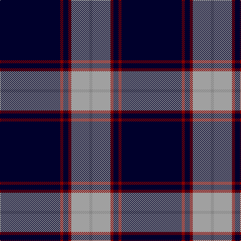

In pattern [KRKRYR](/stripes/krkryr/).

This was sourced from tartans-authority.  It is a [6 stripe tartan](/stripes/stripes6/).

Original link http://www.tartansauthority.com/tartan-ferret/display/8105/

## Thread count
DB/120 DR6 DB10 DR6 N36 Na/6

## Palette
Each colour and the base-6 reference it is a variant of.

| Colour | Shade | Base |
|---|---|---|
| DB | <code style="background-color:#00002C;">#00002C</code> `oklch(13.2% 0.092 264.1)` <small>#00002C</small> | K <code style="background-color:#000000;">#000000</code> |
| DR | <code style="background-color:#880000;">#880000</code> `oklch(39.4% 0.162 29.2)` <small>#880000</small> | R <code style="background-color:#CC0000;">#CC0000</code> |
| N | <code style="background-color:#A0A0A0;">#A0A0A0</code> `oklch(70.6% 0.000 89.9)` <small>#A0A0A0</small> | Y <code style="background-color:#F2BF00;">#F2BF00</code> |
| Na | <code style="background-color:#888888;">#888888</code> `oklch(62.7% 0.000 89.9)` <small>#888888</small> | R <code style="background-color:#CC0000;">#CC0000</code> |

# Sample pattern

## Nearest tartans

The nearest existing variants by ΔTartan distance.

1. [Pride of Nova Scotia (Corporate)](/setts/s7/k3lo2k36dt16k5dt2w3~x2/) — ΔT 1.08
1. [Hong Kong St Andrew's Society](/setts/s6/db75k4r25db6k6w2~x2/) — ΔT 1.22
1. [Loretto School](/setts/s8/db4r14dp6r5db12dg8db70m4/) — ΔT 1.29
1. [Special Air Service](/setts/s5/db26t6dg1o1w2~x2/) — ΔT 1.36
1. [SPA Association (Corporate)](/setts/s10/w1db5ly1db1ly1k4db15w1db2ly1~x4/) — ΔT 1.36
1. [Indiana #2](/setts/s8/db50ly4db3ly4db8k2db12w5~x2/) — ΔT 1.38
1. [Tokyo Bluebells](/setts/s8/db18r1db1r1db1k7db13w2~x4/) — ΔT 1.38
1. [C-Tec N.I. Ltd](/setts/s4/k62db15w6ly4~x2/) — ΔT 1.41
1. [Wcwm 4907-2](/setts/s7/db40k8ly8db4ly1db4lr8~x4/) — ΔT 1.53
1. [MaleHsuHK (Hong Kong) (Personal)](/setts/s4/db60dg16w8lo3~x2/) — ΔT 1.58

## Neighbour map

Every grey dot is one of 14299 variants placed by the first two principal components of the ΔTartan feature space (44% of its variance). Red is this tartan; blue dots are its nearest — click one to open its page.

<svg viewBox="0 0 640 380" role="img" style="max-width:100%;height:auto;border:1px solid #e0e0e0;border-radius:4px;display:block" xmlns="http://www.w3.org/2000/svg"><image href="/nn/cloud.v1.png" width="640" height="380"/><a href="/setts/s7/k3lo2k36dt16k5dt2w3~x2/"><circle cx="414.2" cy="177.3" r="4" fill="#3465a4"><title>Pride of Nova Scotia (Corporate)</title></circle></a><a href="/setts/s6/db75k4r25db6k6w2~x2/"><circle cx="458.4" cy="142.1" r="4" fill="#3465a4"><title>Hong Kong St Andrew's Society</title></circle></a><a href="/setts/s8/db4r14dp6r5db12dg8db70m4/"><circle cx="411.4" cy="137.7" r="4" fill="#3465a4"><title>Loretto School</title></circle></a><a href="/setts/s5/db26t6dg1o1w2~x2/"><circle cx="453.6" cy="149.0" r="4" fill="#3465a4"><title>Special Air Service</title></circle></a><a href="/setts/s10/w1db5ly1db1ly1k4db15w1db2ly1~x4/"><circle cx="420.7" cy="148.5" r="4" fill="#3465a4"><title>SPA Association (Corporate)</title></circle></a><a href="/setts/s8/db50ly4db3ly4db8k2db12w5~x2/"><circle cx="412.6" cy="123.7" r="4" fill="#3465a4"><title>Indiana #2</title></circle></a><a href="/setts/s8/db18r1db1r1db1k7db13w2~x4/"><circle cx="460.5" cy="168.5" r="4" fill="#3465a4"><title>Tokyo Bluebells</title></circle></a><a href="/setts/s4/k62db15w6ly4~x2/"><circle cx="424.6" cy="199.4" r="4" fill="#3465a4"><title>C-Tec N.I. Ltd</title></circle></a><a href="/setts/s7/db40k8ly8db4ly1db4lr8~x4/"><circle cx="403.6" cy="131.2" r="4" fill="#3465a4"><title>Wcwm 4907-2</title></circle></a><a href="/setts/s4/db60dg16w8lo3~x2/"><circle cx="421.6" cy="198.4" r="4" fill="#3465a4"><title>MaleHsuHK (Hong Kong) (Personal)</title></circle></a><circle cx="436.6" cy="160.2" r="5" fill="#c00000"/></svg>

ID: /setts/s6/k60r3k5r3lr18o3~x2/
