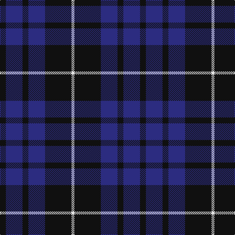

In pattern [KBKBKW](/patterns/kbkbkw/).

This was sourced from tartans-authority.  It is a [6 stripes tartan](/stripes/stripes6/).

Original link http://www.tartansauthority.com/tartan-ferret/display/10432/

## Thread count
K/12 DB34 K12 DB34 K54 LN/6

## Palette
Each colour and its ΔE from the base-6 reference it is a variant of.

| Colour | Shade | Base | ΔE (OKLab) |
|---|---|---|---|
| DB | <code style="background-color:#2C2C80;">#2C2C80</code> `#2C2C80` | B <code style="background-color:#2A418A;">#2A418A</code> | 0.06 |
| K | <code style="background-color:#101010;">#101010</code> `#101010` | K <code style="background-color:#000000;">#000000</code> | 0.17 |
| LN | <code style="background-color:#E0E0E0;">#E0E0E0</code> `#E0E0E0` | W <code style="background-color:#F7F7F7;">#F7F7F7</code> | 0.07 |

# Sample pattern

## Nearest tartans

The nearest existing variants by ΔTartan distance.

1. [Royal Scotsman Train (Corporate)](/setts/s6/b5k2b14k14b2y2x2~b2c2c80-k101010-yb8b4b8/) — ΔT 0.88
1. [Oban](/setts/s8/b6k10b1k1b1k10ba10k6x4~b3850c8-ba2c2c80-k101010/) — ΔT 1.12
1. [MacKay (Blue) #2](/setts/s5/k15b4k15b28r2x2~b2c4084-k101010-rdc0000/) — ΔT 1.15
1. [Marchmont (Personal)](/setts/s7/g1b12k12g1k12b12k1x4~b2c2c80-g289c18-k101010/) — ΔT 1.17
1. [Scottish Express International](/setts/s6/b1k4w1k4ba7k1x4~b9058d8-ba1c0070-k101010-wa8ace8/) — ΔT 1.19
1. [Wallace (Personal)](/setts/s4/k1b7k7y1x10~b200084-k101010-yfccc3c/) — ΔT 1.21
1. [Britannia](/setts/s5/k14r4k25b30w4x2~b202060-k101010-rc80000-we0e0e0/) — ΔT 1.26
1. [Cadence](/setts/s7/b51g5r15g37b17r6g5x2~b000050-g004010-rc00000/) — ΔT 1.26
1. [Press & Journal](/setts/s5/k9b3k28b25w2x2~b4c5484-k101010-we0e0e0/) — ΔT 1.33
1. [Gifford (Personal)](/setts/s7/k15r8y2b25k5b13k5x2~b2c2c80-k101010-rc80000-ye8c000/) — ΔT 1.36

## Neighbour map

Every grey dot is one of 15726 variants placed by the first two principal components of the ΔTartan feature space (44% of its variance). Red is this tartan; blue dots are its nearest — click one to open its page.

<svg viewBox="0 0 640 380" role="img" style="max-width:100%;height:auto;border:1px solid #e0e0e0;border-radius:4px;display:block" xmlns="http://www.w3.org/2000/svg"><image href="/nn/cloud.v1.png" width="640" height="380"/><a href="/setts/s6/b5k2b14k14b2y2x2~b2c2c80-k101010-yb8b4b8/"><circle cx="350.4" cy="267.7" r="4" fill="#3465a4"><title>Royal Scotsman Train (Corporate)</title></circle></a><a href="/setts/s8/b6k10b1k1b1k10ba10k6x4~b3850c8-ba2c2c80-k101010/"><circle cx="365.2" cy="259.6" r="4" fill="#3465a4"><title>Oban</title></circle></a><a href="/setts/s5/k15b4k15b28r2x2~b2c4084-k101010-rdc0000/"><circle cx="376.0" cy="266.0" r="4" fill="#3465a4"><title>MacKay (Blue) #2</title></circle></a><a href="/setts/s7/g1b12k12g1k12b12k1x4~b2c2c80-g289c18-k101010/"><circle cx="364.4" cy="258.8" r="4" fill="#3465a4"><title>Marchmont (Personal)</title></circle></a><a href="/setts/s6/b1k4w1k4ba7k1x4~b9058d8-ba1c0070-k101010-wa8ace8/"><circle cx="282.7" cy="253.8" r="4" fill="#3465a4"><title>Scottish Express International</title></circle></a><a href="/setts/s4/k1b7k7y1x10~b200084-k101010-yfccc3c/"><circle cx="305.5" cy="281.9" r="4" fill="#3465a4"><title>Wallace (Personal)</title></circle></a><a href="/setts/s5/k14r4k25b30w4x2~b202060-k101010-rc80000-we0e0e0/"><circle cx="283.0" cy="260.8" r="4" fill="#3465a4"><title>Britannia</title></circle></a><a href="/setts/s7/b51g5r15g37b17r6g5x2~b000050-g004010-rc00000/"><circle cx="308.2" cy="237.3" r="4" fill="#3465a4"><title>Cadence</title></circle></a><a href="/setts/s5/k9b3k28b25w2x2~b4c5484-k101010-we0e0e0/"><circle cx="368.4" cy="242.4" r="4" fill="#3465a4"><title>Press &amp; Journal</title></circle></a><a href="/setts/s7/k15r8y2b25k5b13k5x2~b2c2c80-k101010-rc80000-ye8c000/"><circle cx="297.4" cy="223.2" r="4" fill="#3465a4"><title>Gifford (Personal)</title></circle></a><circle cx="329.3" cy="271.7" r="5" fill="#c00000"/></svg>

ID: /setts/s6/k6b17k6b17k27w3x2~b2c2c80-k101010-we0e0e0/
