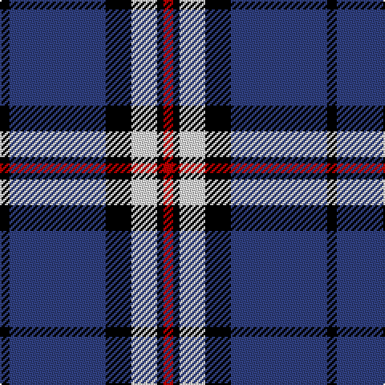

In pattern [KBKWKR](/patterns/kbkwkr/).

This was sourced from weddslist.  It is a [6 stripes tartan](/stripes/stripes6/).

Original link http://www.weddslist.com/cgi-bin/tartans/pg.pl?source=sts

## Thread count
K/6 B60 K16 LN16 K4 R/6

## Palette
Each colour and its ΔE from the base-6 reference it is a variant of.

| Colour | Shade | Base | ΔE (OKLab) |
|---|---|---|---|
| B | <code style="background-color:#304080;">#304080</code> `#304080` | B <code style="background-color:#2C4084;">#2C4084</code> | 0.01 |
| K | <code style="background-color:#000000;">#000000</code> `#000000` | K <code style="background-color:#000000;">#000000</code> | 0.00 |
| LN | <code style="background-color:#E0E0E0;">#E0E0E0</code> `#E0E0E0` | W <code style="background-color:#F4F4F0;">#F4F4F0</code> | 0.06 |
| R | <code style="background-color:#C00000;">#C00000</code> `#C00000` | R <code style="background-color:#C80000;">#C80000</code> | 0.02 |

# Sample pattern

## Nearest tartans

The nearest existing variants by ΔTartan distance.

1. [Wolverines (Corporate)](/setts/s6/y16w6b80k24w6y6-b2c2c80-k101010-we0e0e0-yfcb464/) — ΔT 0.68
1. [DeCloud-McMasters (Personal)](/setts/s8/r6b4w4b52k44w6b6w6-b2c2c80-k101010-rc80000-wfcfcfc/) — ΔT 0.94
1. [Highlands School (North Carolina)](/setts/s8/y24b4y4b60ba4b4ba26w8-b1c0070-ba14283c-wc0c0c0-yd09800/) — ΔT 0.96
1. [Hannah (Personal)](/setts/s6/w4b70k18w6k18y4-b30308c-k101010-we0e0e0-ye8c000/) — ΔT 1.06
1. [Wolverine Corporate Tartan Tartan Number: 10748. Earliest known date: 03/12/2012 Created by the designer to celebrate an exclusive group of work colleagues known affectionately as the 'Wolverines'. Many within this close group share a proud Scottish heritage and wished to acknowledge this strong affiliation by commissioning a tartan. Yes. The Wolverine tartan has been created for the exclusive use of the 'Wolverines'. No commercial use of this tartan is permitted without expressed permission from the designer, and any party wishing to use or reproduce this tartan should first seek permission by email from the designer. See products available Copyright © Blair Urquhart, Comrie, 2015](/setts/s6/y16k6b80ka24k6y6-b0c4ba8-k000000-ka101010-yaba712/) — ΔT 1.06
1. [Detroit Lions](/setts/s8/b60w4k18wa6b12wa8k6w12-b2c4084-k101010-wc8c8c8-waffffff/) — ΔT 1.07
1. [Lytley Hunting (Personal)](/setts/s5/b50r5y5ba15y10-b2c2c80-ba202060-rc80000-yfccc00/) — ΔT 1.14
1. [Highlands School (N. Carolina) Corporate Tartan Tartan Number: 2109. Earliest known date: 1990 Highlands in North Carolina is the home of the Scottish Tartans Society's Museum Extension. The school tartan was designed by Bob Martin who is a 'Fellow of the Society'. Blue and Gold are the school colours. See products available Copyright © Blair Urquhart, Comrie, 2015](/setts/s8/y24b4y4b60ba6b4ba26w8-b2c2c80-ba202060-we0e0e0-ye8c000/) — ΔT 1.17
1. [East Tennessee State University](/setts/s7/y4w2b12w2ya4k34ya2-b202060-k00002c-wfcfcfc-yd09800-yafccc00/) — ΔT 1.17
1. [Sinclair, The Jack](/setts/s7/b8r4b78k22g4w32r4-b304080-g008000-k000000-rc00000-we0e0e0/) — ΔT 1.18

## Neighbour map

Every grey dot is one of 15726 variants placed by the first two principal components of the ΔTartan feature space (44% of its variance). Red is this tartan; blue dots are its nearest — click one to open its page.

<svg viewBox="0 0 640 380" role="img" style="max-width:100%;height:auto;border:1px solid #e0e0e0;border-radius:4px;display:block" xmlns="http://www.w3.org/2000/svg"><image href="/nn/cloud.v1.png" width="640" height="380"/><a href="/setts/s6/y16w6b80k24w6y6-b2c2c80-k101010-we0e0e0-yfcb464/"><circle cx="304.2" cy="166.9" r="4" fill="#3465a4"><title>Wolverines (Corporate)</title></circle></a><a href="/setts/s8/r6b4w4b52k44w6b6w6-b2c2c80-k101010-rc80000-wfcfcfc/"><circle cx="259.7" cy="158.0" r="4" fill="#3465a4"><title>DeCloud-McMasters (Personal)</title></circle></a><a href="/setts/s8/y24b4y4b60ba4b4ba26w8-b1c0070-ba14283c-wc0c0c0-yd09800/"><circle cx="269.3" cy="159.1" r="4" fill="#3465a4"><title>Highlands School (North Carolina)</title></circle></a><a href="/setts/s6/w4b70k18w6k18y4-b30308c-k101010-we0e0e0-ye8c000/"><circle cx="346.4" cy="169.9" r="4" fill="#3465a4"><title>Hannah (Personal)</title></circle></a><a href="/setts/s6/y16k6b80ka24k6y6-b0c4ba8-k000000-ka101010-yaba712/"><circle cx="310.8" cy="178.8" r="4" fill="#3465a4"><title>Wolverine Corporate Tartan Tartan Number: 10748. Earliest known date: 03/12/2012 Created by the designer to celebrate an exclusive group of work colleagues known affectionately as the 'Wolverines'. Many within this close group share a proud Scottish heritage and wished to acknowledge this strong affiliation by commissioning a tartan. Yes. The Wolverine tartan has been created for the exclusive use of the 'Wolverines'. No commercial use of this tartan is permitted without expressed permission from the designer, and any party wishing to use or reproduce this tartan should first seek permission by email from the designer. See products available Copyright © Blair Urquhart, Comrie, 2015</title></circle></a><a href="/setts/s8/b60w4k18wa6b12wa8k6w12-b2c4084-k101010-wc8c8c8-waffffff/"><circle cx="288.1" cy="153.3" r="4" fill="#3465a4"><title>Detroit Lions</title></circle></a><a href="/setts/s5/b50r5y5ba15y10-b2c2c80-ba202060-rc80000-yfccc00/"><circle cx="306.1" cy="199.5" r="4" fill="#3465a4"><title>Lytley Hunting (Personal)</title></circle></a><a href="/setts/s8/y24b4y4b60ba6b4ba26w8-b2c2c80-ba202060-we0e0e0-ye8c000/"><circle cx="256.7" cy="155.1" r="4" fill="#3465a4"><title>Highlands School (N. Carolina) Corporate Tartan Tartan Number: 2109. Earliest known date: 1990 Highlands in North Carolina is the home of the Scottish Tartans Society's Museum Extension. The school tartan was designed by Bob Martin who is a 'Fellow of the Society'. Blue and Gold are the school colours. See products available Copyright © Blair Urquhart, Comrie, 2015</title></circle></a><a href="/setts/s7/y4w2b12w2ya4k34ya2-b202060-k00002c-wfcfcfc-yd09800-yafccc00/"><circle cx="278.8" cy="132.2" r="4" fill="#3465a4"><title>East Tennessee State University</title></circle></a><a href="/setts/s7/b8r4b78k22g4w32r4-b304080-g008000-k000000-rc00000-we0e0e0/"><circle cx="281.1" cy="128.3" r="4" fill="#3465a4"><title>Sinclair, The Jack</title></circle></a><circle cx="288.7" cy="168.1" r="5" fill="#c00000"/></svg>

ID: /setts/s6/k6b60k16w16k4r6-b304080-k000000-rc00000-we0e0e0/
