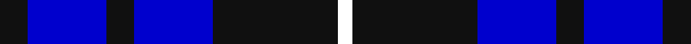

**Bands:** [KBKBKW](/stripes/kbkbkw/) · **Stripes:** [K DB K DB K W](/stripes/stripes6/) K DB K DB K W

This was sourced from register-of-tartans.  It is a [6 band tartan](/bands/bands6/).

Original link https://www.tartanregister.gov.uk/tartanDetails.aspx?ref=10432

## Also known as

This cloth is also recorded under:

- Swan, Brian E

## Attestations

This cloth appears in 2 source records; the oldest owns this page.

- 25/05/2011 — Swan, Brian E (register-of-tartans, [record](https://www.tartanregister.gov.uk/tartanDetails.aspx?ref=10432))
- 25th May 2011 — Swan (Name) (tartans-authority, [record](http://www.tartansauthority.com/tartan-ferret/display/10432/))

## Register references

External register numbers recorded for this tartan.

- Scottish Register of Tartans: [10432](https://www.tartanregister.gov.uk/tartanDetails.aspx?ref=10432)

## Thread count
K/12 B34 K12 B34 K54 W/6

## Palette
Each colour and its ΔE from the base-6 reference it is a variant of.

| Colour | Shade | Base | ΔE (OKLab) |
|---|---|---|---|
| B | <code style="background-color:#0000CD;">#0000CD</code> `#0000CD` | B <code style="background-color:#2A418A;">#2A418A</code> | 0.14 |
| K | <code style="background-color:#101010;">#101010</code> `#101010` | K <code style="background-color:#000000;">#000000</code> | 0.17 |
| W | <code style="background-color:#FFFFFF;">#FFFFFF</code> `#FFFFFF` | W <code style="background-color:#F7F7F7;">#F7F7F7</code> | 0.02 |

# Sample pattern

## Nearest tartans

The nearest existing variants by ΔTartan distance.

1. [Swan 2015, Brian E (Personal)](/setts/s7/k2db9k2db9k13w1k2~x4/) — ΔT 0.91
1. [Fenston/Morris (Personal)](/setts/s5/k33db8k4db35p3~x2/) — ΔT 1.30
1. [Swan](/setts/s6/k3lb2k18db18k2db3~x4/) — ΔT 1.38
1. [College of Radiographers](/setts/s5/k15lo2k10db18lb3~x2/) — ΔT 1.50
1. [Wallace (Personal)](/setts/s4/k1db7k7ly1~x10/) — ΔT 1.62
1. [Gallaecia (Unofficial) (District)](/setts/s5/db24t13db4t4w2~x2/) — ΔT 1.63
1. [Murray Taylor](/setts/s6/db3t3db16t16db16w3~x2/) — ΔT 1.67
1. [Brazell (Personal)](/setts/s5/db7ly1db7b11r2~x6/) — ΔT 1.70
1. [Bank of Scotland (1995)](/setts/s5/lo1db6k5db6lb1~x6/) — ΔT 1.76
1. [St. Georges, Edgbaston](/setts/s7/r4k21w2k20db21k2db2~x2/) — ΔT 1.76

## Neighbour map

Every grey dot is one of 14299 variants placed by the first two principal components of the ΔTartan feature space (44% of its variance). Red is this tartan; blue dots are its nearest — click one to open its page.

<svg viewBox="0 0 640 380" role="img" style="max-width:100%;height:auto;border:1px solid #e0e0e0;border-radius:4px;display:block" xmlns="http://www.w3.org/2000/svg"><image href="/nn/cloud.v1.png" width="640" height="380"/><a href="/setts/s7/k2db9k2db9k13w1k2~x4/"><circle cx="322.6" cy="229.1" r="4" fill="#3465a4"><title>Swan 2015, Brian E (Personal)</title></circle></a><a href="/setts/s5/k33db8k4db35p3~x2/"><circle cx="346.8" cy="249.8" r="4" fill="#3465a4"><title>Fenston/Morris (Personal)</title></circle></a><a href="/setts/s6/k3lb2k18db18k2db3~x4/"><circle cx="298.5" cy="229.4" r="4" fill="#3465a4"><title>Swan</title></circle></a><a href="/setts/s5/k15lo2k10db18lb3~x2/"><circle cx="273.8" cy="252.7" r="4" fill="#3465a4"><title>College of Radiographers</title></circle></a><a href="/setts/s4/k1db7k7ly1~x10/"><circle cx="308.7" cy="281.6" r="4" fill="#3465a4"><title>Wallace (Personal)</title></circle></a><a href="/setts/s5/db24t13db4t4w2~x2/"><circle cx="365.8" cy="234.5" r="4" fill="#3465a4"><title>Gallaecia (Unofficial) (District)</title></circle></a><a href="/setts/s6/db3t3db16t16db16w3~x2/"><circle cx="323.6" cy="271.7" r="4" fill="#3465a4"><title>Murray Taylor</title></circle></a><a href="/setts/s5/db7ly1db7b11r2~x6/"><circle cx="242.0" cy="229.3" r="4" fill="#3465a4"><title>Brazell (Personal)</title></circle></a><a href="/setts/s5/lo1db6k5db6lb1~x6/"><circle cx="296.2" cy="262.7" r="4" fill="#3465a4"><title>Bank of Scotland (1995)</title></circle></a><a href="/setts/s7/r4k21w2k20db21k2db2~x2/"><circle cx="347.8" cy="222.1" r="4" fill="#3465a4"><title>St. Georges, Edgbaston</title></circle></a><circle cx="291.7" cy="258.1" r="5" fill="#c00000"/></svg>

ID: /setts/s6/k6db17k6db17k27w3~x2/
