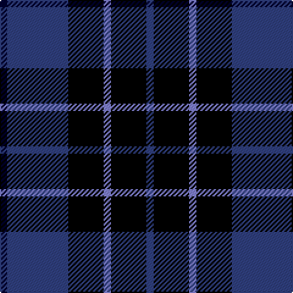

In pattern [BKBKBK](/stripes/bkbkbk/).

This was sourced from weddslist.  It is a [6 stripe tartan](/stripes/stripes6/).

Original link http://www.weddslist.com/cgi-bin/tartans/pg.pl?source=sts

## Thread count
DB/6 Ba50 K29 B6 K29 Ba/6

## Palette
Each colour and the base-6 reference it is a variant of.

| Colour | Shade | Base |
|---|---|---|
| B | <code style="background-color:#8080D0;">#8080D0</code> `oklch(63.4% 0.119 282.5)` <small>#8080D0</small> | B <code style="background-color:#2A418A;">#2A418A</code> |
| Ba | <code style="background-color:#304080;">#304080</code> `oklch(39.4% 0.109 270.2)` <small>#304080</small> | B <code style="background-color:#2A418A;">#2A418A</code> |
| DB | <code style="background-color:#000030;">#000030</code> `oklch(14.0% 0.097 264.1)` <small>#000030</small> | K <code style="background-color:#000000;">#000000</code> |
| K | <code style="background-color:#000000;">#000000</code> `oklch(0.0% 0.000 0.0)` <small>#000000</small> | K <code style="background-color:#000000;">#000000</code> |

# Sample pattern

## Nearest tartans

The nearest existing variants by ΔTartan distance.

1. [Carrick High School](/setts/s7/k6lo2k16t6k3db18k2~x2/) — ΔT 0.79
1. [Marchmont](/setts/s7/k1db12k12g1k12db12w1~x4/) — ΔT 0.87
1. [Wcwm 1106-2](/setts/s5/k4dg3dp18k18lb2~x2/) — ΔT 0.95
1. [Allianz Deutschland 2012](/setts/s7/n6db3n6db20k20db8w4~x2/) — ΔT 1.03
1. [College of Radiographers](/setts/s5/k15lo2k10db18lb3~x2/) — ΔT 1.04
1. [College of Radiographers](/setts/s5/k15y2k10db18w3~x2/) — ΔT 1.15
1. [Printing Industries of America](/setts/s8/k7r2k2k6lo1k1lo1k4~x4/) — ΔT 1.20
1. [College of Radiographers Corporate Tartan Tartan Number: 1274. Earliest known date: 1988 Marketed in Edinburgh around 1930s but no longer seen. See products available Copyright © Blair Urquhart, Comrie, 2015](/setts/s5/k15ly2k10db18w3~x2/) — ΔT 1.21
1. [Inverness Caledonian Thistle Football Club](/setts/s8/k21db3k12r2db12k2db12w2~x2/) — ΔT 1.30
1. [Wallace Blue Dress Tartan Tartan Number: 6569. Earliest known date: See products available Copyright © Blair Urquhart, Comrie, 2015](/setts/s5/g1k9t4db9t1~x6/) — ΔT 1.35

## Neighbour map

Every grey dot is one of 14299 variants placed by the first two principal components of the ΔTartan feature space (44% of its variance). Red is this tartan; blue dots are its nearest — click one to open its page.

<svg viewBox="0 0 640 380" role="img" style="max-width:100%;height:auto;border:1px solid #e0e0e0;border-radius:4px;display:block" xmlns="http://www.w3.org/2000/svg"><image href="/nn/cloud.v1.png" width="640" height="380"/><a href="/setts/s7/k6lo2k16t6k3db18k2~x2/"><circle cx="249.9" cy="217.8" r="4" fill="#3465a4"><title>Carrick High School</title></circle></a><a href="/setts/s7/k1db12k12g1k12db12w1~x4/"><circle cx="284.8" cy="218.0" r="4" fill="#3465a4"><title>Marchmont</title></circle></a><a href="/setts/s5/k4dg3dp18k18lb2~x2/"><circle cx="271.8" cy="231.2" r="4" fill="#3465a4"><title>Wcwm 1106-2</title></circle></a><a href="/setts/s7/n6db3n6db20k20db8w4~x2/"><circle cx="199.7" cy="236.2" r="4" fill="#3465a4"><title>Allianz Deutschland 2012</title></circle></a><a href="/setts/s5/k15lo2k10db18lb3~x2/"><circle cx="273.8" cy="252.7" r="4" fill="#3465a4"><title>College of Radiographers</title></circle></a><a href="/setts/s5/k15y2k10db18w3~x2/"><circle cx="250.7" cy="240.1" r="4" fill="#3465a4"><title>College of Radiographers</title></circle></a><a href="/setts/s8/k7r2k2k6lo1k1lo1k4~x4/"><circle cx="231.3" cy="236.5" r="4" fill="#3465a4"><title>Printing Industries of America</title></circle></a><a href="/setts/s5/k15ly2k10db18w3~x2/"><circle cx="267.5" cy="244.6" r="4" fill="#3465a4"><title>College of Radiographers Corporate Tartan Tartan Number: 1274. Earliest known date: 1988 Marketed in Edinburgh around 1930s but no longer seen. See products available Copyright © Blair Urquhart, Comrie, 2015</title></circle></a><a href="/setts/s8/k21db3k12r2db12k2db12w2~x2/"><circle cx="310.8" cy="227.4" r="4" fill="#3465a4"><title>Inverness Caledonian Thistle Football Club</title></circle></a><a href="/setts/s5/g1k9t4db9t1~x6/"><circle cx="183.9" cy="232.9" r="4" fill="#3465a4"><title>Wallace Blue Dress Tartan Tartan Number: 6569. Earliest known date: See products available Copyright © Blair Urquhart, Comrie, 2015</title></circle></a><circle cx="255.9" cy="234.7" r="5" fill="#c00000"/></svg>

ID: /setts/s6/k6db50k29b6k29db6/
