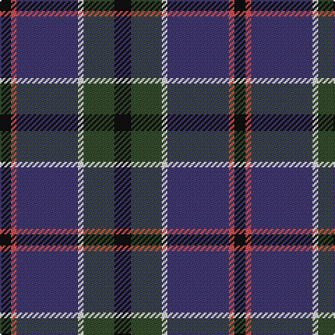

This page is one **sett** — a single exact thread-count. It belongs to the [tartan](/tartans/k6dg11w2db22r2k4/)
(the same proportion at any scale), whose colour order is pattern [KGWBRK](/stripes/kgwbrk/).

Sourced from house-of-tartan.  It is a [6 stripe tartan](/stripes/stripes6/).

Original link http://www.house-of-tartan.scotland.net/house/TartanViewjs.asp?colr=Def&tnam=1111

## Thread count
K/12 T22 LN4 DB44 DO4 K/8

## Palette

Palette: <strong>Tartan Register</strong> <small style="color:#888">(2 of 5 colours)</small>
<table><thead><tr><th>Colour</th><th>Threads</th><th>Shade</th><th>Base</th><th>OKLCh</th></tr></thead><tbody><tr><td>K/</td><td style="text-align:right;font-variant-numeric:tabular-nums">12</td><td><code style="background-color:#101010;">#101010</code> <small style="color:#888">#101010</small></td><td>K <code style="background-color:#000000;">#000000</code></td><td><small style="color:#888">oklch(17.3% 0.000 89.9)</small></td></tr><tr><td>T</td><td style="text-align:right;font-variant-numeric:tabular-nums">22</td><td><code style="background-color:#344C2C;">#344C2C</code> <small style="color:#888">#344C2C</small></td><td>G <code style="background-color:#006100;">#006100</code></td><td><small style="color:#888">oklch(38.8% 0.060 138.1)</small></td></tr><tr><td>LN</td><td style="text-align:right;font-variant-numeric:tabular-nums">4</td><td><code style="background-color:#E0E0E0;">#E0E0E0</code> <small style="color:#888">#E0E0E0</small></td><td>W <code style="background-color:#F7F7F7;">#F7F7F7</code></td><td><small style="color:#888">oklch(90.7% 0.000 89.9)</small></td></tr><tr><td>DB</td><td style="text-align:right;font-variant-numeric:tabular-nums">44</td><td><code style="background-color:#403870;">#403870</code> <small style="color:#888">#403870</small></td><td>B <code style="background-color:#2A418A;">#2A418A</code></td><td><small style="color:#888">oklch(37.8% 0.093 287.6)</small></td></tr><tr><td>DO</td><td style="text-align:right;font-variant-numeric:tabular-nums">4</td><td><code style="background-color:#D05054;">#D05054</code> <small style="color:#888">#D05054</small></td><td>R <code style="background-color:#CC0000;">#CC0000</code></td><td><small style="color:#888">oklch(60.2% 0.162 21.5)</small></td></tr><tr><td>K/</td><td style="text-align:right;font-variant-numeric:tabular-nums">8</td><td><code style="background-color:#101010;">#101010</code> <small style="color:#888">#101010</small></td><td>K <code style="background-color:#000000;">#000000</code></td><td><small style="color:#888">oklch(17.3% 0.000 89.9)</small></td></tr></tbody></table>

# Sample pattern

## Nearest tartans

The nearest existing variants by ΔTartan distance, with this tartan at the top so the swatches line up against it.

ΔTartan

Tartan

Sett

—

<a href="/ttd/edit/#slug=k6dg11w2db22r2k4~x2">Leslie Hebridean Artifact Tartan Tartan Number: 1111. Earliest known date: 1740 From the Telfer Dunbar collection and said to date to C.1740s. See products available Copyright © Blair Urquhart, Comrie, 2015</a> <a class="nn-out" href="/setts/s6/k6dg11w2db22r2k4~x2/" title="open its dictionary page">↗</a>

0.89

<a href="/ttd/edit/#slug=k7t3dy30db30w3~x2">Douglas, (Brown)</a> <a class="nn-out" href="/setts/s5/k7t3dy30db30w3~x2/" title="open its dictionary page">↗</a>

0.93

<a href="/ttd/edit/#slug=dg5b2dg9dt19r9ly2~x2">Lyle and Scott</a> <a class="nn-out" href="/setts/s6/dg5b2dg9dt19r9ly2~x2/" title="open its dictionary page">↗</a>

0.97

<a href="/ttd/edit/#slug=r2db23k14dg16k2w2~x2">MacPhail Hunting</a> <a class="nn-out" href="/setts/s6/r2db23k14dg16k2w2~x2/" title="open its dictionary page">↗</a>

0.97

<a href="/ttd/edit/#slug=db12k4g4r1g4k1lo1~x4">MacLaren</a> <a class="nn-out" href="/setts/s7/db12k4g4r1g4k1lo1~x4/" title="open its dictionary page">↗</a>

0.98

<a href="/ttd/edit/#slug=lo4k28r2do22t8do3~x2">Loch Long One Design</a> <a class="nn-out" href="/setts/s6/lo4k28r2do22t8do3~x2/" title="open its dictionary page">↗</a>

1.02

<a href="/ttd/edit/#slug=k2w1k12g5db11r1~x2">New England (Fashion)</a> <a class="nn-out" href="/setts/s6/k2w1k12g5db11r1~x2/" title="open its dictionary page">↗</a>

1.05

<a href="/ttd/edit/#slug=dr4dg27o2db25lo5dg3o3~x2">Kilkenny, County (District)</a> <a class="nn-out" href="/setts/s7/dr4dg27o2db25lo5dg3o3~x2/" title="open its dictionary page">↗</a>

1.07

<a href="/ttd/edit/#slug=g27ri2g4r15db26k2db6~x2">Bailies of Bennachie (Corporate)</a> <a class="nn-out" href="/setts/s7/g27ri2g4r15db26k2db6~x2/" title="open its dictionary page">↗</a>

1.14

<a href="/ttd/edit/#slug=db15dp3db30k22dg18dp3dg3w3~x2">Moray (Corporate)</a> <a class="nn-out" href="/setts/s8/db15dp3db30k22dg18dp3dg3w3~x2/" title="open its dictionary page">↗</a>

1.17

<a href="/ttd/edit/#slug=dt10r1dt1r1dt1k6y9b2~x2">Antique 2000</a> <a class="nn-out" href="/setts/s8/dt10r1dt1r1dt1k6y9b2~x2/" title="open its dictionary page">↗</a>

## Neighbour map

Every grey dot is one of 14359 variants placed by the first two principal components of the ΔTartan feature space (44% of its variance). Red is this tartan; blue dots are its nearest — click one to open its page.

<svg viewBox="0 0 640 380" role="img" style="max-width:100%;height:auto;border:1px solid #e0e0e0;border-radius:4px;display:block" xmlns="http://www.w3.org/2000/svg"><image href="/nn/cloud.v1.png" width="640" height="380"/><a href="/setts/s5/k7t3dy30db30w3~x2/"><circle cx="259.5" cy="229.9" r="4" fill="#3465a4"><title>Douglas, (Brown)</title></circle></a><a href="/setts/s6/dg5b2dg9dt19r9ly2~x2/"><circle cx="220.3" cy="226.5" r="4" fill="#3465a4"><title>Lyle and Scott</title></circle></a><a href="/setts/s6/r2db23k14dg16k2w2~x2/"><circle cx="214.9" cy="210.8" r="4" fill="#3465a4"><title>MacPhail Hunting</title></circle></a><a href="/setts/s7/db12k4g4r1g4k1lo1~x4/"><circle cx="236.6" cy="187.8" r="4" fill="#3465a4"><title>MacLaren</title></circle></a><a href="/setts/s6/lo4k28r2do22t8do3~x2/"><circle cx="265.3" cy="202.3" r="4" fill="#3465a4"><title>Loch Long One Design</title></circle></a><a href="/setts/s6/k2w1k12g5db11r1~x2/"><circle cx="238.3" cy="204.6" r="4" fill="#3465a4"><title>New England (Fashion)</title></circle></a><a href="/setts/s7/dr4dg27o2db25lo5dg3o3~x2/"><circle cx="282.7" cy="195.6" r="4" fill="#3465a4"><title>Kilkenny, County (District)</title></circle></a><a href="/setts/s7/g27ri2g4r15db26k2db6~x2/"><circle cx="240.6" cy="195.7" r="4" fill="#3465a4"><title>Bailies of Bennachie (Corporate)</title></circle></a><a href="/setts/s8/db15dp3db30k22dg18dp3dg3w3~x2/"><circle cx="255.2" cy="218.1" r="4" fill="#3465a4"><title>Moray (Corporate)</title></circle></a><a href="/setts/s8/dt10r1dt1r1dt1k6y9b2~x2/"><circle cx="204.0" cy="190.2" r="4" fill="#3465a4"><title>Antique 2000</title></circle></a><circle cx="261.4" cy="208.9" r="5" fill="#c00000"/></svg>

ID: /setts/s6/k6dg11w2db22r2k4~x2/
