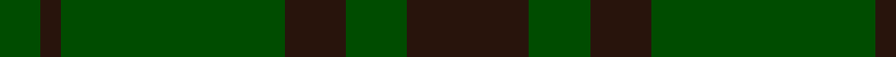
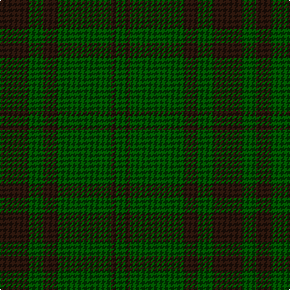

This page is one **sett** — a single exact thread-count. It belongs to the [tartan](/tartans/k6dg3k3dg11k1dg2/)
(the same proportion at any scale), whose colour order is pattern [GKGKGK](/stripes/gkgkgk/).

Sourced from tartans-authority.  It is a [6 stripe tartan](/stripes/stripes6/).

Original link http://www.tartansauthority.com/tartan-ferret/display/4464/

## Register references

External register numbers recorded for this tartan.

- Scottish Tartans Authority (ITI): 4464

## Thread count
K/24 G12 K12 G44 K4 G/8

## Palette

Palette: <strong>Tartan Register</strong> <small style="color:#888">(1 of 2 colours)</small>
<table><thead><tr><th>Colour</th><th>Threads</th><th>Shade</th><th>Base</th><th>OKLCh</th></tr></thead><tbody><tr><td>K/</td><td style="text-align:right;font-variant-numeric:tabular-nums">24</td><td><code style="background-color:#28140C;">#28140C</code> <small style="color:#888">#28140C</small></td><td>K <code style="background-color:#000000;">#000000</code></td><td><small style="color:#888">oklch(21.7% 0.036 42.3)</small></td></tr><tr><td>G</td><td style="text-align:right;font-variant-numeric:tabular-nums">12</td><td><code style="background-color:#004C00;">#004C00</code> <small style="color:#888">#004C00</small></td><td>G <code style="background-color:#006100;">#006100</code></td><td><small style="color:#888">oklch(36.1% 0.123 142.5)</small></td></tr><tr><td>K</td><td style="text-align:right;font-variant-numeric:tabular-nums">12</td><td><code style="background-color:#28140C;">#28140C</code> <small style="color:#888">#28140C</small></td><td>K <code style="background-color:#000000;">#000000</code></td><td><small style="color:#888">oklch(21.7% 0.036 42.3)</small></td></tr><tr><td>G</td><td style="text-align:right;font-variant-numeric:tabular-nums">44</td><td><code style="background-color:#004C00;">#004C00</code> <small style="color:#888">#004C00</small></td><td>G <code style="background-color:#006100;">#006100</code></td><td><small style="color:#888">oklch(36.1% 0.123 142.5)</small></td></tr><tr><td>K</td><td style="text-align:right;font-variant-numeric:tabular-nums">4</td><td><code style="background-color:#28140C;">#28140C</code> <small style="color:#888">#28140C</small></td><td>K <code style="background-color:#000000;">#000000</code></td><td><small style="color:#888">oklch(21.7% 0.036 42.3)</small></td></tr><tr><td>G/</td><td style="text-align:right;font-variant-numeric:tabular-nums">8</td><td><code style="background-color:#004C00;">#004C00</code> <small style="color:#888">#004C00</small></td><td>G <code style="background-color:#006100;">#006100</code></td><td><small style="color:#888">oklch(36.1% 0.123 142.5)</small></td></tr></tbody></table>

# Sample pattern

## Nearest tartans

The nearest existing variants by ΔTartan distance, with this tartan at the top so the swatches line up against it.

ΔTartan

Tartan

Sett

—

<a href="/ttd/edit/#slug=k6dg3k3dg11k1dg2~x4">Carnet (Fashion)</a> <a class="nn-out" href="/setts/s6/k6dg3k3dg11k1dg2~x4/" title="open its dictionary page">↗</a>

1.48

<a href="/setts/s4/dg12k4dg1~x2/">Graham</a>

1.75

<a href="/ttd/edit/#slug=g37o9g3dr9o3~x2">Glen Boig</a> <a class="nn-out" href="/setts/s5/g37o9g3dr9o3~x2/" title="open its dictionary page">↗</a>

1.97

<a href="/ttd/edit/#slug=dg5g3dg24g24dg3g5~x2">Erskine Hunting</a> <a class="nn-out" href="/setts/s6/dg5g3dg24g24dg3g5~x2/" title="open its dictionary page">↗</a>

2.07

<a href="/ttd/edit/#slug=g4k2g28k8dg21g3~x2">Dunbar Hunting</a> <a class="nn-out" href="/setts/s6/g4k2g28k8dg21g3~x2/" title="open its dictionary page">↗</a>

2.11

<a href="/ttd/edit/#slug=dg30dgi13dg7dgi30dg2ly4~x2">MacSporran Rejected design</a> <a class="nn-out" href="/setts/s6/dg30dgi13dg7dgi30dg2ly4~x2/" title="open its dictionary page">↗</a>

2.17

<a href="/ttd/edit/#slug=dg18k3dg3k3dg3k21g2k21dg21k4~x2">Guildry of Stirling</a> <a class="nn-out" href="/setts/s10/dg18k3dg3k3dg3k21g2k21dg21k4~x2/" title="open its dictionary page">↗</a>

2.17

<a href="/ttd/edit/#slug=dg37dy9dg3r9dy3~x2">Glen Trool District Tartan Tartan Number: 914. Earliest known date: pre 1945 Glen Trool is in the Galloway Uplands in the Southwest of Scotland. The tartan began life as a trade sett - a colourful fashion fabric - and was given a name merely to identify it. It proved very popular and is now recognised as a District Tartan. See products available Copyright © Blair Urquhart, Comrie, 2015</a> <a class="nn-out" href="/setts/s5/dg37dy9dg3r9dy3~x2/" title="open its dictionary page">↗</a>

2.19

<a href="/ttd/edit/#slug=dr6lr2dr30dg12dr3dg12dr3~x2">Crawford</a> <a class="nn-out" href="/setts/s7/dr6lr2dr30dg12dr3dg12dr3~x2/" title="open its dictionary page">↗</a>

2.19

<a href="/ttd/edit/#slug=dr6lr2dr30dg12dr3dg12dr3">Crawford</a> <a class="nn-out" href="/setts/s7/dr6lr2dr30dg12dr3dg12dr3/" title="open its dictionary page">↗</a>

2.21

<a href="/ttd/edit/#slug=o6g2o29g29o2g6~x2">Harmony, 11</a> <a class="nn-out" href="/setts/s6/o6g2o29g29o2g6~x2/" title="open its dictionary page">↗</a>

## Neighbour map

Every grey dot is one of 14359 variants placed by the first two principal components of the ΔTartan feature space (44% of its variance). Red is this tartan; blue dots are its nearest — click one to open its page.

<svg viewBox="0 0 640 380" role="img" style="max-width:100%;height:auto;border:1px solid #e0e0e0;border-radius:4px;display:block" xmlns="http://www.w3.org/2000/svg"><image href="/nn/cloud.v1.png" width="640" height="380"/><a href="/setts/s4/dg12k4dg1~x2/"><circle cx="487.9" cy="320.7" r="4" fill="#3465a4"><title>Graham</title></circle></a><a href="/setts/s5/g37o9g3dr9o3~x2/"><circle cx="492.4" cy="271.7" r="4" fill="#3465a4"><title>Glen Boig</title></circle></a><a href="/setts/s6/dg5g3dg24g24dg3g5~x2/"><circle cx="477.7" cy="340.2" r="4" fill="#3465a4"><title>Erskine Hunting</title></circle></a><a href="/setts/s6/g4k2g28k8dg21g3~x2/"><circle cx="402.2" cy="271.3" r="4" fill="#3465a4"><title>Dunbar Hunting</title></circle></a><a href="/setts/s6/dg30dgi13dg7dgi30dg2ly4~x2/"><circle cx="396.3" cy="273.1" r="4" fill="#3465a4"><title>MacSporran Rejected design</title></circle></a><a href="/setts/s10/dg18k3dg3k3dg3k21g2k21dg21k4~x2/"><circle cx="402.0" cy="260.3" r="4" fill="#3465a4"><title>Guildry of Stirling</title></circle></a><a href="/setts/s5/dg37dy9dg3r9dy3~x2/"><circle cx="476.6" cy="258.9" r="4" fill="#3465a4"><title>Glen Trool District Tartan Tartan Number: 914. Earliest known date: pre 1945 Glen Trool is in the Galloway Uplands in the Southwest of Scotland. The tartan began life as a trade sett - a colourful fashion fabric - and was given a name merely to identify it. It proved very popular and is now recognised as a District Tartan. See products available Copyright © Blair Urquhart, Comrie, 2015</title></circle></a><a href="/setts/s7/dr6lr2dr30dg12dr3dg12dr3~x2/"><circle cx="492.2" cy="253.5" r="4" fill="#3465a4"><title>Crawford</title></circle></a><a href="/setts/s7/dr6lr2dr30dg12dr3dg12dr3/"><circle cx="492.2" cy="253.5" r="4" fill="#3465a4"><title>Crawford</title></circle></a><a href="/setts/s6/o6g2o29g29o2g6~x2/"><circle cx="480.7" cy="285.5" r="4" fill="#3465a4"><title>Harmony, 11</title></circle></a><circle cx="505.1" cy="321.6" r="5" fill="#c00000"/></svg>

ID: /setts/s6/k6dg3k3dg11k1dg2~x4/
