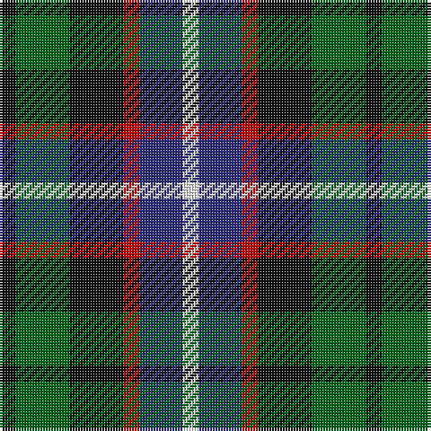

In pattern [KGKRBW](/patterns/kgkrbw/).

This was sourced from tartans-authority.  It is a [6 stripes tartan](/stripes/stripes6/).

Original link http://www.tartansauthority.com/tartan-ferret/display/3179/

## Attestations

This cloth appears in 2 source records; the oldest owns this page.

- 1830-40 — Russell (Clan) (tartans-authority, [record](http://www.tartansauthority.com/tartan-ferret/display/3179/))
- 01/01/1892 — Russell (register-of-tartans, [record](https://www.tartanregister.gov.uk/tartanDetails.aspx?ref=5146))

## Thread count
K/6 G20 K20 R6 DB16 W/6

## Palette
Each colour and its ΔE from the base-6 reference it is a variant of.

| Colour | Shade | Base | ΔE (OKLab) |
|---|---|---|---|
| DB | <code style="background-color:#2C2C80;">#2C2C80</code> `#2C2C80` | B <code style="background-color:#2C4084;">#2C4084</code> | 0.05 |
| G | <code style="background-color:#006818;">#006818</code> `#006818` | G <code style="background-color:#006400;">#006400</code> | 0.02 |
| K | <code style="background-color:#101010;">#101010</code> `#101010` | K <code style="background-color:#000000;">#000000</code> | 0.17 |
| R | <code style="background-color:#C80000;">#C80000</code> `#C80000` | R <code style="background-color:#C80000;">#C80000</code> | 0.00 |
| W | <code style="background-color:#FCFCFC;">#FCFCFC</code> `#FCFCFC` | W <code style="background-color:#F4F4F0;">#F4F4F0</code> | 0.03 |

# Sample pattern

## Nearest tartans

The nearest existing variants by ΔTartan distance.

1. [Mitchell Family Tartan Tartan Number: 2142. Earliest known date: 1816-20 Named in honour of General Billy Mitchell when it was adopted as the tartan of the United States Air Force pipe band. The sett is also known as Russell, Hunter and Galbraith. The earliest reference to the tartan is in the collection of the Highland Society of London where it is labelled Galbraith. See products available Copyright © Blair Urquhart, Comrie, 2015](/setts/s6/k6g16k16r4b16w4-b2c2c80-g006818-k101010-rc80000-we0e0e0/) — ΔT 0.57
1. [Dalmeny (Wlison's) Family Tartan Tartan Number: 1480. Earliest known date: 1819 Restricted See products available Copyright © Blair Urquhart, Comrie, 2015](/setts/s5/r8g30k30b30w8-b2c2c80-g006818-k101010-rc80000-we0e0e0/) — ΔT 0.77
1. [Gala Water Old](/setts/s5/k19b10ba19g40y10-b3c82af-ba5a008c-g005020-k101010-ye8c000/) — ΔT 0.84
1. [Wellington, or Waterloo](/setts/s6/b6g16k18ba14r4ba4-b5480b0-ba304080-g008000-k000000-rc00000/) — ΔT 0.85
1. [Dalmeny](/setts/s5/r8g30k30b30w8-b304080-g008000-k000000-rc00000-we0e0e0/) — ΔT 0.88
1. [Davidson, Double](/setts/s8/b6r4b16k16g16k6w4k6-b2c2c80-g006818-k101010-rc80000-wfcfcfc/) — ΔT 0.96
1. [Casely](/setts/s6/r16g44k44g8b44ga12-b304080-g008000-ga607030-k000000-rc00000/) — ΔT 1.05
1. [Friebe (2014)](/setts/s5/g30ga36b46w8r16-b1c1c50-g649848-ga23321b-rb62531-wf9f5ef/) — ΔT 1.05
1. [Gallowater Old District Tartan Tartan Number: 1025. Earliest known date: 1819 Both 'Old' and 'New' appear in Wilson's 1819 pattern book. See products available Copyright © Blair Urquhart, Comrie, 2015](/setts/s5/k19b10ba19g40y10-b5c8ca8-ba780078-g006818-k101010-ye8c000/) — ΔT 1.06
1. [Davidson Double.. Clan Tartan Tartan Number: 444. Earliest known date: 1847 Wilson's of Bannockburn produced this sett in 1847, calling it 'Double Davidson'. See products available Copyright © Blair Urquhart, Comrie, 2015](/setts/s8/b6r4b16k16g16k6w4k6-b2c2c80-g006818-k101010-rc80000-we0e0e0/) — ΔT 1.06

## Neighbour map

Every grey dot is one of 15726 variants placed by the first two principal components of the ΔTartan feature space (44% of its variance). Red is this tartan; blue dots are its nearest — click one to open its page.

<svg viewBox="0 0 640 380" role="img" style="max-width:100%;height:auto;border:1px solid #e0e0e0;border-radius:4px;display:block" xmlns="http://www.w3.org/2000/svg"><image href="/nn/cloud.v1.png" width="640" height="380"/><a href="/setts/s6/k6g16k16r4b16w4-b2c2c80-g006818-k101010-rc80000-we0e0e0/"><circle cx="91.9" cy="254.3" r="4" fill="#3465a4"><title>Mitchell Family Tartan Tartan Number: 2142. Earliest known date: 1816-20 Named in honour of General Billy Mitchell when it was adopted as the tartan of the United States Air Force pipe band. The sett is also known as Russell, Hunter and Galbraith. The earliest reference to the tartan is in the collection of the Highland Society of London where it is labelled Galbraith. See products available Copyright © Blair Urquhart, Comrie, 2015</title></circle></a><a href="/setts/s5/r8g30k30b30w8-b2c2c80-g006818-k101010-rc80000-we0e0e0/"><circle cx="56.2" cy="266.7" r="4" fill="#3465a4"><title>Dalmeny (Wlison's) Family Tartan Tartan Number: 1480. Earliest known date: 1819 Restricted See products available Copyright © Blair Urquhart, Comrie, 2015</title></circle></a><a href="/setts/s5/k19b10ba19g40y10-b3c82af-ba5a008c-g005020-k101010-ye8c000/"><circle cx="111.2" cy="259.8" r="4" fill="#3465a4"><title>Gala Water Old</title></circle></a><a href="/setts/s6/b6g16k18ba14r4ba4-b5480b0-ba304080-g008000-k000000-rc00000/"><circle cx="53.5" cy="244.1" r="4" fill="#3465a4"><title>Wellington, or Waterloo</title></circle></a><a href="/setts/s5/r8g30k30b30w8-b304080-g008000-k000000-rc00000-we0e0e0/"><circle cx="33.5" cy="258.8" r="4" fill="#3465a4"><title>Dalmeny</title></circle></a><a href="/setts/s8/b6r4b16k16g16k6w4k6-b2c2c80-g006818-k101010-rc80000-wfcfcfc/"><circle cx="101.2" cy="240.8" r="4" fill="#3465a4"><title>Davidson, Double</title></circle></a><a href="/setts/s6/r16g44k44g8b44ga12-b304080-g008000-ga607030-k000000-rc00000/"><circle cx="70.1" cy="235.2" r="4" fill="#3465a4"><title>Casely</title></circle></a><a href="/setts/s5/g30ga36b46w8r16-b1c1c50-g649848-ga23321b-rb62531-wf9f5ef/"><circle cx="88.9" cy="249.1" r="4" fill="#3465a4"><title>Friebe (2014)</title></circle></a><a href="/setts/s5/k19b10ba19g40y10-b5c8ca8-ba780078-g006818-k101010-ye8c000/"><circle cx="107.0" cy="255.2" r="4" fill="#3465a4"><title>Gallowater Old District Tartan Tartan Number: 1025. Earliest known date: 1819 Both 'Old' and 'New' appear in Wilson's 1819 pattern book. See products available Copyright © Blair Urquhart, Comrie, 2015</title></circle></a><a href="/setts/s8/b6r4b16k16g16k6w4k6-b2c2c80-g006818-k101010-rc80000-we0e0e0/"><circle cx="107.2" cy="243.5" r="4" fill="#3465a4"><title>Davidson Double.. Clan Tartan Tartan Number: 444. Earliest known date: 1847 Wilson's of Bannockburn produced this sett in 1847, calling it 'Double Davidson'. See products available Copyright © Blair Urquhart, Comrie, 2015</title></circle></a><circle cx="64.9" cy="257.0" r="5" fill="#c00000"/></svg>

ID: /setts/s6/k6g20k20r6b16w6-b2c2c80-g006818-k101010-rc80000-wfcfcfc/
