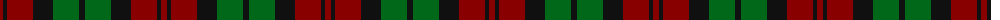

In pattern [KGKRKR](/patterns/kgkrkr/).

This was sourced from register-of-tartans.  It is a [6 stripes tartan](/stripes/stripes6/).

Original link https://www.tartanregister.gov.uk/tartanDetails.aspx?ref=2323

## Attestations

This cloth appears in 2 source records; the oldest owns this page.

- 01/01/1985 — MacCormick (Dress) (register-of-tartans, [record](https://www.tartanregister.gov.uk/tartanDetails.aspx?ref=2323))
- 1985 — MacCormick Dress (Name) (tartans-authority, [record](http://www.tartansauthority.com/tartan-ferret/display/1091/))

## Thread count
DR/6 K4 DR26 K20 G26 K/6

## Palette
Each colour and its ΔE from the base-6 reference it is a variant of.

| Colour | Shade | Base | ΔE (OKLab) |
|---|---|---|---|
| DR | <code style="background-color:#880000;">#880000</code> `#880000` | R <code style="background-color:#C80000;">#C80000</code> | 0.14 |
| G | <code style="background-color:#006818;">#006818</code> `#006818` | G <code style="background-color:#006400;">#006400</code> | 0.02 |
| K | <code style="background-color:#101010;">#101010</code> `#101010` | K <code style="background-color:#000000;">#000000</code> | 0.17 |

# Sample pattern

ID: /setts/s6/k6g26k20r26k4r6-g006818-k101010-r880000/
