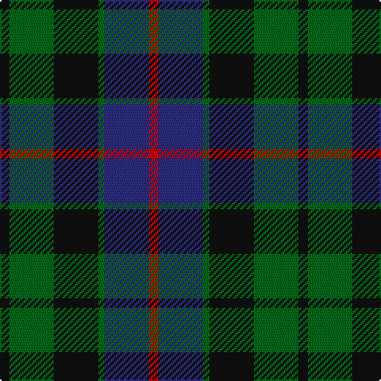

In pattern [KGKGBR](/patterns/kgkgbr/).

This was sourced from house-of-tartan.  It is a [6 stripes tartan](/stripes/stripes6/).

Original link http://www.house-of-tartan.scotland.net/house/TartanViewjs.asp?colr=Def&tnam=1083

## Thread count
K/6 G28 K28 G4 DB28 R/6

## Palette
Each colour and its ΔE from the base-6 reference it is a variant of.

| Colour | Shade | Base | ΔE (OKLab) |
|---|---|---|---|
| DB | <code style="background-color:#2C2C80;">#2C2C80</code> `#2C2C80` | B <code style="background-color:#2A418A;">#2A418A</code> | 0.06 |
| G | <code style="background-color:#006818;">#006818</code> `#006818` | G <code style="background-color:#006100;">#006100</code> | 0.02 |
| K | <code style="background-color:#101010;">#101010</code> `#101010` | K <code style="background-color:#000000;">#000000</code> | 0.17 |
| R | <code style="background-color:#C80000;">#C80000</code> `#C80000` | R <code style="background-color:#CC0000;">#CC0000</code> | 0.01 |

# Sample pattern

## Nearest tartans

The nearest existing variants by ΔTartan distance.

1. [Ferguson of Balquhidder #2](/setts/s6/g8b48r6k48g50k8-b2c2c80-g006818-k101010-rc80000/) — ΔT 0.42
1. [Glenturret Corporate Tartan Tartan Number: 1097. Earliest known date: 1988 Glenturret Distillery is open to the public. Visitors can view the whisky making process and taste the final product. Glenturret tartan goods are for sale in the distillery shop. See products available Copyright © Blair Urquhart, Comrie, 2015](/setts/s6/k6g28k28g4b30y4-b202060-g006818-k101010-ye8c000/) — ΔT 0.43
1. [Callum Beg (Fashion)](/setts/s6/g6b36k36g36r6g6-b2c2c80-g006818-k101010-rc80000/) — ΔT 0.49
1. [Murray (Variation) Clan Tartan Tartan Number: 271. Earliest known date: 1810-15 A simplified version of the Murray of Atholl. The Cockburn collection housed in the Mitchell Library in Glasgow, is one of the earliest references for clan tartans. James Logan, in his book, The Scottish Gael (1831), wrote concerning the Black Watch, that "...a red stripe is often introduced", and this by Lord Murray who commanded the regiment. See products available Copyright © Blair Urquhart, Comrie, 2015](/setts/s6/b4k4b24k16g22r4-b2c2c80-g006818-k101010-rc80000/) — ΔT 0.54
1. [Gallamore](/setts/s6/k6b28r4k28g28k6-b2c2c80-g006818-k101010-rc80000/) — ΔT 0.55
1. [Inneryne (Personal)](/setts/s7/b8k6b32k28g28r6g6-b2c2c80-g006818-k101010-rc80000/) — ΔT 0.60
1. [Unnamed 19th Century Plaid](/setts/s7/g32b4g4k24ba24k4ba12-b5c8ca8-ba440044-g006818-k101010/) — ΔT 0.62
1. [Gunn - 1810 (Clan)](/setts/s6/r8g24k24g4b24g6-b1c0070-g006818-k101010-rc80000/) — ΔT 0.64
1. [Fletcher of Dunans Clan Tartan Tartan Number: 272. Earliest known date: 1906 The Fletchers of Dunans tartan is distinguished by a red stripe in place of the more usual black. Fletchers were arrow makers associated with the Stewarts and Campbells in Argyll and with the MacGregors in Perthshire. See products available Copyright © Blair Urquhart, Comrie, 2015](/setts/s7/b12k2b12k16r2g16r4-b2c2c80-g006818-k101010-rc80000/) — ΔT 0.69
1. [Forbes #4](/setts/s7/b2k2b12k12g12k2w2-b2c4084-g005020-k101010-we0e0e0/) — ΔT 0.73

## Neighbour map

Every grey dot is one of 15726 variants placed by the first two principal components of the ΔTartan feature space (44% of its variance). Red is this tartan; blue dots are its nearest — click one to open its page.

<svg viewBox="0 0 640 380" role="img" style="max-width:100%;height:auto;border:1px solid #e0e0e0;border-radius:4px;display:block" xmlns="http://www.w3.org/2000/svg"><image href="/nn/cloud.v1.png" width="640" height="380"/><a href="/setts/s6/g8b48r6k48g50k8-b2c2c80-g006818-k101010-rc80000/"><circle cx="200.7" cy="243.5" r="4" fill="#3465a4"><title>Ferguson of Balquhidder #2</title></circle></a><a href="/setts/s6/k6g28k28g4b30y4-b202060-g006818-k101010-ye8c000/"><circle cx="182.9" cy="245.9" r="4" fill="#3465a4"><title>Glenturret Corporate Tartan Tartan Number: 1097. Earliest known date: 1988 Glenturret Distillery is open to the public. Visitors can view the whisky making process and taste the final product. Glenturret tartan goods are for sale in the distillery shop. See products available Copyright © Blair Urquhart, Comrie, 2015</title></circle></a><a href="/setts/s6/g6b36k36g36r6g6-b2c2c80-g006818-k101010-rc80000/"><circle cx="194.5" cy="255.7" r="4" fill="#3465a4"><title>Callum Beg (Fashion)</title></circle></a><a href="/setts/s6/b4k4b24k16g22r4-b2c2c80-g006818-k101010-rc80000/"><circle cx="194.7" cy="257.1" r="4" fill="#3465a4"><title>Murray (Variation) Clan Tartan Tartan Number: 271. Earliest known date: 1810-15 A simplified version of the Murray of Atholl. The Cockburn collection housed in the Mitchell Library in Glasgow, is one of the earliest references for clan tartans. James Logan, in his book, The Scottish Gael (1831), wrote concerning the Black Watch, that &quot;...a red stripe is often introduced&quot;, and this by Lord Murray who commanded the regiment. See products available Copyright © Blair Urquhart, Comrie, 2015</title></circle></a><a href="/setts/s6/k6b28r4k28g28k6-b2c2c80-g006818-k101010-rc80000/"><circle cx="211.1" cy="256.0" r="4" fill="#3465a4"><title>Gallamore</title></circle></a><a href="/setts/s7/b8k6b32k28g28r6g6-b2c2c80-g006818-k101010-rc80000/"><circle cx="176.1" cy="255.0" r="4" fill="#3465a4"><title>Inneryne (Personal)</title></circle></a><a href="/setts/s7/g32b4g4k24ba24k4ba12-b5c8ca8-ba440044-g006818-k101010/"><circle cx="199.8" cy="237.4" r="4" fill="#3465a4"><title>Unnamed 19th Century Plaid</title></circle></a><a href="/setts/s6/r8g24k24g4b24g6-b1c0070-g006818-k101010-rc80000/"><circle cx="164.8" cy="260.4" r="4" fill="#3465a4"><title>Gunn - 1810 (Clan)</title></circle></a><a href="/setts/s7/b12k2b12k16r2g16r4-b2c2c80-g006818-k101010-rc80000/"><circle cx="185.1" cy="242.7" r="4" fill="#3465a4"><title>Fletcher of Dunans Clan Tartan Tartan Number: 272. Earliest known date: 1906 The Fletchers of Dunans tartan is distinguished by a red stripe in place of the more usual black. Fletchers were arrow makers associated with the Stewarts and Campbells in Argyll and with the MacGregors in Perthshire. See products available Copyright © Blair Urquhart, Comrie, 2015</title></circle></a><a href="/setts/s7/b2k2b12k12g12k2w2-b2c4084-g005020-k101010-we0e0e0/"><circle cx="188.0" cy="242.2" r="4" fill="#3465a4"><title>Forbes #4</title></circle></a><circle cx="179.8" cy="252.3" r="5" fill="#c00000"/></svg>

ID: /setts/s6/k6g28k28g4b28r6-b2c2c80-g006818-k101010-rc80000/
