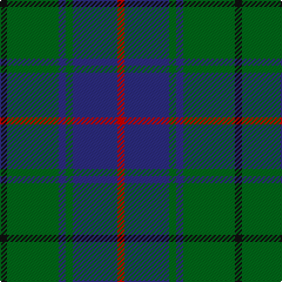

In pattern [KGBGBR](/patterns/kgbgbr/).

This was sourced from register-of-tartans.  It is a [6 stripes tartan](/stripes/stripes6/).

Original link https://www.tartanregister.gov.uk/tartanDetails.aspx?ref=897

## Attestations

This cloth appears in 3 source records; the oldest owns this page.

- 01/01/2002 — Davidson, Half (register-of-tartans, [record](https://www.tartanregister.gov.uk/tartanDetails.aspx?ref=897))
- pre 2002 — Davidson - 1990 (Half) (tartans-authority, [record](http://www.tartansauthority.com/tartan-ferret/display/1076/))
- undated — Davidson Half.. Clan Tartan Tartan Number: 1076. Earliest known date: 1952 D.C.Stewart calls this sett, 'the more recent Davidson', and the basis for the Henderson tartan. It was published by his father D. W. Stewart in 1893, in a beautifully illustrated book, 'Old and Rare Scottish Tartans', in which each sample was woven in silk. This version omits the white stripe of earlier setts recorded in the Highland Society of London collection and the Moy Hall collection. Uniquely among tartans, there is a 'Half' Davidson and a 'Double' Davidson. The former being simply a reduced pattern and the latter a version woven by Wilson's of Bannockburn around 1847 in which the red and white stripes are doubled. Davidsons of Clan Dhai, as they were known, were part of Clan Chattan confederation. See products available Copyright © Blair Urquhart, Comrie, 2015 (house-of-tartan, [record](http://www.house-of-tartan.scotland.net/house/TartanViewjs.asp?colr=Def&tnam=1076))

## Thread count
K/6 G44 DB6 G6 DB38 R/6

## Palette
Each colour and its ΔE from the base-6 reference it is a variant of.

| Colour | Shade | Base | ΔE (OKLab) |
|---|---|---|---|
| DB | <code style="background-color:#2C2C80;">#2C2C80</code> `#2C2C80` | B <code style="background-color:#2A418A;">#2A418A</code> | 0.06 |
| G | <code style="background-color:#006818;">#006818</code> `#006818` | G <code style="background-color:#006100;">#006100</code> | 0.02 |
| K | <code style="background-color:#101010;">#101010</code> `#101010` | K <code style="background-color:#000000;">#000000</code> | 0.17 |
| R | <code style="background-color:#C80000;">#C80000</code> `#C80000` | R <code style="background-color:#CC0000;">#CC0000</code> | 0.01 |

# Sample pattern

## Nearest tartans

The nearest existing variants by ΔTartan distance.

1. [MacIntyre](/setts/s6/g8b24r6b24g64w8-b304080-g004010-rc00000-we0e0e0/) — ΔT 0.88
1. [Scott Green (Sir Walter)](/setts/s6/g24b8ba56b8g24k8-b5c8ca8-ba2c2c80-g006818-k101010/) — ΔT 0.88
1. [Flower of Scotland Commemorative Tartan Tartan Number: 2059. Earliest known date: September 1990 Designed as a tribute to Roy Williamson, writer of the words and music of 'The Flower of Scotland'. Roy wore the Gunn tartan which has been used as the framework of the new tartan. Cornflower blue and Zephyr green have been used to suggest the bluebell and the thistle. Worn by the Seafield and District pipe band, Strathallan Games, 1994 (UK Reg. Design No.600421) See products available Copyright © Blair Urquhart, Comrie, 2015](/setts/s6/b4g28b4k16b28r4-b40649c-g00643c-k101010-re86000/) — ΔT 1.03
1. [Flower of Scotland MINI Tartan Tartan Number: 20599. Earliest known date: Dupion Silk. Generated only for display purposes. reduced copy of the original 2059 Flower of Scotland. See products available Copyright © Blair Urquhart, Comrie, 2015](/setts/s6/b2g14b2k8b14r2-b40649c-g00643c-k101010-re86000/) — ΔT 1.03
1. [Rowan (Personal)](/setts/s5/g48y4b32k4b4-b2c2c80-g006818-k101010-yd09800/) — ΔT 1.05
1. [Irving of Bonshaw Tower (Personal)](/setts/s6/r4g6b4g28b28y4-b1c0070-g006818-r880000-yb8b8b8/) — ΔT 1.05
1. [Trafalgar (Fashion)](/setts/s6/g6b2g16b14k6y2-b2c2c80-g006818-k101010-ye8c000/) — ΔT 1.06
1. [Davidson, Half..](/setts/s6/k6g44b6g6b38r6-b304080-g008000-k000000-rc00000/) — ΔT 1.06
1. [St. Andrews Old Course Hotel (Corp)](/setts/s6/g104b40k12b8ga8b40-b1c0070-g006818-ga604000-k101010/) — ΔT 1.08
1. [MacIntyre LC](/setts/s6/g8b24r6b24g64y8-b000052-g11450d-raa0000-yaaaaaa/) — ΔT 1.11

## Neighbour map

Every grey dot is one of 15726 variants placed by the first two principal components of the ΔTartan feature space (44% of its variance). Red is this tartan; blue dots are its nearest — click one to open its page.

<svg viewBox="0 0 640 380" role="img" style="max-width:100%;height:auto;border:1px solid #e0e0e0;border-radius:4px;display:block" xmlns="http://www.w3.org/2000/svg"><image href="/nn/cloud.v1.png" width="640" height="380"/><a href="/setts/s6/g8b24r6b24g64w8-b304080-g004010-rc00000-we0e0e0/"><circle cx="320.6" cy="221.8" r="4" fill="#3465a4"><title>MacIntyre</title></circle></a><a href="/setts/s6/g24b8ba56b8g24k8-b5c8ca8-ba2c2c80-g006818-k101010/"><circle cx="246.3" cy="246.8" r="4" fill="#3465a4"><title>Scott Green (Sir Walter)</title></circle></a><a href="/setts/s6/b4g28b4k16b28r4-b40649c-g00643c-k101010-re86000/"><circle cx="235.5" cy="247.6" r="4" fill="#3465a4"><title>Flower of Scotland Commemorative Tartan Tartan Number: 2059. Earliest known date: September 1990 Designed as a tribute to Roy Williamson, writer of the words and music of 'The Flower of Scotland'. Roy wore the Gunn tartan which has been used as the framework of the new tartan. Cornflower blue and Zephyr green have been used to suggest the bluebell and the thistle. Worn by the Seafield and District pipe band, Strathallan Games, 1994 (UK Reg. Design No.600421) See products available Copyright © Blair Urquhart, Comrie, 2015</title></circle></a><a href="/setts/s6/b2g14b2k8b14r2-b40649c-g00643c-k101010-re86000/"><circle cx="235.5" cy="247.6" r="4" fill="#3465a4"><title>Flower of Scotland MINI Tartan Tartan Number: 20599. Earliest known date: Dupion Silk. Generated only for display purposes. reduced copy of the original 2059 Flower of Scotland. See products available Copyright © Blair Urquhart, Comrie, 2015</title></circle></a><a href="/setts/s5/g48y4b32k4b4-b2c2c80-g006818-k101010-yd09800/"><circle cx="337.2" cy="221.4" r="4" fill="#3465a4"><title>Rowan (Personal)</title></circle></a><a href="/setts/s6/r4g6b4g28b28y4-b1c0070-g006818-r880000-yb8b8b8/"><circle cx="253.1" cy="227.6" r="4" fill="#3465a4"><title>Irving of Bonshaw Tower (Personal)</title></circle></a><a href="/setts/s6/g6b2g16b14k6y2-b2c2c80-g006818-k101010-ye8c000/"><circle cx="246.1" cy="243.8" r="4" fill="#3465a4"><title>Trafalgar (Fashion)</title></circle></a><a href="/setts/s6/k6g44b6g6b38r6-b304080-g008000-k000000-rc00000/"><circle cx="262.5" cy="223.2" r="4" fill="#3465a4"><title>Davidson, Half..</title></circle></a><a href="/setts/s6/g104b40k12b8ga8b40-b1c0070-g006818-ga604000-k101010/"><circle cx="311.9" cy="212.9" r="4" fill="#3465a4"><title>St. Andrews Old Course Hotel (Corp)</title></circle></a><a href="/setts/s6/g8b24r6b24g64y8-b000052-g11450d-raa0000-yaaaaaa/"><circle cx="319.1" cy="224.4" r="4" fill="#3465a4"><title>MacIntyre LC</title></circle></a><circle cx="288.8" cy="234.4" r="5" fill="#c00000"/></svg>

ID: /setts/s6/k6g44b6g6b38r6-b2c2c80-g006818-k101010-rc80000/
