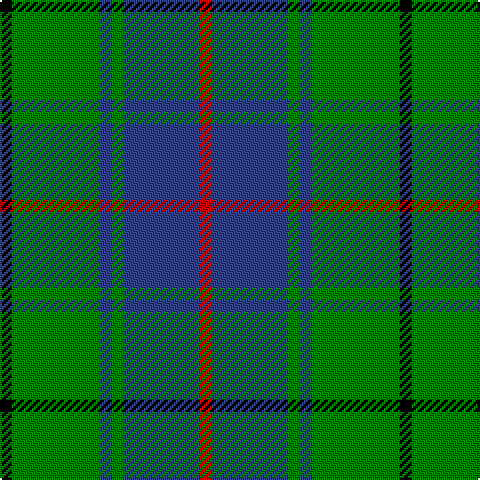

In pattern [KGBGBR](/patterns/kgbgbr/).

This was sourced from weddslist.  It is a [6 stripes tartan](/stripes/stripes6/).

Original link http://www.weddslist.com/cgi-bin/tartans/pg.pl?source=sts

## Thread count
K/6 G44 B6 G6 B38 R/6

## Palette
Each colour and its ΔE from the base-6 reference it is a variant of.

| Colour | Shade | Base | ΔE (OKLab) |
|---|---|---|---|
| B | <code style="background-color:#304080;">#304080</code> `#304080` | B <code style="background-color:#2C4084;">#2C4084</code> | 0.01 |
| G | <code style="background-color:#008000;">#008000</code> `#008000` | G <code style="background-color:#006400;">#006400</code> | 0.09 |
| K | <code style="background-color:#000000;">#000000</code> `#000000` | K <code style="background-color:#000000;">#000000</code> | 0.00 |
| R | <code style="background-color:#C00000;">#C00000</code> `#C00000` | R <code style="background-color:#C80000;">#C80000</code> | 0.02 |

# Sample pattern

## Nearest tartans

The nearest existing variants by ΔTartan distance.

1. [Michaluk (Personal)](/setts/s6/k12b16g80k80g12y12-b1474b4-g408060-k101010-ybc8c00/) — ΔT 0.77
1. [MacIntyre Hunting Clan Tartan Tartan Number: 743. Earliest known date: 1800 There is a doublet in Kingussie Museum dated 1800 in this tartan. It also appeared in the Vestiarium Scoticum (1842). See products available Copyright © Blair Urquhart, Comrie, 2015](/setts/s6/g8b24r6b24g64w8-b2c2c80-g006818-rc80000-we0e0e0/) — ΔT 0.85
1. [MacIntyre Hunting (VS)](/setts/s6/g8b24r6b24g64w8-b202060-g006818-rc80000-wfcfcfc/) — ΔT 0.90
1. [Cameron Hunting Clan Tartan Tartan Number: 1535. Earliest known date: 1956 A document written in Latin of 1689 descibes the Cameron men from Lochaber as being clad in blue and yellow when they followed their great Chief, Sir Ewan Cameron, to battle and victory at Killiecrankie. This new design was evolved in the 1940s by J G MacKay of Portree and first put on show at the Cameron Gathering at Achnacarry in 1956. The original Cameron first appeared in the Vestiarium Scoticum (1842). See products available Copyright © Blair Urquhart, Comrie, 2015](/setts/s7/r6g20r6g28b32g6y4-b2c2c80-g006818-re87878-ye8c000/) — ΔT 0.92
1. [Heritage Tartan, The](/setts/s6/b8r4b24g35w4g8-b1c0070-g006818-r880000-wc0c0c0/) — ΔT 0.94
1. [Trafalgar (Fashion)](/setts/s6/g6b2g16b14k6y2-b2c2c80-g006818-k101010-ye8c000/) — ΔT 1.00
1. [St. Andrew Society, Sao Paulo (Corp)](/setts/s6/b10w6b72g76y10g10-b2c2c80-g006818-we0e0e0-ye8c000/) — ΔT 1.02
1. [Irving of Bonshaw Tower](/setts/s6/r6g6k6g54b54w6-b304080-g008000-k000000-rc00000-we0e0e0/) — ΔT 1.03
1. [Irving of Bonshaw Tower (Personal)](/setts/s6/r4g6b4g28b28y4-b1c0070-g006818-r880000-yb8b8b8/) — ΔT 1.04
1. [Cameron of Lochiel (Hunting)](/setts/s7/r6g20r6g28b32g6y4-b1c0070-g006818-rc80000-ye8c000/) — ΔT 1.04

## Neighbour map

Every grey dot is one of 15726 variants placed by the first two principal components of the ΔTartan feature space (44% of its variance). Red is this tartan; blue dots are its nearest — click one to open its page.

<svg viewBox="0 0 640 380" role="img" style="max-width:100%;height:auto;border:1px solid #e0e0e0;border-radius:4px;display:block" xmlns="http://www.w3.org/2000/svg"><image href="/nn/cloud.v1.png" width="640" height="380"/><a href="/setts/s6/k12b16g80k80g12y12-b1474b4-g408060-k101010-ybc8c00/"><circle cx="231.2" cy="225.4" r="4" fill="#3465a4"><title>Michaluk (Personal)</title></circle></a><a href="/setts/s6/g8b24r6b24g64w8-b2c2c80-g006818-rc80000-we0e0e0/"><circle cx="303.6" cy="213.4" r="4" fill="#3465a4"><title>MacIntyre Hunting Clan Tartan Tartan Number: 743. Earliest known date: 1800 There is a doublet in Kingussie Museum dated 1800 in this tartan. It also appeared in the Vestiarium Scoticum (1842). See products available Copyright © Blair Urquhart, Comrie, 2015</title></circle></a><a href="/setts/s6/g8b24r6b24g64w8-b202060-g006818-rc80000-wfcfcfc/"><circle cx="292.6" cy="209.1" r="4" fill="#3465a4"><title>MacIntyre Hunting (VS)</title></circle></a><a href="/setts/s7/r6g20r6g28b32g6y4-b2c2c80-g006818-re87878-ye8c000/"><circle cx="265.4" cy="226.0" r="4" fill="#3465a4"><title>Cameron Hunting Clan Tartan Tartan Number: 1535. Earliest known date: 1956 A document written in Latin of 1689 descibes the Cameron men from Lochaber as being clad in blue and yellow when they followed their great Chief, Sir Ewan Cameron, to battle and victory at Killiecrankie. This new design was evolved in the 1940s by J G MacKay of Portree and first put on show at the Cameron Gathering at Achnacarry in 1956. The original Cameron first appeared in the Vestiarium Scoticum (1842). See products available Copyright © Blair Urquhart, Comrie, 2015</title></circle></a><a href="/setts/s6/b8r4b24g35w4g8-b1c0070-g006818-r880000-wc0c0c0/"><circle cx="282.1" cy="225.7" r="4" fill="#3465a4"><title>Heritage Tartan, The</title></circle></a><a href="/setts/s6/g6b2g16b14k6y2-b2c2c80-g006818-k101010-ye8c000/"><circle cx="246.1" cy="243.8" r="4" fill="#3465a4"><title>Trafalgar (Fashion)</title></circle></a><a href="/setts/s6/b10w6b72g76y10g10-b2c2c80-g006818-we0e0e0-ye8c000/"><circle cx="290.6" cy="198.9" r="4" fill="#3465a4"><title>St. Andrew Society, Sao Paulo (Corp)</title></circle></a><a href="/setts/s6/r6g6k6g54b54w6-b304080-g008000-k000000-rc00000-we0e0e0/"><circle cx="234.7" cy="188.0" r="4" fill="#3465a4"><title>Irving of Bonshaw Tower</title></circle></a><a href="/setts/s6/r4g6b4g28b28y4-b1c0070-g006818-r880000-yb8b8b8/"><circle cx="253.1" cy="227.6" r="4" fill="#3465a4"><title>Irving of Bonshaw Tower (Personal)</title></circle></a><a href="/setts/s7/r6g20r6g28b32g6y4-b1c0070-g006818-rc80000-ye8c000/"><circle cx="257.9" cy="223.3" r="4" fill="#3465a4"><title>Cameron of Lochiel (Hunting)</title></circle></a><circle cx="262.5" cy="223.2" r="5" fill="#c00000"/></svg>

ID: /setts/s6/k6g44b6g6b38r6-b304080-g008000-k000000-rc00000/
