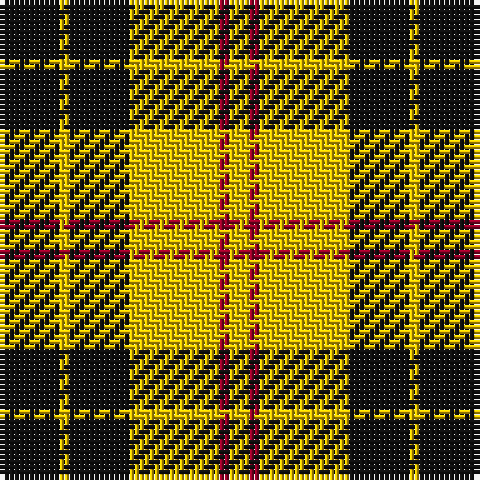

This page is one **sett** — a single exact thread-count. It belongs to the [tartan](/tartans/k6ly1k6ly9r1ly2/)
(the same proportion at any scale), whose colour order is pattern [KYKYRY](/stripes/kykyry/).

Sourced from register-of-tartans.  It is a [6 stripe tartan](/stripes/stripes6/).

Original link https://www.tartanregister.gov.uk/tartanDetails.aspx?ref=2628

## Also known as

This cloth is also recorded under:

- MacLeod #3

2 attestations — the source records this cloth was collapsed from (oldest owns this page)

<ul>
<li>undated — MacLeod #3 (register-of-tartans, <a href="https://www.tartanregister.gov.uk/tartanDetails.aspx?ref=2628">record</a>)</li>
<li>undated — MacLeod (weddslist, <a href="http://www.weddslist.com/cgi-bin/tartans/pg.pl?source=sts">record</a>)</li>
</ul>

## Register references

External register numbers recorded for this tartan.

- Scottish Register of Tartans: [2628](https://www.tartanregister.gov.uk/tartanDetails.aspx?ref=2628)
- Scottish Tartans World Register: 1278

## Thread count
K/12 Y2 K12 Y18 DR2 Y/4

## Palette

Palette: <strong>Logan (The Scottish Gael, 1831)</strong>
<table><thead><tr><th>Colour</th><th>Threads</th><th>Shade</th><th>Base</th><th>OKLCh</th></tr></thead><tbody><tr><td>K/</td><td style="text-align:right;font-variant-numeric:tabular-nums">12</td><td><code style="background-color:#101010;">#101010</code> <small style="color:#888">#101010</small></td><td>K <code style="background-color:#000000;">#000000</code></td><td><small style="color:#888">oklch(17.3% 0.000 89.9)</small></td></tr><tr><td>Y</td><td style="text-align:right;font-variant-numeric:tabular-nums">2</td><td><code style="background-color:#E8C000;">#E8C000</code> <small style="color:#888">#E8C000</small></td><td>Y <code style="background-color:#F2BF00;">#F2BF00</code></td><td><small style="color:#888">oklch(81.9% 0.168 93.7)</small></td></tr><tr><td>K</td><td style="text-align:right;font-variant-numeric:tabular-nums">12</td><td><code style="background-color:#101010;">#101010</code> <small style="color:#888">#101010</small></td><td>K <code style="background-color:#000000;">#000000</code></td><td><small style="color:#888">oklch(17.3% 0.000 89.9)</small></td></tr><tr><td>Y</td><td style="text-align:right;font-variant-numeric:tabular-nums">18</td><td><code style="background-color:#E8C000;">#E8C000</code> <small style="color:#888">#E8C000</small></td><td>Y <code style="background-color:#F2BF00;">#F2BF00</code></td><td><small style="color:#888">oklch(81.9% 0.168 93.7)</small></td></tr><tr><td>DR</td><td style="text-align:right;font-variant-numeric:tabular-nums">2</td><td><code style="background-color:#960028;">#960028</code> <small style="color:#888">#960028</small></td><td>R <code style="background-color:#CC0000;">#CC0000</code></td><td><small style="color:#888">oklch(42.7% 0.171 18.3)</small></td></tr><tr><td>Y/</td><td style="text-align:right;font-variant-numeric:tabular-nums">4</td><td><code style="background-color:#E8C000;">#E8C000</code> <small style="color:#888">#E8C000</small></td><td>Y <code style="background-color:#F2BF00;">#F2BF00</code></td><td><small style="color:#888">oklch(81.9% 0.168 93.7)</small></td></tr></tbody></table>

# Sample pattern

## Nearest tartans

The nearest existing variants by ΔTartan distance, with this tartan at the top so the swatches line up against it.

ΔTartan

Tartan

Sett

—

<a href="/ttd/edit/#slug=k6ly1k6ly9r1ly2~x2">MacLeod #3</a> <a class="nn-out" href="/setts/s6/k6ly1k6ly9r1ly2~x2/" title="open its dictionary page">↗</a>

0.54

<a href="/ttd/edit/#slug=k4ly32k16r3k16ly4~x2">Unnamed C21st - Fashion</a> <a class="nn-out" href="/setts/s6/k4ly32k16r3k16ly4~x2/" title="open its dictionary page">↗</a>

0.87

<a href="/ttd/edit/#slug=k8ly1k8ly12r1~x4">MacLeod of Lewis (Vestiarium Scoticum)</a> <a class="nn-out" href="/setts/s5/k8ly1k8ly12r1~x4/" title="open its dictionary page">↗</a>

0.92

<a href="/ttd/edit/#slug=k4ly1k4ly6r1~x4">MacLeod Dress Clan Tartan Tartan Number: 1272. Earliest known date: 1829 See illustration in Bain where red is 4 threads. Sir Thomas Dick Lauder in a letter to Sir Walter Scott in 1829 wrote, MacLeod has got a sketch of this splendid tartan, &quot;three black stryps upon ain yellow fylde,&quot; See products available Copyright © Blair Urquhart, Comrie, 2015</a> <a class="nn-out" href="/setts/s5/k4ly1k4ly6r1~x4/" title="open its dictionary page">↗</a>

0.94

<a href="/ttd/edit/#slug=k10ly2k10w2k2ly13w3~x2">Nooten-Boom (Personal)</a> <a class="nn-out" href="/setts/s7/k10ly2k10w2k2ly13w3~x2/" title="open its dictionary page">↗</a>

0.95

<a href="/ttd/edit/#slug=k2ly6k2ly11k9r1~x2">Porter Drinkers', The</a> <a class="nn-out" href="/setts/s6/k2ly6k2ly11k9r1~x2/" title="open its dictionary page">↗</a>

1.17

<a href="/ttd/edit/#slug=w1ly6k6ly1~x8">Barclay Dress Clan Tartan Tartan Number: 1879. Earliest known date: 1906 Based on the earlier hunting sett which appeared in the Vestiarium Scoticum in 1842. Barclay's appear to have no 'regular' tartan. The dress version assumes this role and is the sett most commonly associated with the name. The Aberdeenshire Barclays of Tolly held lands for over 600 years, and their descendant, Michael Andreas Barclay, was made Prince Barclay de Tolly for his part in the defeat of Napoleon. There is also a green hunting version of the same pattern. See products available Copyright © Blair Urquhart, Comrie, 2015</a> <a class="nn-out" href="/setts/s4/w1ly6k6ly1~x8/" title="open its dictionary page">↗</a>

1.20

<a href="/ttd/edit/#slug=w5ly32dt32ly5~x2">Barclay Dress</a> <a class="nn-out" href="/setts/s4/w5ly32dt32ly5~x2/" title="open its dictionary page">↗</a>

1.30

<a href="/ttd/edit/#slug=w1ly6k6ly1~x2">Barclay Dress</a> <a class="nn-out" href="/setts/s4/w1ly6k6ly1~x2/" title="open its dictionary page">↗</a>

1.39

<a href="/ttd/edit/#slug=k8ly1k8ly12r1~x2">MacLeod of Lewis</a> <a class="nn-out" href="/setts/s5/k8ly1k8ly12r1~x2/" title="open its dictionary page">↗</a>

1.42

<a href="/ttd/edit/#slug=lr1ly6k6ly1~x2">Barclay Dress</a> <a class="nn-out" href="/setts/s4/lr1ly6k6ly1~x2/" title="open its dictionary page">↗</a>

## Neighbour map

Every grey dot is one of 14299 variants placed by the first two principal components of the ΔTartan feature space (44% of its variance). Red is this tartan; blue dots are its nearest — click one to open its page.

<svg viewBox="0 0 640 380" role="img" style="max-width:100%;height:auto;border:1px solid #e0e0e0;border-radius:4px;display:block" xmlns="http://www.w3.org/2000/svg"><image href="/nn/cloud.v1.png" width="640" height="380"/><a href="/setts/s6/k4ly32k16r3k16ly4~x2/"><circle cx="267.6" cy="198.2" r="4" fill="#3465a4"><title>Unnamed C21st - Fashion</title></circle></a><a href="/setts/s5/k8ly1k8ly12r1~x4/"><circle cx="297.0" cy="219.8" r="4" fill="#3465a4"><title>MacLeod of Lewis (Vestiarium Scoticum)</title></circle></a><a href="/setts/s5/k4ly1k4ly6r1~x4/"><circle cx="234.7" cy="250.4" r="4" fill="#3465a4"><title>MacLeod Dress Clan Tartan Tartan Number: 1272. Earliest known date: 1829 See illustration in Bain where red is 4 threads. Sir Thomas Dick Lauder in a letter to Sir Walter Scott in 1829 wrote, MacLeod has got a sketch of this splendid tartan, &quot;three black stryps upon ain yellow fylde,&quot; See products available Copyright © Blair Urquhart, Comrie, 2015</title></circle></a><a href="/setts/s7/k10ly2k10w2k2ly13w3~x2/"><circle cx="235.6" cy="219.1" r="4" fill="#3465a4"><title>Nooten-Boom (Personal)</title></circle></a><a href="/setts/s6/k2ly6k2ly11k9r1~x2/"><circle cx="287.7" cy="201.8" r="4" fill="#3465a4"><title>Porter Drinkers', The</title></circle></a><a href="/setts/s4/w1ly6k6ly1~x8/"><circle cx="241.6" cy="244.5" r="4" fill="#3465a4"><title>Barclay Dress Clan Tartan Tartan Number: 1879. Earliest known date: 1906 Based on the earlier hunting sett which appeared in the Vestiarium Scoticum in 1842. Barclay's appear to have no 'regular' tartan. The dress version assumes this role and is the sett most commonly associated with the name. The Aberdeenshire Barclays of Tolly held lands for over 600 years, and their descendant, Michael Andreas Barclay, was made Prince Barclay de Tolly for his part in the defeat of Napoleon. There is also a green hunting version of the same pattern. See products available Copyright © Blair Urquhart, Comrie, 2015</title></circle></a><a href="/setts/s4/w5ly32dt32ly5~x2/"><circle cx="249.2" cy="241.2" r="4" fill="#3465a4"><title>Barclay Dress</title></circle></a><a href="/setts/s4/w1ly6k6ly1~x2/"><circle cx="234.6" cy="249.2" r="4" fill="#3465a4"><title>Barclay Dress</title></circle></a><a href="/setts/s5/k8ly1k8ly12r1~x2/"><circle cx="286.9" cy="222.8" r="4" fill="#3465a4"><title>MacLeod of Lewis</title></circle></a><a href="/setts/s4/lr1ly6k6ly1~x2/"><circle cx="241.6" cy="255.2" r="4" fill="#3465a4"><title>Barclay Dress</title></circle></a><circle cx="256.2" cy="216.7" r="5" fill="#c00000"/></svg>

ID: /setts/s6/k6ly1k6ly9r1ly2~x2/
