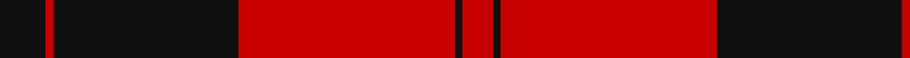
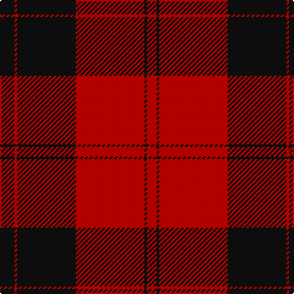

**Bands:** [KRKRKR](/stripes/krkrkr/) · **Stripes:** [K R K R K R](/stripes/stripes6/) K R K R K R

This was sourced from register-of-tartans.  It is a [6 band tartan](/bands/bands6/).

Original link https://www.tartanregister.gov.uk/tartanDetails.aspx?ref=5281

## Register references

External register numbers recorded for this tartan.

- Scottish Register of Tartans: [5281](https://www.tartanregister.gov.uk/tartanDetails.aspx?ref=5281)
- Scottish Tartans Authority (ITI): 3034

## Variants

Other setts woven to the same stripe pattern.

- [Cameron Black & Red (Dress)](/setts/s6/k2r12k2r12k33r2~x2/)
- [Cameron, Black & Red (dress)](/setts/s6/k1r4k1r4k13r1~x4/)
- [Erskine (Paton)](/setts/s6/k31r4k47r47k4r31~x2/)
- [Erskine, Black & Red (Clan)](/setts/s6/k6r3k28r28k3r6~x2/)
- [Ewing](/setts/s6/k23r3k1r12k1r3~x4/)
- [The Mary Erskine](/setts/s6/k3r1k16r16k1r3~x4/)

## Thread count
K/12 R2 K48 R56 K2 R/8

## Palette
Each colour and its ΔE from the base-6 reference it is a variant of.

| Colour | Shade | Base | ΔE (OKLab) |
|---|---|---|---|
| K | <code style="background-color:#101010;">#101010</code> `#101010` | K <code style="background-color:#000000;">#000000</code> | 0.17 |
| R | <code style="background-color:#C80000;">#C80000</code> `#C80000` | R <code style="background-color:#CC0000;">#CC0000</code> | 0.01 |

# Sample pattern

## Nearest tartans

The nearest existing variants by ΔTartan distance.

1. [Ewing](/setts/s6/k23r3k1r12k1r3~x4/) — ΔT 0.78
1. [Campbell Red (artefact)](/setts/s5/r4k1r24k22r2~x2/) — ΔT 0.88
1. [Ramsay of Dalhousie](/setts/s6/k4w2k28r30k1r3~x2/) — ΔT 1.10
1. [Masai Shuka 15 (Artefact)](/setts/s5/r20k2r2k15w1~x2/) — ΔT 1.16
1. [Knights Templar Htg (Corporate)](/setts/s5/k22w1k12r43w1~x2/) — ΔT 1.23
1. [Cunningham](/setts/s7/k3r1k30r28k1r1w3~x2/) — ΔT 1.33
1. [Rosser (Welsh Name)](/setts/s6/r16k57r36k2r4r2/) — ΔT 1.36
1. [Brodie (Clan)](/setts/s6/k2r16k8ly1k8r2~x4/) — ΔT 1.37
1. [MacIver](/setts/s5/k16r2k2r12w1~x2/) — ΔT 1.44
1. [Las Vegas Fire Fighters](/setts/s8/lb1r2k1r30k28lb2k3r1~x2/) — ΔT 1.45

## Neighbour map

Every grey dot is one of 14313 variants placed by the first two principal components of the ΔTartan feature space (44% of its variance). Red is this tartan; blue dots are its nearest — click one to open its page.

<svg viewBox="0 0 640 380" role="img" style="max-width:100%;height:auto;border:1px solid #e0e0e0;border-radius:4px;display:block" xmlns="http://www.w3.org/2000/svg"><image href="/nn/cloud.v1.png" width="640" height="380"/><a href="/setts/s6/k23r3k1r12k1r3~x4/"><circle cx="431.2" cy="184.0" r="4" fill="#3465a4"><title>Ewing</title></circle></a><a href="/setts/s5/r4k1r24k22r2~x2/"><circle cx="421.2" cy="192.4" r="4" fill="#3465a4"><title>Campbell Red (artefact)</title></circle></a><a href="/setts/s6/k4w2k28r30k1r3~x2/"><circle cx="371.0" cy="150.9" r="4" fill="#3465a4"><title>Ramsay of Dalhousie</title></circle></a><a href="/setts/s5/r20k2r2k15w1~x2/"><circle cx="386.6" cy="184.1" r="4" fill="#3465a4"><title>Masai Shuka 15 (Artefact)</title></circle></a><a href="/setts/s5/k22w1k12r43w1~x2/"><circle cx="410.3" cy="156.4" r="4" fill="#3465a4"><title>Knights Templar Htg (Corporate)</title></circle></a><a href="/setts/s7/k3r1k30r28k1r1w3~x2/"><circle cx="377.4" cy="133.6" r="4" fill="#3465a4"><title>Cunningham</title></circle></a><a href="/setts/s6/r16k57r36k2r4r2/"><circle cx="362.7" cy="166.5" r="4" fill="#3465a4"><title>Rosser (Welsh Name)</title></circle></a><a href="/setts/s6/k2r16k8ly1k8r2~x4/"><circle cx="341.4" cy="198.8" r="4" fill="#3465a4"><title>Brodie (Clan)</title></circle></a><a href="/setts/s5/k16r2k2r12w1~x2/"><circle cx="360.5" cy="195.4" r="4" fill="#3465a4"><title>MacIver</title></circle></a><a href="/setts/s8/lb1r2k1r30k28lb2k3r1~x2/"><circle cx="382.9" cy="127.6" r="4" fill="#3465a4"><title>Las Vegas Fire Fighters</title></circle></a><circle cx="417.0" cy="183.3" r="5" fill="#c00000"/></svg>

ID: /setts/s6/k6r1k24r28k1r4~x2/
