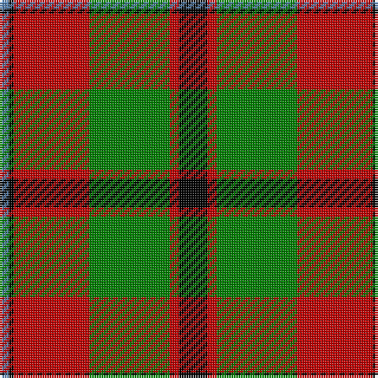

In pattern [BKRGRK](/patterns/bkrgrk/).

This was sourced from weddslist.  It is a [6 stripes tartan](/stripes/stripes6/).

Original link http://www.weddslist.com/cgi-bin/tartans/pg.pl?source=sts

## Thread count
B/4 K2 R32 G34 R4 K/12

## Palette
Each colour and its ΔE from the base-6 reference it is a variant of.

| Colour | Shade | Base | ΔE (OKLab) |
|---|---|---|---|
| B | <code style="background-color:#5480B0;">#5480B0</code> `#5480B0` | B <code style="background-color:#2A418A;">#2A418A</code> | 0.19 |
| G | <code style="background-color:#008000;">#008000</code> `#008000` | G <code style="background-color:#006100;">#006100</code> | 0.10 |
| K | <code style="background-color:#000000;">#000000</code> `#000000` | K <code style="background-color:#000000;">#000000</code> | 0.00 |
| R | <code style="background-color:#C00000;">#C00000</code> `#C00000` | R <code style="background-color:#CC0000;">#CC0000</code> | 0.03 |

# Sample pattern

## Nearest tartans

The nearest existing variants by ΔTartan distance.

1. [Longford County Crest (Fashion)](/setts/s8/k44y9k3y8y16y15y6k7x2~k101010-ybc8c00/) — ΔT 0.77
1. [Loch Ness Trade Tartan Tartan Number: 1219. Earliest known date: pre 2003 Nothing See products available Copyright © Blair Urquhart, Comrie, 2015](/setts/s6/r10w2k10w10g35k5x2~g604000-k101010-rc80000-we0e0e0/) — ΔT 0.91
1. [Prince Edward Island District Tartan Tartan Number: 1815. Earliest known date: 1960-70 The warmth and glow of the fertile soil, The green field and tree, The yellow and the brown of Autumn, The white of surf or a summer snow, Rust, green, yellow and white, Yes! That's our Island Tartan. See products available Copyright © Blair Urquhart, Comrie, 2015](/setts/s7/w2k1g16k12r12k1w2x2~g006818-k101010-rc80000-we0e0e0/) — ΔT 0.95
1. [Unidentified #15](/setts/s6/k6r2g17r16k1b2x2~b3c82af-g005020-k101010-rdc0000/) — ΔT 0.96
1. [Logan, Dark](/setts/s7/k9r4k1r4g15ra4k1x2~g008000-k000000-rd03030-rac00000/) — ΔT 0.96
1. [Strathspey, Check](/setts/s6/g3r22b5g10k10g2x2~b5480b0-g008000-k000000-rc00000/) — ΔT 0.98
1. [Island of Innis, The](/setts/s8/k15g1k3r9g1r3y11k1x4~g285800-k101010-ra00000-yd09800/) — ΔT 0.99
1. [Loch Ness](/setts/s6/r10w2k10w10g35k5x2~g503c14-k101010-rdc0000-we0e0e0/) — ΔT 0.99
1. [Prince Edward Island #2](/setts/s7/w2k1g16k12r12k1w2x2~g005020-k101010-rdc0000-we0e0e0/) — ΔT 1.04
1. [Christmas (Fashion)](/setts/s5/y2g17ga4r15g1x2~g003820-ga006818-rc80000-yfccc00/) — ΔT 1.04

## Neighbour map

Every grey dot is one of 15726 variants placed by the first two principal components of the ΔTartan feature space (44% of its variance). Red is this tartan; blue dots are its nearest — click one to open its page.

<svg viewBox="0 0 640 380" role="img" style="max-width:100%;height:auto;border:1px solid #e0e0e0;border-radius:4px;display:block" xmlns="http://www.w3.org/2000/svg"><image href="/nn/cloud.v1.png" width="640" height="380"/><a href="/setts/s8/k44y9k3y8y16y15y6k7x2~k101010-ybc8c00/"><circle cx="210.5" cy="167.9" r="4" fill="#3465a4"><title>Longford County Crest (Fashion)</title></circle></a><a href="/setts/s6/r10w2k10w10g35k5x2~g604000-k101010-rc80000-we0e0e0/"><circle cx="254.5" cy="172.5" r="4" fill="#3465a4"><title>Loch Ness Trade Tartan Tartan Number: 1219. Earliest known date: pre 2003 Nothing See products available Copyright © Blair Urquhart, Comrie, 2015</title></circle></a><a href="/setts/s7/w2k1g16k12r12k1w2x2~g006818-k101010-rc80000-we0e0e0/"><circle cx="187.9" cy="169.2" r="4" fill="#3465a4"><title>Prince Edward Island District Tartan Tartan Number: 1815. Earliest known date: 1960-70 The warmth and glow of the fertile soil, The green field and tree, The yellow and the brown of Autumn, The white of surf or a summer snow, Rust, green, yellow and white, Yes! That's our Island Tartan. See products available Copyright © Blair Urquhart, Comrie, 2015</title></circle></a><a href="/setts/s6/k6r2g17r16k1b2x2~b3c82af-g005020-k101010-rdc0000/"><circle cx="257.4" cy="179.6" r="4" fill="#3465a4"><title>Unidentified #15</title></circle></a><a href="/setts/s7/k9r4k1r4g15ra4k1x2~g008000-k000000-rd03030-rac00000/"><circle cx="187.2" cy="175.2" r="4" fill="#3465a4"><title>Logan, Dark</title></circle></a><a href="/setts/s6/g3r22b5g10k10g2x2~b5480b0-g008000-k000000-rc00000/"><circle cx="196.3" cy="196.7" r="4" fill="#3465a4"><title>Strathspey, Check</title></circle></a><a href="/setts/s8/k15g1k3r9g1r3y11k1x4~g285800-k101010-ra00000-yd09800/"><circle cx="232.0" cy="165.4" r="4" fill="#3465a4"><title>Island of Innis, The</title></circle></a><a href="/setts/s6/r10w2k10w10g35k5x2~g503c14-k101010-rdc0000-we0e0e0/"><circle cx="251.4" cy="172.5" r="4" fill="#3465a4"><title>Loch Ness</title></circle></a><a href="/setts/s7/w2k1g16k12r12k1w2x2~g005020-k101010-rdc0000-we0e0e0/"><circle cx="189.1" cy="168.7" r="4" fill="#3465a4"><title>Prince Edward Island #2</title></circle></a><a href="/setts/s5/y2g17ga4r15g1x2~g003820-ga006818-rc80000-yfccc00/"><circle cx="286.6" cy="194.5" r="4" fill="#3465a4"><title>Christmas (Fashion)</title></circle></a><circle cx="233.6" cy="173.6" r="5" fill="#c00000"/></svg>

ID: /setts/s6/k6r2g17r16k1b2x2~b5480b0-g008000-k000000-rc00000/
