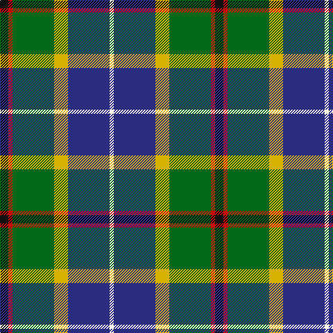

This page is one **sett** — a single exact thread-count. It belongs to the [tartan](/tartans/k6r3g30y10db30w3/)
(the same proportion at any scale), whose colour order is pattern [KRGYBW](/stripes/krgybw/).

Sourced from register-of-tartans.  It is a [6 stripe tartan](/stripes/stripes6/).

Original link https://www.tartanregister.gov.uk/tartanDetails.aspx?ref=4164

2 attestations — the source records this cloth was collapsed from (oldest owns this page)

<ul>
<li>01/01/1996 — Turnbull of Thornton (Personal) (register-of-tartans, <a href="https://www.tartanregister.gov.uk/tartanDetails.aspx?ref=4164">record</a>)</li>
<li>1996 — Turnbull of Thornton (Personal) (tartans-authority, <a href="http://www.tartansauthority.com/tartan-ferret/display/5087/">record</a>)</li>
</ul>

## Register references

External register numbers recorded for this tartan.

- Scottish Register of Tartans: [4164](https://www.tartanregister.gov.uk/tartanDetails.aspx?ref=4164)
- Scottish Tartans Authority (ITI): 5087

## Thread count
K/12 R6 G60 Y20 DB60 W/6

## Palette
Each colour and the base-6 reference it is a variant of.

| Colour | Shade | Base |
|---|---|---|
| DB | <code style="background-color:#2C2C80;">#2C2C80</code> `oklch(35.0% 0.138 276.6)` <small>#2C2C80</small> | B <code style="background-color:#2A418A;">#2A418A</code> |
| G | <code style="background-color:#006818;">#006818</code> `oklch(45.0% 0.142 145.0)` <small>#006818</small> | G <code style="background-color:#006100;">#006100</code> |
| K | <code style="background-color:#101010;">#101010</code> `oklch(17.3% 0.000 89.9)` <small>#101010</small> | K <code style="background-color:#000000;">#000000</code> |
| R | <code style="background-color:#C80000;">#C80000</code> `oklch(52.3% 0.215 29.2)` <small>#C80000</small> | R <code style="background-color:#CC0000;">#CC0000</code> |
| W | <code style="background-color:#FCFCFC;">#FCFCFC</code> `oklch(99.1% 0.000 89.9)` <small>#FCFCFC</small> | W <code style="background-color:#F7F7F7;">#F7F7F7</code> |
| Y | <code style="background-color:#D8B000;">#D8B000</code> `oklch(77.1% 0.158 92.3)` <small>#D8B000</small> | Y <code style="background-color:#F2BF00;">#F2BF00</code> |

# Sample pattern

## Nearest tartans

The nearest existing variants by ΔTartan distance, with this tartan at the top so the swatches line up against it.

ΔTartan

Tartan

Sett

—

<a href="/ttd/edit/#slug=k6r3g30ly10db30w3~x2">Turnbull of Thornton (Personal)</a> <a class="nn-out" href="/setts/s6/k6r3g30ly10db30w3~x2/" title="open its dictionary page">↗</a>

0.83

<a href="/ttd/edit/#slug=o5dt30w3dg15ly8r4~x2">Carleton College Rugby</a> <a class="nn-out" href="/setts/s6/o5dt30w3dg15ly8r4~x2/" title="open its dictionary page">↗</a>

0.84

<a href="/ttd/edit/#slug=dt36y20dg6w12k6r3~x2">Sirens &amp; Swords</a> <a class="nn-out" href="/setts/s6/dt36y20dg6w12k6r3~x2/" title="open its dictionary page">↗</a>

0.87

<a href="/ttd/edit/#slug=db2r1db10w1y4g8lo1g2~x4">Ayrshire (District)</a> <a class="nn-out" href="/setts/s8/db2r1db10w1y4g8lo1g2~x4/" title="open its dictionary page">↗</a>

0.88

<a href="/ttd/edit/#slug=w2db20r3k10g20lo2~x2">Morris of Eddergoll (Personal)</a> <a class="nn-out" href="/setts/s6/w2db20r3k10g20lo2~x2/" title="open its dictionary page">↗</a>

0.93

<a href="/ttd/edit/#slug=w2r2db16k14g15r2ly2~x2">Council of Scottish Clans &amp; Ass. (Co</a> <a class="nn-out" href="/setts/s7/w2r2db16k14g15r2ly2~x2/" title="open its dictionary page">↗</a>

0.95

<a href="/ttd/edit/#slug=k10ly3k2b20k10g15k2r3w3~x2">McCuaig (2010) (Name)</a> <a class="nn-out" href="/setts/s9/k10ly3k2b20k10g15k2r3w3~x2/" title="open its dictionary page">↗</a>

0.98

<a href="/ttd/edit/#slug=ly4k2b20k10g15k2r3~x2">Green MacLeod</a> <a class="nn-out" href="/setts/s7/ly4k2b20k10g15k2r3~x2/" title="open its dictionary page">↗</a>

1.00

<a href="/ttd/edit/#slug=w1r2b16k14g15k3ly1~x2">Macneil of Barra - Chief (Personal)</a> <a class="nn-out" href="/setts/s7/w1r2b16k14g15k3ly1~x2/" title="open its dictionary page">↗</a>

1.01

<a href="/ttd/edit/#slug=r2ly2db9dy1dg9r1w1~x2">Unidentified (ex Tony Murray)</a> <a class="nn-out" href="/setts/s7/r2ly2db9dy1dg9r1w1~x2/" title="open its dictionary page">↗</a>

1.02

<a href="/ttd/edit/#slug=k1ly1db8g10t7w1~x2">Porteous</a> <a class="nn-out" href="/setts/s6/k1ly1db8g10t7w1~x2/" title="open its dictionary page">↗</a>

## Neighbour map

Every grey dot is one of 14299 variants placed by the first two principal components of the ΔTartan feature space (44% of its variance). Red is this tartan; blue dots are its nearest — click one to open its page.

<svg viewBox="0 0 640 380" role="img" style="max-width:100%;height:auto;border:1px solid #e0e0e0;border-radius:4px;display:block" xmlns="http://www.w3.org/2000/svg"><image href="/nn/cloud.v1.png" width="640" height="380"/><a href="/setts/s6/o5dt30w3dg15ly8r4~x2/"><circle cx="172.0" cy="167.9" r="4" fill="#3465a4"><title>Carleton College Rugby</title></circle></a><a href="/setts/s6/dt36y20dg6w12k6r3~x2/"><circle cx="154.2" cy="162.6" r="4" fill="#3465a4"><title>Sirens &amp; Swords</title></circle></a><a href="/setts/s8/db2r1db10w1y4g8lo1g2~x4/"><circle cx="152.8" cy="153.2" r="4" fill="#3465a4"><title>Ayrshire (District)</title></circle></a><a href="/setts/s6/w2db20r3k10g20lo2~x2/"><circle cx="138.9" cy="181.3" r="4" fill="#3465a4"><title>Morris of Eddergoll (Personal)</title></circle></a><a href="/setts/s7/w2r2db16k14g15r2ly2~x2/"><circle cx="84.7" cy="167.4" r="4" fill="#3465a4"><title>Council of Scottish Clans &amp; Ass. (Co</title></circle></a><a href="/setts/s9/k10ly3k2b20k10g15k2r3w3~x2/"><circle cx="115.4" cy="159.5" r="4" fill="#3465a4"><title>McCuaig (2010) (Name)</title></circle></a><a href="/setts/s7/ly4k2b20k10g15k2r3~x2/"><circle cx="148.4" cy="188.3" r="4" fill="#3465a4"><title>Green MacLeod</title></circle></a><a href="/setts/s7/w1r2b16k14g15k3ly1~x2/"><circle cx="152.3" cy="155.8" r="4" fill="#3465a4"><title>Macneil of Barra - Chief (Personal)</title></circle></a><a href="/setts/s7/r2ly2db9dy1dg9r1w1~x2/"><circle cx="148.6" cy="162.0" r="4" fill="#3465a4"><title>Unidentified (ex Tony Murray)</title></circle></a><a href="/setts/s6/k1ly1db8g10t7w1~x2/"><circle cx="142.5" cy="186.8" r="4" fill="#3465a4"><title>Porteous</title></circle></a><circle cx="143.9" cy="173.0" r="5" fill="#c00000"/></svg>

ID: /setts/s6/k6r3g30ly10db30w3~x2/
