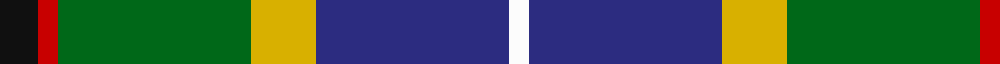

In pattern [KRGYBW](/patterns/krgybw/).

This was sourced from register-of-tartans.  It is a [6 stripes tartan](/stripes/stripes6/).

Original link https://www.tartanregister.gov.uk/tartanDetails.aspx?ref=4164

## Attestations

This cloth appears in 2 source records; the oldest owns this page.

- 01/01/1996 — Turnbull of Thornton (Personal) (register-of-tartans, [record](https://www.tartanregister.gov.uk/tartanDetails.aspx?ref=4164))
- 1996 — Turnbull of Thornton (Personal) (tartans-authority, [record](http://www.tartansauthority.com/tartan-ferret/display/5087/))

## Thread count
K/12 R6 G60 Y20 DB60 W/6

## Palette
Each colour and its ΔE from the base-6 reference it is a variant of.

| Colour | Shade | Base | ΔE (OKLab) |
|---|---|---|---|
| DB | <code style="background-color:#2C2C80;">#2C2C80</code> `#2C2C80` | B <code style="background-color:#2A418A;">#2A418A</code> | 0.06 |
| G | <code style="background-color:#006818;">#006818</code> `#006818` | G <code style="background-color:#006100;">#006100</code> | 0.02 |
| K | <code style="background-color:#101010;">#101010</code> `#101010` | K <code style="background-color:#000000;">#000000</code> | 0.17 |
| R | <code style="background-color:#C80000;">#C80000</code> `#C80000` | R <code style="background-color:#CC0000;">#CC0000</code> | 0.01 |
| W | <code style="background-color:#FCFCFC;">#FCFCFC</code> `#FCFCFC` | W <code style="background-color:#F7F7F7;">#F7F7F7</code> | 0.01 |
| Y | <code style="background-color:#D8B000;">#D8B000</code> `#D8B000` | Y <code style="background-color:#F2BF00;">#F2BF00</code> | 0.06 |

# Sample pattern

## Nearest tartans

The nearest existing variants by ΔTartan distance.

1. [Carleton College Rugby](/setts/s6/r5b30w3g15y8ra4x2~b003c64-g004c00-rb07430-rac80000-wf8f8f8-yfccc00/) — ΔT 0.84
1. [Sirens & Swords](/setts/s6/b36g20ga6w12k6r3x2~b0c4252-g789484-ga003c14-k1c1714-r960028-wffffff/) — ΔT 0.84
1. [Ayrshire (District)](/setts/s8/b2r1b10w1g4ga8y1ga2x4~b1c0070-g785000-ga30ac38-r880000-we0e0e0-ybc8c00/) — ΔT 0.87
1. [Morris of Eddergoll (Personal)](/setts/s6/w2b20r3k10g20y2x2~b1c0070-g006818-k101010-rc80000-wf8f8f8-yd09800/) — ΔT 0.88
1. [Council of Scottish Clans & Ass. (Co](/setts/s7/w2r2b16k14g15r2y2x2~b2c2c80-g289c18-k101010-rc80000-wfcfcfc-yfccc00/) — ΔT 0.94
1. [McCuaig (2010) (Name)](/setts/s9/k10y3k2b20k10g15k2r3w3x2~b1474b4-g006818-k101010-rc8002c-we0e0e0-ye8c000/) — ΔT 0.95
1. [Green MacLeod](/setts/s7/y4k2b20k10g15k2r3x2~b1474b4-g006818-k101010-rc80000-ye8c000/) — ΔT 0.98
1. [Crofters (Corporate?)](/setts/s7/b20r2g9w6y4k2g8x2~b2c2c80-g009420-k101010-rc80000-wf8f8f8-ye8c000/) — ΔT 1.00
1. [Macneil of Barra - Chief (Personal)](/setts/s7/w1r2b16k14g15k3y1x2~b1474b4-g006818-k101010-rc80000-wfcfcfc-ye8c000/) — ΔT 1.00
1. [Souza Nery](/setts/s7/y4g22r3k17r3b37w3x2~b304080-g008000-k000000-rc00020-we0e0e0-yf0c000/) — ΔT 1.01

## Neighbour map

Every grey dot is one of 15726 variants placed by the first two principal components of the ΔTartan feature space (44% of its variance). Red is this tartan; blue dots are its nearest — click one to open its page.

<svg viewBox="0 0 640 380" role="img" style="max-width:100%;height:auto;border:1px solid #e0e0e0;border-radius:4px;display:block" xmlns="http://www.w3.org/2000/svg"><image href="/nn/cloud.v1.png" width="640" height="380"/><a href="/setts/s6/r5b30w3g15y8ra4x2~b003c64-g004c00-rb07430-rac80000-wf8f8f8-yfccc00/"><circle cx="169.0" cy="167.5" r="4" fill="#3465a4"><title>Carleton College Rugby</title></circle></a><a href="/setts/s6/b36g20ga6w12k6r3x2~b0c4252-g789484-ga003c14-k1c1714-r960028-wffffff/"><circle cx="151.0" cy="162.1" r="4" fill="#3465a4"><title>Sirens &amp; Swords</title></circle></a><a href="/setts/s8/b2r1b10w1g4ga8y1ga2x4~b1c0070-g785000-ga30ac38-r880000-we0e0e0-ybc8c00/"><circle cx="149.3" cy="152.6" r="4" fill="#3465a4"><title>Ayrshire (District)</title></circle></a><a href="/setts/s6/w2b20r3k10g20y2x2~b1c0070-g006818-k101010-rc80000-wf8f8f8-yd09800/"><circle cx="135.2" cy="178.7" r="4" fill="#3465a4"><title>Morris of Eddergoll (Personal)</title></circle></a><a href="/setts/s7/w2r2b16k14g15r2y2x2~b2c2c80-g289c18-k101010-rc80000-wfcfcfc-yfccc00/"><circle cx="81.0" cy="166.2" r="4" fill="#3465a4"><title>Council of Scottish Clans &amp; Ass. (Co</title></circle></a><a href="/setts/s9/k10y3k2b20k10g15k2r3w3x2~b1474b4-g006818-k101010-rc8002c-we0e0e0-ye8c000/"><circle cx="111.6" cy="156.9" r="4" fill="#3465a4"><title>McCuaig (2010) (Name)</title></circle></a><a href="/setts/s7/y4k2b20k10g15k2r3x2~b1474b4-g006818-k101010-rc80000-ye8c000/"><circle cx="144.8" cy="185.8" r="4" fill="#3465a4"><title>Green MacLeod</title></circle></a><a href="/setts/s7/b20r2g9w6y4k2g8x2~b2c2c80-g009420-k101010-rc80000-wf8f8f8-ye8c000/"><circle cx="119.0" cy="160.1" r="4" fill="#3465a4"><title>Crofters (Corporate?)</title></circle></a><a href="/setts/s7/w1r2b16k14g15k3y1x2~b1474b4-g006818-k101010-rc80000-wfcfcfc-ye8c000/"><circle cx="148.5" cy="152.2" r="4" fill="#3465a4"><title>Macneil of Barra - Chief (Personal)</title></circle></a><a href="/setts/s7/y4g22r3k17r3b37w3x2~b304080-g008000-k000000-rc00020-we0e0e0-yf0c000/"><circle cx="153.4" cy="146.4" r="4" fill="#3465a4"><title>Souza Nery</title></circle></a><circle cx="140.5" cy="171.2" r="5" fill="#c00000"/></svg>

ID: /setts/s6/k6r3g30y10b30w3x2~b2c2c80-g006818-k101010-rc80000-wfcfcfc-yd8b000/
