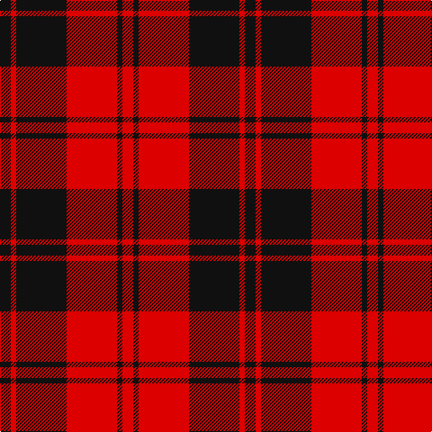

In pattern [KRKRKR](/patterns/krkrkr/).

This was sourced from register-of-tartans.  It is a [6 stripes tartan](/stripes/stripes6/).

Original link https://www.tartanregister.gov.uk/tartanDetails.aspx?ref=1120

## Thread count
K/12 R6 K56 R56 K6 R/12

## Palette
Each colour and its ΔE from the base-6 reference it is a variant of.

| Colour | Shade | Base | ΔE (OKLab) |
|---|---|---|---|
| K | <code style="background-color:#101010;">#101010</code> `#101010` | K <code style="background-color:#000000;">#000000</code> | 0.17 |
| R | <code style="background-color:#DC0000;">#DC0000</code> `#DC0000` | R <code style="background-color:#CC0000;">#CC0000</code> | 0.03 |

# Sample pattern

## Nearest tartans

The nearest existing variants by ΔTartan distance.

1. [Erskine, Black & Red (Clan)](/setts/s6/k6r3k28r28k3r6~k101010-rc80000~x2/) — ΔT 0.40
1. [Erskine (Paton)](/setts/s6/k31r4k47r47k4r31~k101010-rdc0000~x2/) — ΔT 0.99
1. [Monmouth College](/setts/s6/k4r33k24w3k4r3~k101010-rc80000-we0e0e0~x2/) — ΔT 1.03
1. [MacLeod Black & Red](/setts/s5/r8k1r8k12r1~k101010-rdc0000~x2/) — ΔT 1.05
1. [Swanstrom (Personal)](/setts/s6/k8r1k8r11y1r1~k101010-rc80000-ye8c000~x4/) — ΔT 1.09
1. [Erskine](/setts/s6/k6r3k28r28k3r6~k000000-rc00000~x2/) — ΔT 1.11
1. [Brodie (Clan)](/setts/s6/k3r15k11y2k4r3~k101010-rc80000-ye8c000~x2/) — ΔT 1.16
1. [MacLeod of Raasay Clan Tartan Tartan Number: 1172. Earliest known date: c.1815-20 The thread count given is from the Provost MacBean Collection sample, which is very similar to to the sample in the collection of the Highland Society of London: K2 R18 K12 R2 K16. The design seems likely to be derived from the Vestiarium Scoticum, and would therefore be later than 1829. See products available Copyright © Blair Urquhart, Comrie, 2015](/setts/s5/k6r1k6r9k1~k101010-rc80000~x4/) — ΔT 1.22
1. [Campbell of Armaddie](/setts/s5/r4k1r12k12r2~k000000-rc80000~x2/) — ΔT 1.23
1. [Brodie (Clan)](/setts/s6/k2r16k8y1k8r2~k101010-rc80000-yd8b000~x4/) — ΔT 1.24

## Neighbour map

Every grey dot is one of 15726 variants placed by the first two principal components of the ΔTartan feature space (44% of its variance). Red is this tartan; blue dots are its nearest — click one to open its page.

<svg viewBox="0 0 640 380" role="img" style="max-width:100%;height:auto;border:1px solid #e0e0e0;border-radius:4px;display:block" xmlns="http://www.w3.org/2000/svg"><image href="/nn/cloud.v1.png" width="640" height="380"/><a href="/setts/s6/k6r3k28r28k3r6~k101010-rc80000~x2/"><circle cx="361.0" cy="237.8" r="4" fill="#3465a4"><title>Erskine, Black &amp; Red (Clan)</title></circle></a><a href="/setts/s6/k31r4k47r47k4r31~k101010-rdc0000~x2/"><circle cx="338.2" cy="247.1" r="4" fill="#3465a4"><title>Erskine (Paton)</title></circle></a><a href="/setts/s6/k4r33k24w3k4r3~k101010-rc80000-we0e0e0~x2/"><circle cx="334.8" cy="200.0" r="4" fill="#3465a4"><title>Monmouth College</title></circle></a><a href="/setts/s5/r8k1r8k12r1~k101010-rdc0000~x2/"><circle cx="376.4" cy="244.8" r="4" fill="#3465a4"><title>MacLeod Black &amp; Red</title></circle></a><a href="/setts/s6/k8r1k8r11y1r1~k101010-rc80000-ye8c000~x4/"><circle cx="335.7" cy="220.5" r="4" fill="#3465a4"><title>Swanstrom (Personal)</title></circle></a><a href="/setts/s6/k6r3k28r28k3r6~k000000-rc00000~x2/"><circle cx="340.0" cy="234.7" r="4" fill="#3465a4"><title>Erskine</title></circle></a><a href="/setts/s6/k3r15k11y2k4r3~k101010-rc80000-ye8c000~x2/"><circle cx="287.2" cy="233.7" r="4" fill="#3465a4"><title>Brodie (Clan)</title></circle></a><a href="/setts/s5/k6r1k6r9k1~k101010-rc80000~x4/"><circle cx="368.0" cy="270.1" r="4" fill="#3465a4"><title>MacLeod of Raasay Clan Tartan Tartan Number: 1172. Earliest known date: c.1815-20 The thread count given is from the Provost MacBean Collection sample, which is very similar to to the sample in the collection of the Highland Society of London: K2 R18 K12 R2 K16. The design seems likely to be derived from the Vestiarium Scoticum, and would therefore be later than 1829. See products available Copyright © Blair Urquhart, Comrie, 2015</title></circle></a><a href="/setts/s5/r4k1r12k12r2~k000000-rc80000~x2/"><circle cx="373.5" cy="239.6" r="4" fill="#3465a4"><title>Campbell of Armaddie</title></circle></a><a href="/setts/s6/k2r16k8y1k8r2~k101010-rc80000-yd8b000~x4/"><circle cx="340.6" cy="204.2" r="4" fill="#3465a4"><title>Brodie (Clan)</title></circle></a><circle cx="352.0" cy="232.3" r="5" fill="#c00000"/></svg>

ID: /setts/s6/k6r3k28r28k3r6~k101010-rdc0000~x2/
