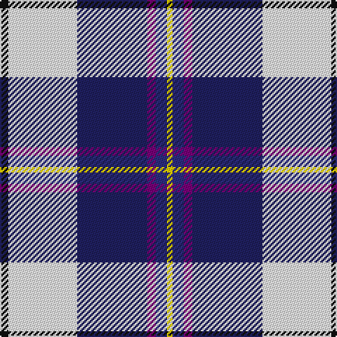

In pattern [KWBBBY](/stripes/kwbbby/).

This was sourced from tartans-authority.  It is a [6 stripe tartan](/stripes/stripes6/).

Original link http://www.tartansauthority.com/tartan-ferret/display/11200/

## Thread count
K/6 W49 DBa50 P6 DB8 Y/4

## Palette
Each colour and the base-6 reference it is a variant of.

| Colour | Shade | Base |
|---|---|---|
| DB | <code style="background-color:#2C2C80;">#2C2C80</code> `oklch(35.0% 0.138 276.6)` <small>#2C2C80</small> | B <code style="background-color:#2A418A;">#2A418A</code> |
| DBa | <code style="background-color:#202060;">#202060</code> `oklch(28.9% 0.111 276.9)` <small>#202060</small> | B <code style="background-color:#2A418A;">#2A418A</code> |
| K | <code style="background-color:#101010;">#101010</code> `oklch(17.3% 0.000 89.9)` <small>#101010</small> | K <code style="background-color:#000000;">#000000</code> |
| P | <code style="background-color:#780078;">#780078</code> `oklch(40.2% 0.185 328.4)` <small>#780078</small> | B <code style="background-color:#2A418A;">#2A418A</code> |
| W | <code style="background-color:#FCFCFC;">#FCFCFC</code> `oklch(99.1% 0.000 89.9)` <small>#FCFCFC</small> | W <code style="background-color:#F7F7F7;">#F7F7F7</code> |
| Y | <code style="background-color:#FCCC00;">#FCCC00</code> `oklch(86.2% 0.176 91.5)` <small>#FCCC00</small> | Y <code style="background-color:#F2BF00;">#F2BF00</code> |

# Sample pattern

## Nearest tartans

The nearest existing variants by ΔTartan distance.

1. [Pipers' Trail Dance, The](/setts/s6/k6w49dt50dp6t8lo4/) — ΔT 0.68
1. [Dignan](/setts/s7/ly2r1t16k5p2w11p1~x4/) — ΔT 0.86
1. [Christian Dress (Personal)](/setts/s7/r3w2db27k19w27dp2ly3~x2/) — ΔT 0.88
1. [Davidson (Wedding) (Personal)](/setts/s7/r2db14k6g1w12g1w2~x4/) — ΔT 1.07
1. [Manx Dress](/setts/s6/g4w28dp8ly2db17g4~x2/) — ΔT 1.22
1. [Edgar-Feyen (Personal)](/setts/s6/w18k1db4g4dp10lo2~x4/) — ΔT 1.25
1. [Dignan School of Dancing](/setts/s7/lo4r2b32k10dp4lb21dp2~x2/) — ΔT 1.28
1. [Minnesota Dress](/setts/s9/dp4k2w3k2db30g9k4w20ly3~x2/) — ΔT 1.29
1. [Madras College (Corporate)](/setts/s7/r3dt25k6lb20ly2lb2w3~x2/) — ΔT 1.32
1. [Sinclair Dress (Dance)](/setts/s7/db4r2db31k10g4w21g2~x2/) — ΔT 1.34

## Neighbour map

Every grey dot is one of 14299 variants placed by the first two principal components of the ΔTartan feature space (44% of its variance). Red is this tartan; blue dots are its nearest — click one to open its page.

<svg viewBox="0 0 640 380" role="img" style="max-width:100%;height:auto;border:1px solid #e0e0e0;border-radius:4px;display:block" xmlns="http://www.w3.org/2000/svg"><image href="/nn/cloud.v1.png" width="640" height="380"/><a href="/setts/s6/k6w49dt50dp6t8lo4/"><circle cx="158.6" cy="130.5" r="4" fill="#3465a4"><title>Pipers' Trail Dance, The</title></circle></a><a href="/setts/s7/ly2r1t16k5p2w11p1~x4/"><circle cx="159.9" cy="115.8" r="4" fill="#3465a4"><title>Dignan</title></circle></a><a href="/setts/s7/r3w2db27k19w27dp2ly3~x2/"><circle cx="119.5" cy="124.1" r="4" fill="#3465a4"><title>Christian Dress (Personal)</title></circle></a><a href="/setts/s7/r2db14k6g1w12g1w2~x4/"><circle cx="149.4" cy="138.7" r="4" fill="#3465a4"><title>Davidson (Wedding) (Personal)</title></circle></a><a href="/setts/s6/g4w28dp8ly2db17g4~x2/"><circle cx="181.6" cy="150.5" r="4" fill="#3465a4"><title>Manx Dress</title></circle></a><a href="/setts/s6/w18k1db4g4dp10lo2~x4/"><circle cx="184.6" cy="120.6" r="4" fill="#3465a4"><title>Edgar-Feyen (Personal)</title></circle></a><a href="/setts/s7/lo4r2b32k10dp4lb21dp2~x2/"><circle cx="178.3" cy="128.5" r="4" fill="#3465a4"><title>Dignan School of Dancing</title></circle></a><a href="/setts/s9/dp4k2w3k2db30g9k4w20ly3~x2/"><circle cx="142.7" cy="105.8" r="4" fill="#3465a4"><title>Minnesota Dress</title></circle></a><a href="/setts/s7/r3dt25k6lb20ly2lb2w3~x2/"><circle cx="172.0" cy="140.0" r="4" fill="#3465a4"><title>Madras College (Corporate)</title></circle></a><a href="/setts/s7/db4r2db31k10g4w21g2~x2/"><circle cx="213.9" cy="143.1" r="4" fill="#3465a4"><title>Sinclair Dress (Dance)</title></circle></a><circle cx="159.2" cy="128.4" r="5" fill="#c00000"/></svg>

ID: /setts/s6/k6w49db50dp6db8ly4/
