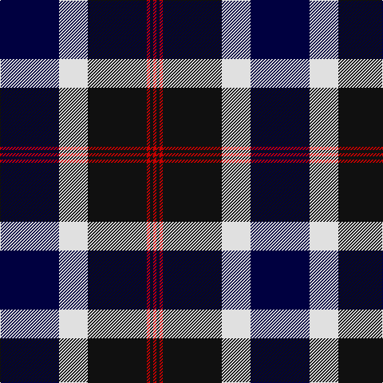

In pattern [KWKRKR](/patterns/kwkrkr/).

This was sourced from tartans-authority.  It is a [6 stripes tartan](/stripes/stripes6/).

Original link http://www.tartansauthority.com/tartan-ferret/display/6151/

## Thread count
DB/74 LN36 K74 R4 K4 R/4

## Palette
Each colour and its ΔE from the base-6 reference it is a variant of.

| Colour | Shade | Base | ΔE (OKLab) |
|---|---|---|---|
| DB | <code style="background-color:#000040;">#000040</code> `#000040` | K <code style="background-color:#000000;">#000000</code> | 0.20 |
| K | <code style="background-color:#101010;">#101010</code> `#101010` | K <code style="background-color:#000000;">#000000</code> | 0.17 |
| LN | <code style="background-color:#E0E0E0;">#E0E0E0</code> `#E0E0E0` | W <code style="background-color:#F4F4F0;">#F4F4F0</code> | 0.06 |
| R | <code style="background-color:#C80000;">#C80000</code> `#C80000` | R <code style="background-color:#C80000;">#C80000</code> | 0.00 |

# Sample pattern

## Nearest tartans

The nearest existing variants by ΔTartan distance.

1. [Meoni (Personal)](/setts/s7/b2g2b36g24k36r2k2-b2c2c80-g006818-k000000-rc80000/) — ΔT 1.16
1. [Kelvingrove (Fashion)](/setts/s8/k64b4k4b4k4b36r72b4-b0000c4-k000000-r90784c/) — ΔT 1.18
1. [Scottish Knights Templar, of M.T.S. International](/setts/s9/r6b40k12w10k8w6k4r2b4-b304080-k000000-rc00000-we0e0e0/) — ΔT 1.28
1. [Kilbranan Sound (Personal)](/setts/s8/b16r22b56r8k34ba2k14r4-b005480-ba8c6088-k000000-ra00028/) — ΔT 1.29
1. [Blair](/setts/s7/b8r2b36k40g36r2g8-b2c2c80-g006818-k000000-rc80000/) — ΔT 1.33
1. [Callaway](/setts/s6/r4k56g10w24g28r4-g808080-k000000-rc00000-we0e0e0/) — ΔT 1.34
1. [MacKean (Personal)](/setts/s7/r16k36r12k36b54k4w6-b1474b4-k101010-rc80000-wfcfcfc/) — ΔT 1.36
1. [Nery](/setts/s7/y12g56r8k40r6b90k10-b00008c-g007800-k000000-r8c0000-yc88c00/) — ΔT 1.36
1. [Hebridean Old](/setts/s9/b4k4b36ba2k26ba2g32b6k4-b304080-ba8080d0-g008000-k000000/) — ΔT 1.39
1. [Hakkarain (Personal)](/setts/s10/k74w36ka74r4ka4r4ka4r4ka74w36-k000040-ka101010-rc80000-we0e0e0/) — ΔT 1.39

## Neighbour map

Every grey dot is one of 15726 variants placed by the first two principal components of the ΔTartan feature space (44% of its variance). Red is this tartan; blue dots are its nearest — click one to open its page.

<svg viewBox="0 0 640 380" role="img" style="max-width:100%;height:auto;border:1px solid #e0e0e0;border-radius:4px;display:block" xmlns="http://www.w3.org/2000/svg"><image href="/nn/cloud.v1.png" width="640" height="380"/><a href="/setts/s7/b2g2b36g24k36r2k2-b2c2c80-g006818-k000000-rc80000/"><circle cx="227.0" cy="174.9" r="4" fill="#3465a4"><title>Meoni (Personal)</title></circle></a><a href="/setts/s8/k64b4k4b4k4b36r72b4-b0000c4-k000000-r90784c/"><circle cx="235.8" cy="163.7" r="4" fill="#3465a4"><title>Kelvingrove (Fashion)</title></circle></a><a href="/setts/s9/r6b40k12w10k8w6k4r2b4-b304080-k000000-rc00000-we0e0e0/"><circle cx="240.5" cy="136.2" r="4" fill="#3465a4"><title>Scottish Knights Templar, of M.T.S. International</title></circle></a><a href="/setts/s8/b16r22b56r8k34ba2k14r4-b005480-ba8c6088-k000000-ra00028/"><circle cx="270.5" cy="159.7" r="4" fill="#3465a4"><title>Kilbranan Sound (Personal)</title></circle></a><a href="/setts/s7/b8r2b36k40g36r2g8-b2c2c80-g006818-k000000-rc80000/"><circle cx="200.4" cy="182.0" r="4" fill="#3465a4"><title>Blair</title></circle></a><a href="/setts/s6/r4k56g10w24g28r4-g808080-k000000-rc00000-we0e0e0/"><circle cx="202.7" cy="176.9" r="4" fill="#3465a4"><title>Callaway</title></circle></a><a href="/setts/s7/r16k36r12k36b54k4w6-b1474b4-k101010-rc80000-wfcfcfc/"><circle cx="227.8" cy="194.2" r="4" fill="#3465a4"><title>MacKean (Personal)</title></circle></a><a href="/setts/s7/y12g56r8k40r6b90k10-b00008c-g007800-k000000-r8c0000-yc88c00/"><circle cx="177.8" cy="165.4" r="4" fill="#3465a4"><title>Nery</title></circle></a><a href="/setts/s9/b4k4b36ba2k26ba2g32b6k4-b304080-ba8080d0-g008000-k000000/"><circle cx="215.3" cy="158.1" r="4" fill="#3465a4"><title>Hebridean Old</title></circle></a><a href="/setts/s10/k74w36ka74r4ka4r4ka4r4ka74w36-k000040-ka101010-rc80000-we0e0e0/"><circle cx="243.1" cy="145.4" r="4" fill="#3465a4"><title>Hakkarain (Personal)</title></circle></a><circle cx="219.3" cy="171.5" r="5" fill="#c00000"/></svg>

ID: /setts/s6/k74w36ka74r4ka4r4-k000040-ka101010-rc80000-we0e0e0/
