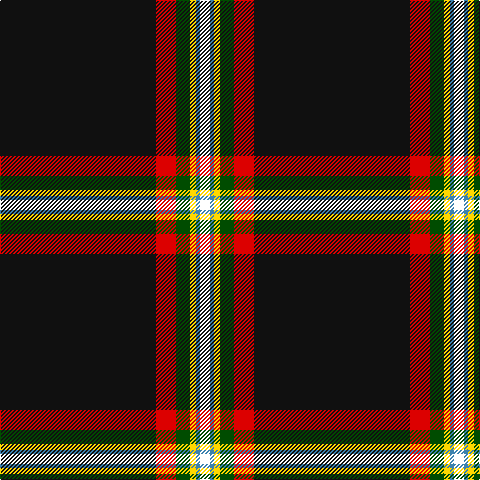

This page is one **sett** — a single exact thread-count. It belongs to the [tartan](/tartans/k78r10dg7ly3t2w5/)
(the same proportion at any scale), whose colour order is pattern [KRGYBW](/stripes/krgybw/).

Sourced from register-of-tartans.  It is a [6 stripe tartan](/stripes/stripes6/).

Original link https://www.tartanregister.gov.uk/tartanDetails.aspx?ref=10881

## Register references

External register numbers recorded for this tartan.

- Scottish Register of Tartans: [10881](https://www.tartanregister.gov.uk/tartanDetails.aspx?ref=10881)

## Thread count
K/156 R20 G14 Y6 B4 W/10

## Palette

Palette: <strong>Tartan Register</strong>
<table><thead><tr><th>Colour</th><th>Threads</th><th>Shade</th><th>Base</th><th>OKLCh</th></tr></thead><tbody><tr><td>K/</td><td style="text-align:right;font-variant-numeric:tabular-nums">156</td><td><code style="background-color:#101010;">#101010</code> <small style="color:#888">#101010</small></td><td>K <code style="background-color:#000000;">#000000</code></td><td><small style="color:#888">oklch(17.3% 0.000 89.9)</small></td></tr><tr><td>R</td><td style="text-align:right;font-variant-numeric:tabular-nums">20</td><td><code style="background-color:#DC0000;">#DC0000</code> <small style="color:#888">#DC0000</small></td><td>R <code style="background-color:#CC0000;">#CC0000</code></td><td><small style="color:#888">oklch(56.2% 0.230 29.2)</small></td></tr><tr><td>G</td><td style="text-align:right;font-variant-numeric:tabular-nums">14</td><td><code style="background-color:#004C00;">#004C00</code> <small style="color:#888">#004C00</small></td><td>G <code style="background-color:#006100;">#006100</code></td><td><small style="color:#888">oklch(36.1% 0.123 142.5)</small></td></tr><tr><td>Y</td><td style="text-align:right;font-variant-numeric:tabular-nums">6</td><td><code style="background-color:#FFD700;">#FFD700</code> <small style="color:#888">#FFD700</small></td><td>Y <code style="background-color:#F2BF00;">#F2BF00</code></td><td><small style="color:#888">oklch(88.7% 0.182 95.3)</small></td></tr><tr><td>B</td><td style="text-align:right;font-variant-numeric:tabular-nums">4</td><td><code style="background-color:#3C82AF;">#3C82AF</code> <small style="color:#888">#3C82AF</small></td><td>B <code style="background-color:#2A418A;">#2A418A</code></td><td><small style="color:#888">oklch(58.1% 0.099 239.8)</small></td></tr><tr><td>W/</td><td style="text-align:right;font-variant-numeric:tabular-nums">10</td><td><code style="background-color:#FFFFFF;">#FFFFFF</code> <small style="color:#888">#FFFFFF</small></td><td>W <code style="background-color:#F7F7F7;">#F7F7F7</code></td><td><small style="color:#888">oklch(100.0% 0.000 89.9)</small></td></tr></tbody></table>

# Sample pattern

## Nearest tartans

The nearest existing variants by ΔTartan distance, with this tartan at the top so the swatches line up against it.

ΔTartan

Tartan

Sett

—

<a href="/ttd/edit/#slug=k78r10dg7ly3t2w5~x2">Charlotte Fire Department</a> <a class="nn-out" href="/setts/s6/k78r10dg7ly3t2w5~x2/" title="open its dictionary page">↗</a>

0.17

<a href="/ttd/edit/#slug=k75r10g7ly3db2w5~x2">Charlotte Fire Department</a> <a class="nn-out" href="/setts/s6/k75r10g7ly3db2w5~x2/" title="open its dictionary page">↗</a>

0.82

<a href="/ttd/edit/#slug=k49r1lp4db5dg5ly5~x2">CREATeGlasgow</a> <a class="nn-out" href="/setts/s6/k49r1lp4db5dg5ly5~x2/" title="open its dictionary page">↗</a>

1.28

<a href="/ttd/edit/#slug=lb6k6lb6b3w1k39lo3k3~x2">Washington County Sheriff's Office</a> <a class="nn-out" href="/setts/s8/lb6k6lb6b3w1k39lo3k3~x2/" title="open its dictionary page">↗</a>

1.30

<a href="/ttd/edit/#slug=t6k6t6db3w1k39ly3k3~x2">Washington County Sheriff’s Office (Oregon)</a> <a class="nn-out" href="/setts/s8/t6k6t6db3w1k39ly3k3~x2/" title="open its dictionary page">↗</a>

1.47

<a href="/ttd/edit/#slug=r2g2k20w1db1~x6">Fily, Sylvain Roger</a> <a class="nn-out" href="/setts/s5/r2g2k20w1db1~x6/" title="open its dictionary page">↗</a>

1.53

<a href="/ttd/edit/#slug=dy3k48dy5w3dy3g2gi5lb3~x2">Pavelka Ltd</a> <a class="nn-out" href="/setts/s8/dy3k48dy5w3dy3g2gi5lb3~x2/" title="open its dictionary page">↗</a>

1.61

<a href="/ttd/edit/#slug=r5k1w3k6n5k2ly3k45n4k2ly3~x2">Williams Dress (Personal)</a> <a class="nn-out" href="/setts/s11/r5k1w3k6n5k2ly3k45n4k2ly3~x2/" title="open its dictionary page">↗</a>

1.67

<a href="/ttd/edit/#slug=w2do3g5k50g4do3w2t3k2ly2~x2">Hawes (2014)</a> <a class="nn-out" href="/setts/s10/w2do3g5k50g4do3w2t3k2ly2~x2/" title="open its dictionary page">↗</a>

1.68

<a href="/ttd/edit/#slug=w2do3g5k50g4do3w2db3k2ly2~x2">Hawks (2014)</a> <a class="nn-out" href="/setts/s10/w2do3g5k50g4do3w2db3k2ly2~x2/" title="open its dictionary page">↗</a>

1.69

<a href="/setts/s10/k45dt2ri2r2ly1w1~x2/">MacHattie Family Tartan Tartan Number: 5917. Earliest known date: 2003 A tartan for the McHattie family of Aberdeen See products available Copyright © Blair Urquhart, Comrie, 2015</a>

## Neighbour map

Every grey dot is one of 14359 variants placed by the first two principal components of the ΔTartan feature space (44% of its variance). Red is this tartan; blue dots are its nearest — click one to open its page.

<svg viewBox="0 0 640 380" role="img" style="max-width:100%;height:auto;border:1px solid #e0e0e0;border-radius:4px;display:block" xmlns="http://www.w3.org/2000/svg"><image href="/nn/cloud.v1.png" width="640" height="380"/><a href="/setts/s6/k75r10g7ly3db2w5~x2/"><circle cx="454.5" cy="97.1" r="4" fill="#3465a4"><title>Charlotte Fire Department</title></circle></a><a href="/setts/s6/k49r1lp4db5dg5ly5~x2/"><circle cx="432.9" cy="90.5" r="4" fill="#3465a4"><title>CREATeGlasgow</title></circle></a><a href="/setts/s8/lb6k6lb6b3w1k39lo3k3~x2/"><circle cx="437.2" cy="99.3" r="4" fill="#3465a4"><title>Washington County Sheriff's Office</title></circle></a><a href="/setts/s8/t6k6t6db3w1k39ly3k3~x2/"><circle cx="446.4" cy="105.8" r="4" fill="#3465a4"><title>Washington County Sheriff’s Office (Oregon)</title></circle></a><a href="/setts/s5/r2g2k20w1db1~x6/"><circle cx="475.6" cy="150.3" r="4" fill="#3465a4"><title>Fily, Sylvain Roger</title></circle></a><a href="/setts/s8/dy3k48dy5w3dy3g2gi5lb3~x2/"><circle cx="386.8" cy="98.3" r="4" fill="#3465a4"><title>Pavelka Ltd</title></circle></a><a href="/setts/s11/r5k1w3k6n5k2ly3k45n4k2ly3~x2/"><circle cx="444.6" cy="69.1" r="4" fill="#3465a4"><title>Williams Dress (Personal)</title></circle></a><a href="/setts/s10/w2do3g5k50g4do3w2t3k2ly2~x2/"><circle cx="396.8" cy="77.1" r="4" fill="#3465a4"><title>Hawes (2014)</title></circle></a><a href="/setts/s10/w2do3g5k50g4do3w2db3k2ly2~x2/"><circle cx="405.4" cy="81.8" r="4" fill="#3465a4"><title>Hawks (2014)</title></circle></a><a href="/setts/s10/k45dt2ri2r2ly1w1~x2/"><circle cx="510.6" cy="60.5" r="4" fill="#3465a4"><title>MacHattie Family Tartan Tartan Number: 5917. Earliest known date: 2003 A tartan for the McHattie family of Aberdeen See products available Copyright © Blair Urquhart, Comrie, 2015</title></circle></a><circle cx="460.1" cy="93.6" r="5" fill="#c00000"/></svg>

ID: /setts/s6/k78r10dg7ly3t2w5~x2/
