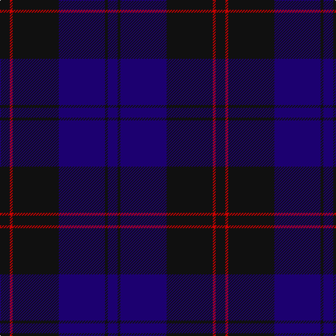

This page is one **sett** — a single exact thread-count. It belongs to the [tartan](/tartans/k7r2k33db33k2db7/)
(the same proportion at any scale), whose colour order is pattern [BKBKRK](/stripes/bkbkrk/).

Sourced from tartans-authority.  It is a [6 stripe tartan](/stripes/stripes6/).

Original link http://www.tartansauthority.com/tartan-ferret/display/8060/

## Thread count
K/14 R4 K66 DB66 K4 DB/14

## Palette

Palette: <strong>Tartan Register</strong>
<table><thead><tr><th>Colour</th><th>Threads</th><th>Shade</th><th>Base</th><th>OKLCh</th></tr></thead><tbody><tr><td>K/</td><td style="text-align:right;font-variant-numeric:tabular-nums">14</td><td><code style="background-color:#101010;">#101010</code> <small style="color:#888">#101010</small></td><td>K <code style="background-color:#000000;">#000000</code></td><td><small style="color:#888">oklch(17.3% 0.000 89.9)</small></td></tr><tr><td>R</td><td style="text-align:right;font-variant-numeric:tabular-nums">4</td><td><code style="background-color:#C80000;">#C80000</code> <small style="color:#888">#C80000</small></td><td>R <code style="background-color:#CC0000;">#CC0000</code></td><td><small style="color:#888">oklch(52.3% 0.215 29.2)</small></td></tr><tr><td>K</td><td style="text-align:right;font-variant-numeric:tabular-nums">66</td><td><code style="background-color:#101010;">#101010</code> <small style="color:#888">#101010</small></td><td>K <code style="background-color:#000000;">#000000</code></td><td><small style="color:#888">oklch(17.3% 0.000 89.9)</small></td></tr><tr><td>DB</td><td style="text-align:right;font-variant-numeric:tabular-nums">66</td><td><code style="background-color:#1C0070;">#1C0070</code> <small style="color:#888">#1C0070</small></td><td>B <code style="background-color:#2A418A;">#2A418A</code></td><td><small style="color:#888">oklch(26.3% 0.162 277.1)</small></td></tr><tr><td>K</td><td style="text-align:right;font-variant-numeric:tabular-nums">4</td><td><code style="background-color:#101010;">#101010</code> <small style="color:#888">#101010</small></td><td>K <code style="background-color:#000000;">#000000</code></td><td><small style="color:#888">oklch(17.3% 0.000 89.9)</small></td></tr><tr><td>DB/</td><td style="text-align:right;font-variant-numeric:tabular-nums">14</td><td><code style="background-color:#1C0070;">#1C0070</code> <small style="color:#888">#1C0070</small></td><td>B <code style="background-color:#2A418A;">#2A418A</code></td><td><small style="color:#888">oklch(26.3% 0.162 277.1)</small></td></tr></tbody></table>

# Sample pattern

## Nearest tartans

The nearest existing variants by ΔTartan distance, with this tartan at the top so the swatches line up against it.

ΔTartan

Tartan

Sett

—

<a href="/ttd/edit/#slug=k7r2k33db33k2db7~x2">Casterton (Corporate)</a> <a class="nn-out" href="/setts/s6/k7r2k33db33k2db7~x2/" title="open its dictionary page">↗</a>

1.26

<a href="/ttd/edit/#slug=k30dt6k6dt41t2~x2">Williams (New York) (Personal)</a> <a class="nn-out" href="/setts/s5/k30dt6k6dt41t2~x2/" title="open its dictionary page">↗</a>

1.28

<a href="/ttd/edit/#slug=db8k39db8k39db87r6">Largan (?)</a> <a class="nn-out" href="/setts/s6/db8k39db8k39db87r6/" title="open its dictionary page">↗</a>

1.73

<a href="/ttd/edit/#slug=do14db14do14db40do3db2~x2">Atlin</a> <a class="nn-out" href="/setts/s6/do14db14do14db40do3db2~x2/" title="open its dictionary page">↗</a>

1.74

<a href="/ttd/edit/#slug=db19k4dr1k4dg9dr1~x4">Monarchs</a> <a class="nn-out" href="/setts/s6/db19k4dr1k4dg9dr1~x4/" title="open its dictionary page">↗</a>

1.76

<a href="/ttd/edit/#slug=k30db6k6db41lt2~x2">Williams (New York) (Personal)</a> <a class="nn-out" href="/setts/s5/k30db6k6db41lt2~x2/" title="open its dictionary page">↗</a>

1.78

<a href="/ttd/edit/#slug=db37r10dg22db11dg3r3~x2">Perthshire, New /Tourist Board</a> <a class="nn-out" href="/setts/s6/db37r10dg22db11dg3r3~x2/" title="open its dictionary page">↗</a>

1.81

<a href="/ttd/edit/#slug=k3db23k17r2~x2">Wellington Variation</a> <a class="nn-out" href="/setts/s4/k3db23k17r2~x2/" title="open its dictionary page">↗</a>

1.86

<a href="/ttd/edit/#slug=db80k28dp9k3m5k12~x2">Earl Blue Marl</a> <a class="nn-out" href="/setts/s6/db80k28dp9k3m5k12~x2/" title="open its dictionary page">↗</a>

1.86

<a href="/ttd/edit/#slug=db3k12db3k17db40k2db2w1~x2">Blue Spirit Fashion Tartan Tartan Number: 7001. Earliest known date: 01/08/2006 Designed by Kirsty Anderson of The House of Edgar for ACS Clothing of Glasgow. See products available Copyright © Blair Urquhart, Comrie, 2015</a> <a class="nn-out" href="/setts/s8/db3k12db3k17db40k2db2w1~x2/" title="open its dictionary page">↗</a>

1.87

<a href="/ttd/edit/#slug=k1db12k12g1k12db12g1~x4">Marchmont (Personal)</a> <a class="nn-out" href="/setts/s7/k1db12k12g1k12db12g1~x4/" title="open its dictionary page">↗</a>

## Neighbour map

Every grey dot is one of 14299 variants placed by the first two principal components of the ΔTartan feature space (44% of its variance). Red is this tartan; blue dots are its nearest — click one to open its page.

<svg viewBox="0 0 640 380" role="img" style="max-width:100%;height:auto;border:1px solid #e0e0e0;border-radius:4px;display:block" xmlns="http://www.w3.org/2000/svg"><image href="/nn/cloud.v1.png" width="640" height="380"/><a href="/setts/s5/k30dt6k6dt41t2~x2/"><circle cx="474.0" cy="270.6" r="4" fill="#3465a4"><title>Williams (New York) (Personal)</title></circle></a><a href="/setts/s6/db8k39db8k39db87r6/"><circle cx="429.9" cy="254.8" r="4" fill="#3465a4"><title>Largan (?)</title></circle></a><a href="/setts/s6/do14db14do14db40do3db2~x2/"><circle cx="552.3" cy="294.4" r="4" fill="#3465a4"><title>Atlin</title></circle></a><a href="/setts/s6/db19k4dr1k4dg9dr1~x4/"><circle cx="380.9" cy="232.6" r="4" fill="#3465a4"><title>Monarchs</title></circle></a><a href="/setts/s5/k30db6k6db41lt2~x2/"><circle cx="436.3" cy="253.4" r="4" fill="#3465a4"><title>Williams (New York) (Personal)</title></circle></a><a href="/setts/s6/db37r10dg22db11dg3r3~x2/"><circle cx="387.9" cy="265.7" r="4" fill="#3465a4"><title>Perthshire, New /Tourist Board</title></circle></a><a href="/setts/s4/k3db23k17r2~x2/"><circle cx="394.5" cy="285.2" r="4" fill="#3465a4"><title>Wellington Variation</title></circle></a><a href="/setts/s6/db80k28dp9k3m5k12~x2/"><circle cx="453.2" cy="200.6" r="4" fill="#3465a4"><title>Earl Blue Marl</title></circle></a><a href="/setts/s8/db3k12db3k17db40k2db2w1~x2/"><circle cx="537.3" cy="205.6" r="4" fill="#3465a4"><title>Blue Spirit Fashion Tartan Tartan Number: 7001. Earliest known date: 01/08/2006 Designed by Kirsty Anderson of The House of Edgar for ACS Clothing of Glasgow. See products available Copyright © Blair Urquhart, Comrie, 2015</title></circle></a><a href="/setts/s7/k1db12k12g1k12db12g1~x4/"><circle cx="366.9" cy="264.5" r="4" fill="#3465a4"><title>Marchmont (Personal)</title></circle></a><circle cx="452.0" cy="266.5" r="5" fill="#c00000"/></svg>

ID: /setts/s6/k7r2k33db33k2db7~x2/
