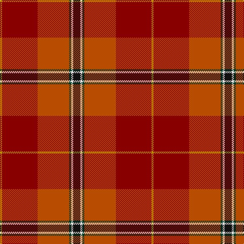

**Bands:** [KWGRRY](/stripes/kwgrry/) · **Stripes:** [K W DG O R LO](/stripes/stripes6/) K W DG O R LO

This was sourced from tartans-authority.  It is a [6 band tartan](/bands/bands6/).

Original link http://www.tartansauthority.com/tartan-ferret/display/10720/

## Thread count
DY/4 DR70 DO62 DG4 LN4 K/14

## Palette
Each colour and its ΔE from the base-6 reference it is a variant of.

| Colour | Shade | Base | ΔE (OKLab) |
|---|---|---|---|
| DG | <code style="background-color:#003820;">#003820</code> `#003820` | G <code style="background-color:#006100;">#006100</code> | 0.15 |
| DO | <code style="background-color:#B84C00;">#B84C00</code> `#B84C00` | R <code style="background-color:#CC0000;">#CC0000</code> | 0.08 |
| DR | <code style="background-color:#880000;">#880000</code> `#880000` | R <code style="background-color:#CC0000;">#CC0000</code> | 0.15 |
| DY | <code style="background-color:#BC8C00;">#BC8C00</code> `#BC8C00` | Y <code style="background-color:#F2BF00;">#F2BF00</code> | 0.16 |
| K | <code style="background-color:#101010;">#101010</code> `#101010` | K <code style="background-color:#000000;">#000000</code> | 0.17 |
| LN | <code style="background-color:#E0E0E0;">#E0E0E0</code> `#E0E0E0` | W <code style="background-color:#F7F7F7;">#F7F7F7</code> | 0.07 |

# Sample pattern

## Nearest tartans

The nearest existing variants by ΔTartan distance.

1. [Snelgrove (Name)](/setts/s7/k2g6dy4t1r18dy5lo1~x4/) — ΔT 0.80
1. [Mason, David Elsworth (Personal)](/setts/s6/k7w2dg2r31r35lo2~x2/) — ΔT 1.14
1. [Passchendaele (Commemorative)](/setts/s6/g3k3lo2r28o28r1~x2/) — ΔT 1.32
1. [Barbour - Cardinal Red](/setts/s7/r3ly2r18db8w1r18r2~x2/) — ΔT 1.41
1. [Flowers of the Forest, The](/setts/s9/o2r4r2db5lg3y13r20do2r2~x2/) — ΔT 1.50
1. [Spragg, Andrew](/setts/s7/r2dg16r1r2r12ly1y1~x2/) — ΔT 1.66
1. [Dundhuin](/setts/s6/lr6o5k2y18r28w2~x2/) — ΔT 1.67
1. [Roseate Sunrise](/setts/s6/r26r5m12ly1g1r3~x2/) — ΔT 1.71
1. [MacQueen of Dalmagarry (Clan?)](/setts/s8/g3r4k1r26y14r4dp16w2~x2/) — ΔT 1.71
1. [Gordon of Abergeldie (Portrait)](/setts/s6/r63w4k4dp18ly4dg50~x2/) — ΔT 1.73

## Neighbour map

Every grey dot is one of 14313 variants placed by the first two principal components of the ΔTartan feature space (44% of its variance). Red is this tartan; blue dots are its nearest — click one to open its page.

<svg viewBox="0 0 640 380" role="img" style="max-width:100%;height:auto;border:1px solid #e0e0e0;border-radius:4px;display:block" xmlns="http://www.w3.org/2000/svg"><image href="/nn/cloud.v1.png" width="640" height="380"/><a href="/setts/s7/k2g6dy4t1r18dy5lo1~x4/"><circle cx="288.6" cy="138.7" r="4" fill="#3465a4"><title>Snelgrove (Name)</title></circle></a><a href="/setts/s6/k7w2dg2r31r35lo2~x2/"><circle cx="282.0" cy="132.4" r="4" fill="#3465a4"><title>Mason, David Elsworth (Personal)</title></circle></a><a href="/setts/s6/g3k3lo2r28o28r1~x2/"><circle cx="346.5" cy="146.0" r="4" fill="#3465a4"><title>Passchendaele (Commemorative)</title></circle></a><a href="/setts/s7/r3ly2r18db8w1r18r2~x2/"><circle cx="305.2" cy="162.1" r="4" fill="#3465a4"><title>Barbour - Cardinal Red</title></circle></a><a href="/setts/s9/o2r4r2db5lg3y13r20do2r2~x2/"><circle cx="291.4" cy="153.7" r="4" fill="#3465a4"><title>Flowers of the Forest, The</title></circle></a><a href="/setts/s7/r2dg16r1r2r12ly1y1~x2/"><circle cx="302.8" cy="154.1" r="4" fill="#3465a4"><title>Spragg, Andrew</title></circle></a><a href="/setts/s6/lr6o5k2y18r28w2~x2/"><circle cx="258.2" cy="163.0" r="4" fill="#3465a4"><title>Dundhuin</title></circle></a><a href="/setts/s6/r26r5m12ly1g1r3~x2/"><circle cx="351.4" cy="122.4" r="4" fill="#3465a4"><title>Roseate Sunrise</title></circle></a><a href="/setts/s8/g3r4k1r26y14r4dp16w2~x2/"><circle cx="272.3" cy="112.7" r="4" fill="#3465a4"><title>MacQueen of Dalmagarry (Clan?)</title></circle></a><a href="/setts/s6/r63w4k4dp18ly4dg50~x2/"><circle cx="242.7" cy="140.9" r="4" fill="#3465a4"><title>Gordon of Abergeldie (Portrait)</title></circle></a><circle cx="305.2" cy="150.0" r="5" fill="#c00000"/></svg>

ID: /setts/s6/k7w2dg2o31r35lo2~x2/
