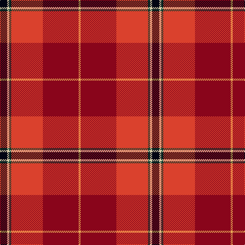

This page is one **sett** — a single exact thread-count. It belongs to the [tartan](/tartans/k7w2dg2r31r35lo2/)
(the same proportion at any scale), whose colour order is pattern [KWGRRY](/stripes/kwgrry/).

Sourced from register-of-tartans.  It is a [6 stripe tartan](/stripes/stripes6/).

Original link https://www.tartanregister.gov.uk/tartanDetails.aspx?ref=10720

2 attestations — the source records this cloth was collapsed from (oldest owns this page)

<ul>
<li>09/10/2012 — Mason, David Elsworth (Personal) (register-of-tartans, <a href="https://www.tartanregister.gov.uk/tartanDetails.aspx?ref=10720">record</a>)</li>
<li>undated — Mason, David Elsworth (Personal) Name Tartan Tartan Number: 10720. Earliest known date: 22 October 2012 Designed for Mr Elsworth’s family and his descendants to wear on special occasions and to celebrate an association with Glencoe Wood and the Keil Estate, Scotland. See products available Copyright © Blair Urquhart, Comrie, 2015 (house-of-tartan, <a href="http://www.house-of-tartan.scotland.net/house/TartanViewjs.asp?colr=Def&tnam=10720">record</a>)</li>
</ul>

## Register references

External register numbers recorded for this tartan.

- Scottish Register of Tartans: [10720](https://www.tartanregister.gov.uk/tartanDetails.aspx?ref=10720)

## Thread count
K/14 LR4 DG4 R62 DR70 O/4

## Palette

Palette: <strong>custom</strong>
<table><thead><tr><th>Colour</th><th>Threads</th><th>Shade</th><th>Base</th><th>OKLCh</th></tr></thead><tbody><tr><td>K/</td><td style="text-align:right;font-variant-numeric:tabular-nums">14</td><td><code style="background-color:#010512;">#010512</code> <small style="color:#888">#010512</small></td><td>K <code style="background-color:#000000;">#000000</code></td><td><small style="color:#888">oklch(11.8% 0.035 259.5)</small></td></tr><tr><td>LR</td><td style="text-align:right;font-variant-numeric:tabular-nums">4</td><td><code style="background-color:#DDD5AF;">#DDD5AF</code> <small style="color:#888">#DDD5AF</small></td><td>W <code style="background-color:#F7F7F7;">#F7F7F7</code></td><td><small style="color:#888">oklch(87.0% 0.051 97.4)</small></td></tr><tr><td>DG</td><td style="text-align:right;font-variant-numeric:tabular-nums">4</td><td><code style="background-color:#0B3D2E;">#0B3D2E</code> <small style="color:#888">#0B3D2E</small></td><td>G <code style="background-color:#006100;">#006100</code></td><td><small style="color:#888">oklch(32.3% 0.058 168.3)</small></td></tr><tr><td>R</td><td style="text-align:right;font-variant-numeric:tabular-nums">62</td><td><code style="background-color:#DA412D;">#DA412D</code> <small style="color:#888">#DA412D</small></td><td>R <code style="background-color:#CC0000;">#CC0000</code></td><td><small style="color:#888">oklch(59.6% 0.193 30.8)</small></td></tr><tr><td>DR</td><td style="text-align:right;font-variant-numeric:tabular-nums">70</td><td><code style="background-color:#89051B;">#89051B</code> <small style="color:#888">#89051B</small></td><td>R <code style="background-color:#CC0000;">#CC0000</code></td><td><small style="color:#888">oklch(40.0% 0.158 22.6)</small></td></tr><tr><td>O/</td><td style="text-align:right;font-variant-numeric:tabular-nums">4</td><td><code style="background-color:#EBAA57;">#EBAA57</code> <small style="color:#888">#EBAA57</small></td><td>Y <code style="background-color:#F2BF00;">#F2BF00</code></td><td><small style="color:#888">oklch(78.4% 0.125 70.8)</small></td></tr></tbody></table>

# Sample pattern

## Nearest tartans

The nearest existing variants by ΔTartan distance, with this tartan at the top so the swatches line up against it.

ΔTartan

Tartan

Sett

—

<a href="/ttd/edit/#slug=k7w2dg2r31r35lo2~x2">Mason, David Elsworth (Personal)</a> <a class="nn-out" href="/setts/s6/k7w2dg2r31r35lo2~x2/" title="open its dictionary page">↗</a>

1.14

<a href="/ttd/edit/#slug=k7w2dg2o31r35lo2~x2">Mason (Personal)</a> <a class="nn-out" href="/setts/s6/k7w2dg2o31r35lo2~x2/" title="open its dictionary page">↗</a>

1.17

<a href="/ttd/edit/#slug=k2g6dy4t1r18dy5lo1~x4">Snelgrove (Name)</a> <a class="nn-out" href="/setts/s7/k2g6dy4t1r18dy5lo1~x4/" title="open its dictionary page">↗</a>

1.22

<a href="/ttd/edit/#slug=g3r4k1r26y14r4dp16w2~x2">MacQueen of Dalmagarry (Clan?)</a> <a class="nn-out" href="/setts/s8/g3r4k1r26y14r4dp16w2~x2/" title="open its dictionary page">↗</a>

1.40

<a href="/ttd/edit/#slug=r60k40ly3p5p3dg12~x2">Rei Okamoto (Personal)</a> <a class="nn-out" href="/setts/s6/r60k40ly3p5p3dg12~x2/" title="open its dictionary page">↗</a>

1.41

<a href="/ttd/edit/#slug=r63w4k4dp18ly4dg50~x2">Gordon of Abergeldie (Portrait)</a> <a class="nn-out" href="/setts/s6/r63w4k4dp18ly4dg50~x2/" title="open its dictionary page">↗</a>

1.50

<a href="/ttd/edit/#slug=r38k12r15r4r15k2w4~x2">Ferguson's Promise (Commemorative)</a> <a class="nn-out" href="/setts/s7/r38k12r15r4r15k2w4~x2/" title="open its dictionary page">↗</a>

1.55

<a href="/ttd/edit/#slug=dt13r50ly7m6g4k4~x2">Harding (Florida) (Personal)</a> <a class="nn-out" href="/setts/s6/dt13r50ly7m6g4k4~x2/" title="open its dictionary page">↗</a>

1.58

<a href="/ttd/edit/#slug=w6r25y2g3y30k3y2r30ly6~x2">Virginia Military Institute, New Market</a> <a class="nn-out" href="/setts/s9/w6r25y2g3y30k3y2r30ly6~x2/" title="open its dictionary page">↗</a>

1.58

<a href="/ttd/edit/#slug=r41w2dp5ly2g21r9dp5db3w2~x2">Perthshire or Drummond District Tartan Tartan Number: 1670. Earliest known date: c.1819 Perthshire is known as the gateway to the Highlands. The Perthshire tartan is similar to a the Drummond sett, the tartan of a Drummond clan who had extensive lands in the district. The first record of this tartan is in the early nineteenth century account book of Wilson's of Bannockburn where it is referred to as the 'Perthshire Rock and Wheel' being an early type of soft tartan. See products available Copyright © Blair Urquhart, Comrie, 2015</a> <a class="nn-out" href="/setts/s9/r41w2dp5ly2g21r9dp5db3w2~x2/" title="open its dictionary page">↗</a>

1.61

<a href="/ttd/edit/#slug=k3r34dg10r5t2k8o2w3~x2">Lambert (Front Royal) Greer</a> <a class="nn-out" href="/setts/s8/k3r34dg10r5t2k8o2w3~x2/" title="open its dictionary page">↗</a>

## Neighbour map

Every grey dot is one of 14299 variants placed by the first two principal components of the ΔTartan feature space (44% of its variance). Red is this tartan; blue dots are its nearest — click one to open its page.

<svg viewBox="0 0 640 380" role="img" style="max-width:100%;height:auto;border:1px solid #e0e0e0;border-radius:4px;display:block" xmlns="http://www.w3.org/2000/svg"><image href="/nn/cloud.v1.png" width="640" height="380"/><a href="/setts/s6/k7w2dg2o31r35lo2~x2/"><circle cx="304.9" cy="150.1" r="4" fill="#3465a4"><title>Mason (Personal)</title></circle></a><a href="/setts/s7/k2g6dy4t1r18dy5lo1~x4/"><circle cx="288.4" cy="138.8" r="4" fill="#3465a4"><title>Snelgrove (Name)</title></circle></a><a href="/setts/s8/g3r4k1r26y14r4dp16w2~x2/"><circle cx="272.1" cy="112.8" r="4" fill="#3465a4"><title>MacQueen of Dalmagarry (Clan?)</title></circle></a><a href="/setts/s6/r60k40ly3p5p3dg12~x2/"><circle cx="274.9" cy="126.5" r="4" fill="#3465a4"><title>Rei Okamoto (Personal)</title></circle></a><a href="/setts/s6/r63w4k4dp18ly4dg50~x2/"><circle cx="242.5" cy="141.0" r="4" fill="#3465a4"><title>Gordon of Abergeldie (Portrait)</title></circle></a><a href="/setts/s7/r38k12r15r4r15k2w4~x2/"><circle cx="235.3" cy="139.0" r="4" fill="#3465a4"><title>Ferguson's Promise (Commemorative)</title></circle></a><a href="/setts/s6/dt13r50ly7m6g4k4~x2/"><circle cx="319.4" cy="132.5" r="4" fill="#3465a4"><title>Harding (Florida) (Personal)</title></circle></a><a href="/setts/s9/w6r25y2g3y30k3y2r30ly6~x2/"><circle cx="274.2" cy="122.8" r="4" fill="#3465a4"><title>Virginia Military Institute, New Market</title></circle></a><a href="/setts/s9/r41w2dp5ly2g21r9dp5db3w2~x2/"><circle cx="316.1" cy="97.2" r="4" fill="#3465a4"><title>Perthshire or Drummond District Tartan Tartan Number: 1670. Earliest known date: c.1819 Perthshire is known as the gateway to the Highlands. The Perthshire tartan is similar to a the Drummond sett, the tartan of a Drummond clan who had extensive lands in the district. The first record of this tartan is in the early nineteenth century account book of Wilson's of Bannockburn where it is referred to as the 'Perthshire Rock and Wheel' being an early type of soft tartan. See products available Copyright © Blair Urquhart, Comrie, 2015</title></circle></a><a href="/setts/s8/k3r34dg10r5t2k8o2w3~x2/"><circle cx="326.7" cy="117.0" r="4" fill="#3465a4"><title>Lambert (Front Royal) Greer</title></circle></a><circle cx="281.7" cy="132.5" r="5" fill="#c00000"/></svg>

ID: /setts/s6/k7w2dg2r31r35lo2~x2/
