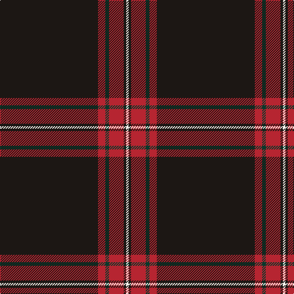

**Bands:** [KRGRKW](/stripes/krgrkw/) · **Stripes:** [K R DG R K W](/stripes/stripes6/) K R DG R K W

This was sourced from register-of-tartans.  It is a [6 band tartan](/bands/bands6/).

Original link https://www.tartanregister.gov.uk/tartanDetails.aspx?ref=11271

## Register references

External register numbers recorded for this tartan.

- Scottish Register of Tartans: [11271](https://www.tartanregister.gov.uk/tartanDetails.aspx?ref=11271)

## Thread count
K/160 R12 DG6 R24 K4 W/4

## Palette
Each colour and its ΔE from the base-6 reference it is a variant of.

| Colour | Shade | Base | ΔE (OKLab) |
|---|---|---|---|
| DG | <code style="background-color:#06392B;">#06392B</code> `#06392B` | G <code style="background-color:#006100;">#006100</code> | 0.15 |
| K | <code style="background-color:#1C1714;">#1C1714</code> `#1C1714` | K <code style="background-color:#000000;">#000000</code> | 0.21 |
| R | <code style="background-color:#B62531;">#B62531</code> `#B62531` | R <code style="background-color:#CC0000;">#CC0000</code> | 0.05 |
| W | <code style="background-color:#F9F5EF;">#F9F5EF</code> `#F9F5EF` | W <code style="background-color:#F7F7F7;">#F7F7F7</code> | 0.01 |

# Sample pattern

## Nearest tartans

The nearest existing variants by ΔTartan distance.

1. [Dellen](/setts/s6/k80r6g3r12k2w2~x2/) — ΔT 0.87
1. [Whitaker (2014)](/setts/s8/k60r3k15r3lb2r5db3r2~x2/) — ΔT 0.93
1. [Whitaker (2014)](/setts/s8/k60r3k15r3lb2r5b3r2~x2/) — ΔT 1.09
1. [Perratt (Personal)](/setts/s6/k83g4r4g10k1w3~x2/) — ΔT 1.12
1. [Noordermeer (Personal)](/setts/s10/k64r1k4r1k6r7w2r7k6t2~x2/) — ΔT 1.35
1. [Harley Davidson (Corporate)](/setts/s6/o4n6k4o8k49o2/) — ΔT 1.39
1. [Forand (Personal)](/setts/s5/k100r1o10db10ly2~x2/) — ΔT 1.43
1. [Laird Abdullah (Personal)](/setts/s8/k10n2k2n8k40r4k5r2~x2/) — ΔT 1.43
1. [Royal Army PTC Assoc. (Military)](/setts/s8/k59r3k6r3k8r15k2ly3~x2/) — ΔT 1.44
1. [Grassi (Personal)](/setts/s9/dp3n2o2k60n2k3n12k1o3~x2/) — ΔT 1.50

## Neighbour map

Every grey dot is one of 14299 variants placed by the first two principal components of the ΔTartan feature space (44% of its variance). Red is this tartan; blue dots are its nearest — click one to open its page.

<svg viewBox="0 0 640 380" role="img" style="max-width:100%;height:auto;border:1px solid #e0e0e0;border-radius:4px;display:block" xmlns="http://www.w3.org/2000/svg"><image href="/nn/cloud.v1.png" width="640" height="380"/><a href="/setts/s6/k80r6g3r12k2w2~x2/"><circle cx="557.6" cy="131.3" r="4" fill="#3465a4"><title>Dellen</title></circle></a><a href="/setts/s8/k60r3k15r3lb2r5db3r2~x2/"><circle cx="580.0" cy="140.0" r="4" fill="#3465a4"><title>Whitaker (2014)</title></circle></a><a href="/setts/s8/k60r3k15r3lb2r5b3r2~x2/"><circle cx="568.1" cy="133.5" r="4" fill="#3465a4"><title>Whitaker (2014)</title></circle></a><a href="/setts/s6/k83g4r4g10k1w3~x2/"><circle cx="589.2" cy="131.6" r="4" fill="#3465a4"><title>Perratt (Personal)</title></circle></a><a href="/setts/s10/k64r1k4r1k6r7w2r7k6t2~x2/"><circle cx="586.8" cy="98.4" r="4" fill="#3465a4"><title>Noordermeer (Personal)</title></circle></a><a href="/setts/s6/o4n6k4o8k49o2/"><circle cx="489.6" cy="164.4" r="4" fill="#3465a4"><title>Harley Davidson (Corporate)</title></circle></a><a href="/setts/s5/k100r1o10db10ly2~x2/"><circle cx="598.6" cy="139.3" r="4" fill="#3465a4"><title>Forand (Personal)</title></circle></a><a href="/setts/s8/k10n2k2n8k40r4k5r2~x2/"><circle cx="538.5" cy="174.0" r="4" fill="#3465a4"><title>Laird Abdullah (Personal)</title></circle></a><a href="/setts/s8/k59r3k6r3k8r15k2ly3~x2/"><circle cx="539.9" cy="149.2" r="4" fill="#3465a4"><title>Royal Army PTC Assoc. (Military)</title></circle></a><a href="/setts/s9/dp3n2o2k60n2k3n12k1o3~x2/"><circle cx="552.5" cy="115.5" r="4" fill="#3465a4"><title>Grassi (Personal)</title></circle></a><circle cx="582.9" cy="141.6" r="5" fill="#c00000"/></svg>

ID: /setts/s6/k80r6dg3r12k2w2~x2/
