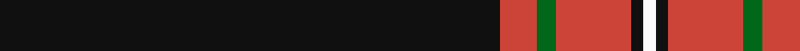

In pattern [KRGRKW](/patterns/krgrkw/).

This was sourced from tartans-authority.  It is a [6 stripes tartan](/stripes/stripes6/).

Original link http://www.tartansauthority.com/tartan-ferret/display/11271/

## Thread count
K/160 R12 G6 R24 K4 W/4

## Palette
Each colour and its ΔE from the base-6 reference it is a variant of.

| Colour | Shade | Base | ΔE (OKLab) |
|---|---|---|---|
| G | <code style="background-color:#006818;">#006818</code> `#006818` | G <code style="background-color:#006100;">#006100</code> | 0.02 |
| K | <code style="background-color:#101010;">#101010</code> `#101010` | K <code style="background-color:#000000;">#000000</code> | 0.17 |
| R | <code style="background-color:#CC4438;">#CC4438</code> `#CC4438` | R <code style="background-color:#CC0000;">#CC0000</code> | 0.06 |
| W | <code style="background-color:#FCFCFC;">#FCFCFC</code> `#FCFCFC` | W <code style="background-color:#F7F7F7;">#F7F7F7</code> | 0.01 |

# Sample pattern

## Nearest tartans

The nearest existing variants by ΔTartan distance.

1. [Whitaker (2014)](/setts/s8/k60r3k15r3w2r5b3r2~b3850c8-k101010-rdc0000-wc0c0c0~x2/) — ΔT 0.87
1. [Dellen](/setts/s6/k80r6g3r12k2w2~g06392b-k1c1714-rb62531-wf9f5ef~x2/) — ΔT 0.87
1. [Perratt (Personal)](/setts/s6/k83g4r4g10k1w3~g006818-k101010-rc80000-wfcfcfc~x2/) — ΔT 0.89
1. [Whitaker (2014)](/setts/s8/k60r3k15r3w2r5b3r2~b2c2c80-k101010-rc80000-wc0c0c0~x2/) — ΔT 1.05
1. [Marine Harvest Scotland (Corporate)](/setts/s8/b10w2k2b1k6w1k45y2~b1474b4-k101010-wc0c0c0-yd87c00~x2/) — ΔT 1.12
1. [Noordermeer (Personal)](/setts/s10/k64r1k4r1k6r7w2r7k6b2~b2888c4-k101010-rc80000-we0e0e0~x2/) — ΔT 1.21
1. [Royal Army PTC Assoc. (Military)](/setts/s8/k59r3k6r3k8r15k2y3~k101010-rc80000-ye8c000~x2/) — ΔT 1.26
1. [degli Uberti, Baron of Cartsburn (P)](/setts/s8/b8r1k6r1y8r1k45y1~b202060-k101010-rc80000-ybc8c00~x2/) — ΔT 1.29
1. [Brockton (Corporate)](/setts/s8/k2w1k2r6k6r3k28w2~k101010-r880000-we0e0e0~x2/) — ΔT 1.31
1. [Brockton](/setts/s8/k2w1k2r6k6r3k28w2~k101010-r880000-wffffff~x2/) — ΔT 1.32

## Neighbour map

Every grey dot is one of 15726 variants placed by the first two principal components of the ΔTartan feature space (44% of its variance). Red is this tartan; blue dots are its nearest — click one to open its page.

<svg viewBox="0 0 640 380" role="img" style="max-width:100%;height:auto;border:1px solid #e0e0e0;border-radius:4px;display:block" xmlns="http://www.w3.org/2000/svg"><image href="/nn/cloud.v1.png" width="640" height="380"/><a href="/setts/s8/k60r3k15r3w2r5b3r2~b3850c8-k101010-rdc0000-wc0c0c0~x2/"><circle cx="566.8" cy="138.4" r="4" fill="#3465a4"><title>Whitaker (2014)</title></circle></a><a href="/setts/s6/k80r6g3r12k2w2~g06392b-k1c1714-rb62531-wf9f5ef~x2/"><circle cx="582.0" cy="144.5" r="4" fill="#3465a4"><title>Dellen</title></circle></a><a href="/setts/s6/k83g4r4g10k1w3~g006818-k101010-rc80000-wfcfcfc~x2/"><circle cx="587.4" cy="135.3" r="4" fill="#3465a4"><title>Perratt (Personal)</title></circle></a><a href="/setts/s8/k60r3k15r3w2r5b3r2~b2c2c80-k101010-rc80000-wc0c0c0~x2/"><circle cx="578.8" cy="143.5" r="4" fill="#3465a4"><title>Whitaker (2014)</title></circle></a><a href="/setts/s8/b10w2k2b1k6w1k45y2~b1474b4-k101010-wc0c0c0-yd87c00~x2/"><circle cx="537.4" cy="121.6" r="4" fill="#3465a4"><title>Marine Harvest Scotland (Corporate)</title></circle></a><a href="/setts/s10/k64r1k4r1k6r7w2r7k6b2~b2888c4-k101010-rc80000-we0e0e0~x2/"><circle cx="585.5" cy="102.8" r="4" fill="#3465a4"><title>Noordermeer (Personal)</title></circle></a><a href="/setts/s8/k59r3k6r3k8r15k2y3~k101010-rc80000-ye8c000~x2/"><circle cx="538.8" cy="154.8" r="4" fill="#3465a4"><title>Royal Army PTC Assoc. (Military)</title></circle></a><a href="/setts/s8/b8r1k6r1y8r1k45y1~b202060-k101010-rc80000-ybc8c00~x2/"><circle cx="505.3" cy="122.6" r="4" fill="#3465a4"><title>degli Uberti, Baron of Cartsburn (P)</title></circle></a><a href="/setts/s8/k2w1k2r6k6r3k28w2~k101010-r880000-we0e0e0~x2/"><circle cx="529.9" cy="165.5" r="4" fill="#3465a4"><title>Brockton (Corporate)</title></circle></a><a href="/setts/s8/k2w1k2r6k6r3k28w2~k101010-r880000-wffffff~x2/"><circle cx="520.4" cy="161.7" r="4" fill="#3465a4"><title>Brockton</title></circle></a><circle cx="556.3" cy="136.6" r="5" fill="#c00000"/></svg>

ID: /setts/s6/k80r6g3r12k2w2~g006818-k101010-rcc4438-wfcfcfc~x2/
