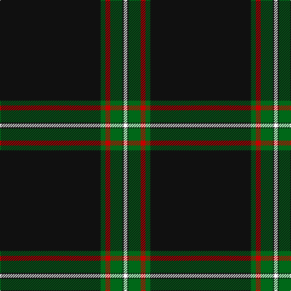

In pattern [KGRGKW](/stripes/kgrgkw/).

This was sourced from register-of-tartans.  It is a [6 stripe tartan](/stripes/stripes6/).

Original link https://www.tartanregister.gov.uk/tartanDetails.aspx?ref=3319

## Attestations

This cloth appears in 2 source records; the oldest owns this page.

- 01/05/2003 — Perratt (Personal) (register-of-tartans, [record](https://www.tartanregister.gov.uk/tartanDetails.aspx?ref=3319))
- pre 2004 — Perratt (Personal) (tartans-authority, [record](http://www.tartansauthority.com/tartan-ferret/display/6221/))

## Register references

External register numbers recorded for this tartan.

- Scottish Register of Tartans: [3319](https://www.tartanregister.gov.uk/tartanDetails.aspx?ref=3319)
- Scottish Tartans Authority (ITI): 6221
- Scottish Tartans World Register: 2747

## Thread count
K/166 G8 R8 G20 K2 W/6

## Palette
Each colour and its ΔE from the base-6 reference it is a variant of.

| Colour | Shade | Base | ΔE (OKLab) |
|---|---|---|---|
| G | <code style="background-color:#006818;">#006818</code> `#006818` | G <code style="background-color:#006100;">#006100</code> | 0.02 |
| K | <code style="background-color:#101010;">#101010</code> `#101010` | K <code style="background-color:#000000;">#000000</code> | 0.17 |
| R | <code style="background-color:#C80000;">#C80000</code> `#C80000` | R <code style="background-color:#CC0000;">#CC0000</code> | 0.01 |
| W | <code style="background-color:#FCFCFC;">#FCFCFC</code> `#FCFCFC` | W <code style="background-color:#F7F7F7;">#F7F7F7</code> | 0.01 |

# Sample pattern

## Nearest tartans

The nearest existing variants by ΔTartan distance.

1. [Dellen](/setts/s6/k80r6g3r12k2w2~x2/) — ΔT 0.89
1. [Marine Harvest Scotland (Corporate)](/setts/s8/b10lb2k2b1k6lb1k45lo2~x2/) — ΔT 1.06
1. [Dellen](/setts/s6/k80r6dg3r12k2w2~x2/) — ΔT 1.12
1. [Forand (Personal)](/setts/s5/k100r1o10db10ly2~x2/) — ΔT 1.27
1. [Whitaker (2014)](/setts/s8/k60r3k15r3lb2r5db3r2~x2/) — ΔT 1.27
1. [Whitaker (2014)](/setts/s8/k60r3k15r3lb2r5b3r2~x2/) — ΔT 1.27
1. [McHattie (Personal)](/setts/s5/k45b2r4ly1w1~x2/) — ΔT 1.30
1. [Fettes Personal Tartan Tartan Number: 7565. Earliest known date: 2008 Designed online for four kilts by Fiona Fettes. See products available Copyright © Blair Urquhart, Comrie, 2015](/setts/s5/k50dt3lp2r3w1~x2/) — ΔT 1.32
1. [McHattie (Personal)](/setts/s5/k45db2r4ly1w1~x2/) — ΔT 1.34
1. [Noordermeer (Personal)](/setts/s10/k64r1k4r1k6r7w2r7k6t2~x2/) — ΔT 1.34

## Neighbour map

Every grey dot is one of 14299 variants placed by the first two principal components of the ΔTartan feature space (44% of its variance). Red is this tartan; blue dots are its nearest — click one to open its page.

<svg viewBox="0 0 640 380" role="img" style="max-width:100%;height:auto;border:1px solid #e0e0e0;border-radius:4px;display:block" xmlns="http://www.w3.org/2000/svg"><image href="/nn/cloud.v1.png" width="640" height="380"/><a href="/setts/s6/k80r6g3r12k2w2~x2/"><circle cx="557.6" cy="131.3" r="4" fill="#3465a4"><title>Dellen</title></circle></a><a href="/setts/s8/b10lb2k2b1k6lb1k45lo2~x2/"><circle cx="539.6" cy="118.1" r="4" fill="#3465a4"><title>Marine Harvest Scotland (Corporate)</title></circle></a><a href="/setts/s6/k80r6dg3r12k2w2~x2/"><circle cx="582.9" cy="141.6" r="4" fill="#3465a4"><title>Dellen</title></circle></a><a href="/setts/s5/k100r1o10db10ly2~x2/"><circle cx="598.6" cy="139.3" r="4" fill="#3465a4"><title>Forand (Personal)</title></circle></a><a href="/setts/s8/k60r3k15r3lb2r5db3r2~x2/"><circle cx="580.0" cy="140.0" r="4" fill="#3465a4"><title>Whitaker (2014)</title></circle></a><a href="/setts/s8/k60r3k15r3lb2r5b3r2~x2/"><circle cx="568.1" cy="133.5" r="4" fill="#3465a4"><title>Whitaker (2014)</title></circle></a><a href="/setts/s5/k45b2r4ly1w1~x2/"><circle cx="612.6" cy="129.2" r="4" fill="#3465a4"><title>McHattie (Personal)</title></circle></a><a href="/setts/s5/k50dt3lp2r3w1~x2/"><circle cx="624.1" cy="131.7" r="4" fill="#3465a4"><title>Fettes Personal Tartan Tartan Number: 7565. Earliest known date: 2008 Designed online for four kilts by Fiona Fettes. See products available Copyright © Blair Urquhart, Comrie, 2015</title></circle></a><a href="/setts/s5/k45db2r4ly1w1~x2/"><circle cx="620.9" cy="133.3" r="4" fill="#3465a4"><title>McHattie (Personal)</title></circle></a><a href="/setts/s10/k64r1k4r1k6r7w2r7k6t2~x2/"><circle cx="586.8" cy="98.4" r="4" fill="#3465a4"><title>Noordermeer (Personal)</title></circle></a><circle cx="589.2" cy="131.6" r="5" fill="#c00000"/></svg>

ID: /setts/s6/k83g4r4g10k1w3~x2/
