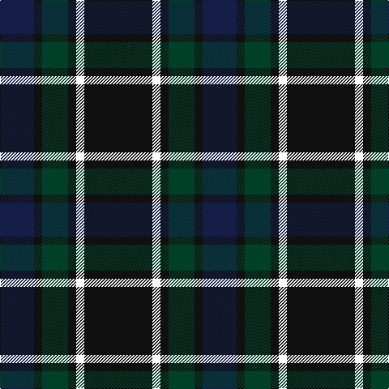

In pattern [BKGKWK](/patterns/bkgkwk/).

This was sourced from register-of-tartans.  It is a [6 stripes tartan](/stripes/stripes6/).

Original link https://www.tartanregister.gov.uk/tartanDetails.aspx?ref=10918

## Thread count
DB/42 K10 DG32 K10 W10 K/84

## Palette
Each colour and its ΔE from the base-6 reference it is a variant of.

| Colour | Shade | Base | ΔE (OKLab) |
|---|---|---|---|
| DB | <code style="background-color:#141E46;">#141E46</code> `#141E46` | B <code style="background-color:#2A418A;">#2A418A</code> | 0.16 |
| DG | <code style="background-color:#004028;">#004028</code> `#004028` | G <code style="background-color:#006100;">#006100</code> | 0.13 |
| K | <code style="background-color:#101010;">#101010</code> `#101010` | K <code style="background-color:#000000;">#000000</code> | 0.17 |
| W | <code style="background-color:#FFFFFF;">#FFFFFF</code> `#FFFFFF` | W <code style="background-color:#F7F7F7;">#F7F7F7</code> | 0.02 |

# Sample pattern

## Nearest tartans

The nearest existing variants by ΔTartan distance.

1. [Givens (Arizona)](/setts/s6/k84w10g32k10k10b42-b202060-g003820-k101010-wfcfcfc/) — ΔT 0.28
1. [Robert Gordon University](/setts/s6/k8r4k24b24k2y4-b202060-k101010-r880000-yd09800/) — ΔT 1.17
1. [Glen Nevis #1](/setts/s8/g16r4g4r6g16b24g4y4-b000064-g002814-r880000-yc89600/) — ΔT 1.19
1. [Nairn](/setts/s5/r8k64g16b32r8-b2c2c80-g006818-k101010-rc80000/) — ΔT 1.26
1. [Nairn Family Tartan Tartan Number: 1331. Earliest known date: c.1930 The exact date of this design is uncertain. We know that it appeared around 1930 in the collection of Messrs. Anderson of Edinburgh. (Later Kinloch Anderson). A note on the weavers scale in the STS collection states '..worn by the Spencer-Nairn family. (done)'. The design is similar to the Hunting Brodie sett without the yellow. Nairns were first recorded in Fife and later in Moray. There is also a family called Nairne of Dunsinnan in Perthshire of MacBeth fame. See products available Copyright © Blair Urquhart, Comrie, 2015](/setts/s5/r4k32g8b16r4-b2c2c80-g006818-k101010-rc80000/) — ΔT 1.26
1. [Glen Nevis #1 (Fashion)](/setts/s8/g16r4g4r6g16b24g4y4-b1c0070-g003820-r880000-ye8c000/) — ΔT 1.28
1. [Britannia](/setts/s5/k28r8k50b60w8-b202060-k101010-rc80000-we0e0e0/) — ΔT 1.30
1. [Cameron Hunting](/setts/s7/r6g20r6g28b32g6y4-b000052-g11450d-raa0000-yaaaa00/) — ΔT 1.30
1. [Cameron Hunting](/setts/s7/r3g10r3g14b16g3y2-b000052-g11450d-raa0000-yaaaa00/) — ΔT 1.30
1. [Guthrie Family Tartan Tartan Number: 1085. Earliest known date: pre 2003 From the Barony of Guthrie in Angus, the name is also said to derive from Guthrum, a Scandinavian prince. Sir David Guthrie was King's Treasurer in the fifteenth century and built Guthrie Castle near Friockheim, Angus, in 1468. See products available Copyright © Blair Urquhart, Comrie, 2015](/setts/s9/k6g48k54r6k6r6k54b48r6-b2c2c80-g006818-k101010-rc80000/) — ΔT 1.32

## Neighbour map

Every grey dot is one of 15726 variants placed by the first two principal components of the ΔTartan feature space (44% of its variance). Red is this tartan; blue dots are its nearest — click one to open its page.

<svg viewBox="0 0 640 380" role="img" style="max-width:100%;height:auto;border:1px solid #e0e0e0;border-radius:4px;display:block" xmlns="http://www.w3.org/2000/svg"><image href="/nn/cloud.v1.png" width="640" height="380"/><a href="/setts/s6/k84w10g32k10k10b42-b202060-g003820-k101010-wfcfcfc/"><circle cx="303.5" cy="237.5" r="4" fill="#3465a4"><title>Givens (Arizona)</title></circle></a><a href="/setts/s6/k8r4k24b24k2y4-b202060-k101010-r880000-yd09800/"><circle cx="335.8" cy="231.8" r="4" fill="#3465a4"><title>Robert Gordon University</title></circle></a><a href="/setts/s8/g16r4g4r6g16b24g4y4-b000064-g002814-r880000-yc89600/"><circle cx="273.1" cy="249.9" r="4" fill="#3465a4"><title>Glen Nevis #1</title></circle></a><a href="/setts/s5/r8k64g16b32r8-b2c2c80-g006818-k101010-rc80000/"><circle cx="272.1" cy="240.6" r="4" fill="#3465a4"><title>Nairn</title></circle></a><a href="/setts/s5/r4k32g8b16r4-b2c2c80-g006818-k101010-rc80000/"><circle cx="272.1" cy="240.6" r="4" fill="#3465a4"><title>Nairn Family Tartan Tartan Number: 1331. Earliest known date: c.1930 The exact date of this design is uncertain. We know that it appeared around 1930 in the collection of Messrs. Anderson of Edinburgh. (Later Kinloch Anderson). A note on the weavers scale in the STS collection states '..worn by the Spencer-Nairn family. (done)'. The design is similar to the Hunting Brodie sett without the yellow. Nairns were first recorded in Fife and later in Moray. There is also a family called Nairne of Dunsinnan in Perthshire of MacBeth fame. See products available Copyright © Blair Urquhart, Comrie, 2015</title></circle></a><a href="/setts/s8/g16r4g4r6g16b24g4y4-b1c0070-g003820-r880000-ye8c000/"><circle cx="261.3" cy="242.0" r="4" fill="#3465a4"><title>Glen Nevis #1 (Fashion)</title></circle></a><a href="/setts/s5/k28r8k50b60w8-b202060-k101010-rc80000-we0e0e0/"><circle cx="283.6" cy="259.1" r="4" fill="#3465a4"><title>Britannia</title></circle></a><a href="/setts/s7/r6g20r6g28b32g6y4-b000052-g11450d-raa0000-yaaaa00/"><circle cx="283.0" cy="237.6" r="4" fill="#3465a4"><title>Cameron Hunting</title></circle></a><a href="/setts/s7/r3g10r3g14b16g3y2-b000052-g11450d-raa0000-yaaaa00/"><circle cx="283.0" cy="237.6" r="4" fill="#3465a4"><title>Cameron Hunting</title></circle></a><a href="/setts/s9/k6g48k54r6k6r6k54b48r6-b2c2c80-g006818-k101010-rc80000/"><circle cx="275.8" cy="212.4" r="4" fill="#3465a4"><title>Guthrie Family Tartan Tartan Number: 1085. Earliest known date: pre 2003 From the Barony of Guthrie in Angus, the name is also said to derive from Guthrum, a Scandinavian prince. Sir David Guthrie was King's Treasurer in the fifteenth century and built Guthrie Castle near Friockheim, Angus, in 1468. See products available Copyright © Blair Urquhart, Comrie, 2015</title></circle></a><circle cx="306.4" cy="239.8" r="5" fill="#c00000"/></svg>

ID: /setts/s6/k84w10k10g32k10b42-b141e46-g004028-k101010-wffffff/
