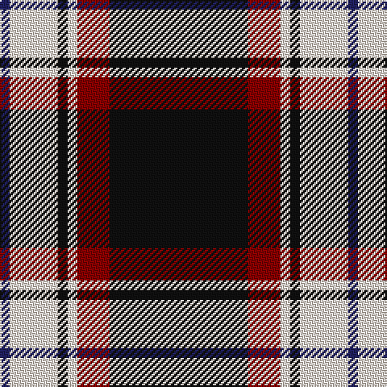

In pattern [BWKWRK](/patterns/bwkwrk/).

This was sourced from register-of-tartans.  It is a [6 stripes tartan](/stripes/stripes6/).

Original link https://www.tartanregister.gov.uk/tartanDetails.aspx?ref=390

## Attestations

This cloth appears in 2 source records; the oldest owns this page.

- 01/05/2005 — Bro-Wened (register-of-tartans, [record](https://www.tartanregister.gov.uk/tartanDetails.aspx?ref=390))
- 2005 May — Bro-Wened (Corporate) (tartans-authority, [record](http://www.tartansauthority.com/tartan-ferret/display/6651/))

## Thread count
DB/6 LY30 K6 LY6 DR20 K/86

## Palette
Each colour and its ΔE from the base-6 reference it is a variant of.

| Colour | Shade | Base | ΔE (OKLab) |
|---|---|---|---|
| DB | <code style="background-color:#202060;">#202060</code> `#202060` | B <code style="background-color:#2C4084;">#2C4084</code> | 0.11 |
| DR | <code style="background-color:#880000;">#880000</code> `#880000` | R <code style="background-color:#C80000;">#C80000</code> | 0.14 |
| K | <code style="background-color:#101010;">#101010</code> `#101010` | K <code style="background-color:#000000;">#000000</code> | 0.17 |
| LY | <code style="background-color:#F8E8D8;">#F8E8D8</code> `#F8E8D8` | W <code style="background-color:#F4F4F0;">#F4F4F0</code> | 0.04 |

# Sample pattern

## Nearest tartans

The nearest existing variants by ΔTartan distance.

1. [Dunfermline Athletic (2008) (Corp)](/setts/s7/k88w8k8w8k32r64ra8-k101010-r888888-rac80000-we0e0e0/) — ΔT 0.85
1. [Phantom](/setts/s7/w6r20k76wa22r12k4w6-k101010-r945067-wf7feee-waeeeeec/) — ΔT 0.93
1. [Cunard O' The Clyde Corporate Tartan Tartan Number: 11296. Earliest known date: 2015 The Cunard on the Clyde tartan has been created to celebrate the historical link between the Cunard and the Clyde as part of the Cunard's 175th anniversary celebrations. It was presented to Cunard by Peel Ports on May 21st 2015. See products available Copyright © Blair Urquhart, Comrie, 2015](/setts/s8/r40k12w4k60y4w12k12y4-k101010-rbc1828-we0e0e0-yc4bc68/) — ΔT 0.98
1. [Ikelman No 4](/setts/s7/r40k60g8k8w4k4w4-g008000-k000030-rc00000-we0e0e0/) — ΔT 1.04
1. [Cunard o' the Clyde](/setts/s8/r40k12w4k60y4w12k12y4-k101010-rc80000-we0e0e0-yc4bc68/) — ΔT 1.05
1. [Calgary Firefighters (Corporate)](/setts/s5/r8k96r32ra24b6-b2c2c80-k101010-r888888-rac80000/) — ΔT 1.18
1. [Phantom (Corporate)](/setts/s7/w6b20k76g22b12k4w6-b6c142c-g848484-k101010-we0e0e0/) — ΔT 1.20
1. [Colbert Check (Fashion)](/setts/s8/k62w10y10k4w18k4ya3w4-k101010-wf0e4cc-ye8c000-yaa08858/) — ΔT 1.23
1. [Machair (warp)](/setts/s6/r144k32w18k8w10k32-k000030-r906030-we0e0e0/) — ΔT 1.24
1. [Ashers of Nairn](/setts/s10/y4k3w3k44y4k22wa22w3k3y4-k101010-wffffff-wac8c8c8-ye0a126/) — ΔT 1.24

## Neighbour map

Every grey dot is one of 15726 variants placed by the first two principal components of the ΔTartan feature space (44% of its variance). Red is this tartan; blue dots are its nearest — click one to open its page.

<svg viewBox="0 0 640 380" role="img" style="max-width:100%;height:auto;border:1px solid #e0e0e0;border-radius:4px;display:block" xmlns="http://www.w3.org/2000/svg"><image href="/nn/cloud.v1.png" width="640" height="380"/><a href="/setts/s7/k88w8k8w8k32r64ra8-k101010-r888888-rac80000-we0e0e0/"><circle cx="310.0" cy="183.2" r="4" fill="#3465a4"><title>Dunfermline Athletic (2008) (Corp)</title></circle></a><a href="/setts/s7/w6r20k76wa22r12k4w6-k101010-r945067-wf7feee-waeeeeec/"><circle cx="284.2" cy="141.7" r="4" fill="#3465a4"><title>Phantom</title></circle></a><a href="/setts/s8/r40k12w4k60y4w12k12y4-k101010-rbc1828-we0e0e0-yc4bc68/"><circle cx="302.5" cy="154.9" r="4" fill="#3465a4"><title>Cunard O' The Clyde Corporate Tartan Tartan Number: 11296. Earliest known date: 2015 The Cunard on the Clyde tartan has been created to celebrate the historical link between the Cunard and the Clyde as part of the Cunard's 175th anniversary celebrations. It was presented to Cunard by Peel Ports on May 21st 2015. See products available Copyright © Blair Urquhart, Comrie, 2015</title></circle></a><a href="/setts/s7/r40k60g8k8w4k4w4-g008000-k000030-rc00000-we0e0e0/"><circle cx="315.8" cy="159.4" r="4" fill="#3465a4"><title>Ikelman No 4</title></circle></a><a href="/setts/s8/r40k12w4k60y4w12k12y4-k101010-rc80000-we0e0e0-yc4bc68/"><circle cx="301.9" cy="153.8" r="4" fill="#3465a4"><title>Cunard o' the Clyde</title></circle></a><a href="/setts/s5/r8k96r32ra24b6-b2c2c80-k101010-r888888-rac80000/"><circle cx="334.5" cy="188.5" r="4" fill="#3465a4"><title>Calgary Firefighters (Corporate)</title></circle></a><a href="/setts/s7/w6b20k76g22b12k4w6-b6c142c-g848484-k101010-we0e0e0/"><circle cx="312.1" cy="156.2" r="4" fill="#3465a4"><title>Phantom (Corporate)</title></circle></a><a href="/setts/s8/k62w10y10k4w18k4ya3w4-k101010-wf0e4cc-ye8c000-yaa08858/"><circle cx="337.3" cy="125.4" r="4" fill="#3465a4"><title>Colbert Check (Fashion)</title></circle></a><a href="/setts/s6/r144k32w18k8w10k32-k000030-r906030-we0e0e0/"><circle cx="361.0" cy="170.2" r="4" fill="#3465a4"><title>Machair (warp)</title></circle></a><a href="/setts/s10/y4k3w3k44y4k22wa22w3k3y4-k101010-wffffff-wac8c8c8-ye0a126/"><circle cx="333.7" cy="139.0" r="4" fill="#3465a4"><title>Ashers of Nairn</title></circle></a><circle cx="315.5" cy="163.9" r="5" fill="#c00000"/></svg>

ID: /setts/s6/k86r20w6k6w30b6-b202060-k101010-r880000-wf8e8d8/
