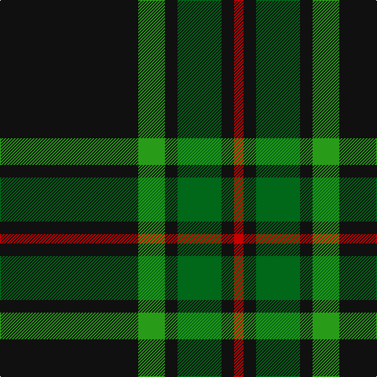

In pattern [KGKGKR](/patterns/kgkgkr/).

This was sourced from house-of-tartan.  It is a [6 stripes tartan](/stripes/stripes6/).

Original link http://www.house-of-tartan.scotland.net/house/TartanViewjs.asp?colr=Def&tnam=1090

## Thread count
K/176 Ga34 K16 G56 K16 R/12

## Palette
Each colour and its ΔE from the base-6 reference it is a variant of.

| Colour | Shade | Base | ΔE (OKLab) |
|---|---|---|---|
| G | <code style="background-color:#006818;">#006818</code> `#006818` | G <code style="background-color:#006100;">#006100</code> | 0.02 |
| Ga | <code style="background-color:#289C18;">#289C18</code> `#289C18` | G <code style="background-color:#006100;">#006100</code> | 0.19 |
| K | <code style="background-color:#101010;">#101010</code> `#101010` | K <code style="background-color:#000000;">#000000</code> | 0.17 |
| R | <code style="background-color:#C80000;">#C80000</code> `#C80000` | R <code style="background-color:#CC0000;">#CC0000</code> | 0.01 |

# Sample pattern

## Nearest tartans

The nearest existing variants by ΔTartan distance.

1. [Childers (Personal)](/setts/s6/k44g8k4ga13k4w3~g408060-ga006818-k101010-we0e0e0~x2/) — ΔT 0.42
1. [Forbes VS](/setts/s6/r1g16k8g3k4y1~g11450d-k000000-raa0000-yaaaa00~x2/) — ΔT 1.11
1. [Forbes VS](/setts/s6/r1g16k8g3k4y1~g11450d-k000000-raa0000-yaaaa00/) — ΔT 1.11
1. [Forbes VS](/setts/s6/r1g16k8g3k4y1~g004c00-k000000-rc80000-yffc800/) — ΔT 1.31
1. [Perry (Calgary), Alex (Personal)](/setts/s4/k62b24y5w3~b3f4441-k120a01-wf7f1e8-yef8f06~x2/) — ΔT 1.32
1. [Mountain Rescue Assoc. (Corporate)](/setts/s7/k32b2k6b2k13ba30w2~b1474b4-ba5c5c5c-k101010-wfcfcfc~x2/) — ΔT 1.33
1. [Glenlivet Check (Corporate)](/setts/s8/g18r6g75b6g13y35g12b6~b3850c8-g003820-r880000-ya08858/) — ΔT 1.35
1. [Wesley Owen 2010 (Personal)](/setts/s4/k61g10ga20w4~g006818-ga289c18-k101010-we0e0e0~x2/) — ΔT 1.37
1. [Wild Highlanders (Corporate)](/setts/s7/k36w3k10w3g28r6k18~g00643c-k101010-r901c38-wfcfcfc~x2/) — ΔT 1.38
1. [Green Ridge](/setts/s8/g24r2g3k6r1y2r1k4~g003014-k000000-r640000-yc89800~x4/) — ΔT 1.39

## Neighbour map

Every grey dot is one of 15726 variants placed by the first two principal components of the ΔTartan feature space (44% of its variance). Red is this tartan; blue dots are its nearest — click one to open its page.

<svg viewBox="0 0 640 380" role="img" style="max-width:100%;height:auto;border:1px solid #e0e0e0;border-radius:4px;display:block" xmlns="http://www.w3.org/2000/svg"><image href="/nn/cloud.v1.png" width="640" height="380"/><a href="/setts/s6/k44g8k4ga13k4w3~g408060-ga006818-k101010-we0e0e0~x2/"><circle cx="411.0" cy="194.7" r="4" fill="#3465a4"><title>Childers (Personal)</title></circle></a><a href="/setts/s6/r1g16k8g3k4y1~g11450d-k000000-raa0000-yaaaa00~x2/"><circle cx="350.4" cy="204.9" r="4" fill="#3465a4"><title>Forbes VS</title></circle></a><a href="/setts/s6/r1g16k8g3k4y1~g11450d-k000000-raa0000-yaaaa00/"><circle cx="350.4" cy="204.9" r="4" fill="#3465a4"><title>Forbes VS</title></circle></a><a href="/setts/s6/r1g16k8g3k4y1~g004c00-k000000-rc80000-yffc800/"><circle cx="337.5" cy="200.2" r="4" fill="#3465a4"><title>Forbes VS</title></circle></a><a href="/setts/s4/k62b24y5w3~b3f4441-k120a01-wf7f1e8-yef8f06~x2/"><circle cx="419.8" cy="206.3" r="4" fill="#3465a4"><title>Perry (Calgary), Alex (Personal)</title></circle></a><a href="/setts/s7/k32b2k6b2k13ba30w2~b1474b4-ba5c5c5c-k101010-wfcfcfc~x2/"><circle cx="364.2" cy="192.6" r="4" fill="#3465a4"><title>Mountain Rescue Assoc. (Corporate)</title></circle></a><a href="/setts/s8/g18r6g75b6g13y35g12b6~b3850c8-g003820-r880000-ya08858/"><circle cx="422.2" cy="200.6" r="4" fill="#3465a4"><title>Glenlivet Check (Corporate)</title></circle></a><a href="/setts/s4/k61g10ga20w4~g006818-ga289c18-k101010-we0e0e0~x2/"><circle cx="358.3" cy="214.8" r="4" fill="#3465a4"><title>Wesley Owen 2010 (Personal)</title></circle></a><a href="/setts/s7/k36w3k10w3g28r6k18~g00643c-k101010-r901c38-wfcfcfc~x2/"><circle cx="326.6" cy="210.9" r="4" fill="#3465a4"><title>Wild Highlanders (Corporate)</title></circle></a><a href="/setts/s8/g24r2g3k6r1y2r1k4~g003014-k000000-r640000-yc89800~x4/"><circle cx="421.9" cy="163.0" r="4" fill="#3465a4"><title>Green Ridge</title></circle></a><circle cx="407.2" cy="198.0" r="5" fill="#c00000"/></svg>

ID: /setts/s6/k88g17k8ga28k8r6~g289c18-ga006818-k101010-rc80000~x2/
