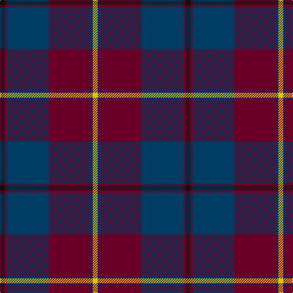

In pattern [KBBBBY](/patterns/kbbbby/).

This was sourced from register-of-tartans.  It is a [6 stripes tartan](/stripes/stripes6/).

Original link https://www.tartanregister.gov.uk/tartanDetails.aspx?ref=3054

## Attestations

This cloth appears in 2 source records; the oldest owns this page.

- 01/01/1999 — Murdoch (Geoffrey) (register-of-tartans, [record](https://www.tartanregister.gov.uk/tartanDetails.aspx?ref=3054))
- Jan. 1999 — Murdoch (Name) (tartans-authority, [record](http://www.tartansauthority.com/tartan-ferret/display/2525/))

## Thread count
K/8 DR4 DBa68 DR68 DB4 Y/8

## Palette
Each colour and its ΔE from the base-6 reference it is a variant of.

| Colour | Shade | Base | ΔE (OKLab) |
|---|---|---|---|
| DB | <code style="background-color:#202060;">#202060</code> `#202060` | B <code style="background-color:#2C4084;">#2C4084</code> | 0.11 |
| DBa | <code style="background-color:#003C64;">#003C64</code> `#003C64` | B <code style="background-color:#2C4084;">#2C4084</code> | 0.07 |
| DR | <code style="background-color:#680028;">#680028</code> `#680028` | B <code style="background-color:#2C4084;">#2C4084</code> | 0.20 |
| K | <code style="background-color:#101010;">#101010</code> `#101010` | K <code style="background-color:#000000;">#000000</code> | 0.17 |
| Y | <code style="background-color:#E8C000;">#E8C000</code> `#E8C000` | Y <code style="background-color:#E8C000;">#E8C000</code> | 0.00 |

# Sample pattern

## Nearest tartans

The nearest existing variants by ΔTartan distance.

1. [Murdoch](/setts/s6/k8r4b68r68ba4y8-b304080-ba102040-k000000-r802040-yf0c000/) — ΔT 0.76
1. [St. Margaret Youth Group (Corporate)](/setts/s8/r60b10r6b66g16k6b16w4-b202060-g006818-k101010-r901c38-we0e0e0/) — ΔT 0.94
1. [Dempster, Ross (Personal)](/setts/s7/b8g4r34ra18g20b60ba4-b1c1c50-ba5c5c5c-g285800-ra02c24-ra880000/) — ΔT 1.14
1. [Loch Long One Design](/setts/s6/y8k56r4b44ba16b6-b3d3134-ba5f749c-k1c1714-rca2625-ye0a126/) — ΔT 1.22
1. [Scotland 2000](/setts/s8/r10y4r70g12r4g12b76w8-b304080-g008000-r802040-we0e0e0-yf0c000/) — ΔT 1.22
1. [Scotland 2000 (Commemorative)](/setts/s8/w8b76g12ba4g12ba72y4ba6-b003c64-ba4c0000-g006818-wc0c0c0-yd09800/) — ΔT 1.23
1. [Hardie (Name)](/setts/s6/r8g18w4g48b74ra6-b202044-g003820-rb468ac-rac80000-we0e0e0/) — ΔT 1.25
1. [Reagan](/setts/s6/g4b2r58ba58b2y4-b00546c-ba206898-g589c5c-r800028-yd09c34/) — ΔT 1.28
1. [Deeside, Royal](/setts/s6/w8g4b8g70ba54r6-b280032-ba07648c-g503c14-rdc0000-wc49cd8/) — ΔT 1.29
1. [21st Century (Fashion)](/setts/s8/w8b76g12r4g12r76y4r6-b003c64-g006818-r880000-we0e0e0-ybc8c00/) — ΔT 1.37

## Neighbour map

Every grey dot is one of 15726 variants placed by the first two principal components of the ΔTartan feature space (44% of its variance). Red is this tartan; blue dots are its nearest — click one to open its page.

<svg viewBox="0 0 640 380" role="img" style="max-width:100%;height:auto;border:1px solid #e0e0e0;border-radius:4px;display:block" xmlns="http://www.w3.org/2000/svg"><image href="/nn/cloud.v1.png" width="640" height="380"/><a href="/setts/s6/k8r4b68r68ba4y8-b304080-ba102040-k000000-r802040-yf0c000/"><circle cx="311.2" cy="168.0" r="4" fill="#3465a4"><title>Murdoch</title></circle></a><a href="/setts/s8/r60b10r6b66g16k6b16w4-b202060-g006818-k101010-r901c38-we0e0e0/"><circle cx="318.3" cy="166.0" r="4" fill="#3465a4"><title>St. Margaret Youth Group (Corporate)</title></circle></a><a href="/setts/s7/b8g4r34ra18g20b60ba4-b1c1c50-ba5c5c5c-g285800-ra02c24-ra880000/"><circle cx="277.9" cy="189.4" r="4" fill="#3465a4"><title>Dempster, Ross (Personal)</title></circle></a><a href="/setts/s6/y8k56r4b44ba16b6-b3d3134-ba5f749c-k1c1714-rca2625-ye0a126/"><circle cx="261.8" cy="196.3" r="4" fill="#3465a4"><title>Loch Long One Design</title></circle></a><a href="/setts/s8/r10y4r70g12r4g12b76w8-b304080-g008000-r802040-we0e0e0-yf0c000/"><circle cx="283.5" cy="144.6" r="4" fill="#3465a4"><title>Scotland 2000</title></circle></a><a href="/setts/s8/w8b76g12ba4g12ba72y4ba6-b003c64-ba4c0000-g006818-wc0c0c0-yd09800/"><circle cx="288.4" cy="151.9" r="4" fill="#3465a4"><title>Scotland 2000 (Commemorative)</title></circle></a><a href="/setts/s6/r8g18w4g48b74ra6-b202044-g003820-rb468ac-rac80000-we0e0e0/"><circle cx="329.6" cy="193.8" r="4" fill="#3465a4"><title>Hardie (Name)</title></circle></a><a href="/setts/s6/g4b2r58ba58b2y4-b00546c-ba206898-g589c5c-r800028-yd09c34/"><circle cx="358.9" cy="147.1" r="4" fill="#3465a4"><title>Reagan</title></circle></a><a href="/setts/s6/w8g4b8g70ba54r6-b280032-ba07648c-g503c14-rdc0000-wc49cd8/"><circle cx="334.3" cy="182.3" r="4" fill="#3465a4"><title>Deeside, Royal</title></circle></a><a href="/setts/s8/w8b76g12r4g12r76y4r6-b003c64-g006818-r880000-we0e0e0-ybc8c00/"><circle cx="288.0" cy="141.8" r="4" fill="#3465a4"><title>21st Century (Fashion)</title></circle></a><circle cx="324.3" cy="178.1" r="5" fill="#c00000"/></svg>

ID: /setts/s6/k8b4ba68b68bb4y8-b680028-ba003c64-bb202060-k101010-ye8c000/
