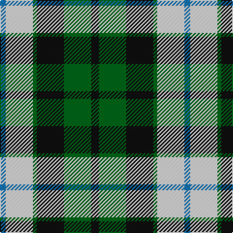

In pattern [BWGKGK](/patterns/bwgkgk/).

This was sourced from tartans-authority.  It is a [6 stripes tartan](/stripes/stripes6/).

Original link http://www.tartansauthority.com/tartan-ferret/display/7015/

## Thread count
B/6 LN28 G4 K28 G28 K/8

## Palette
Each colour and its ΔE from the base-6 reference it is a variant of.

| Colour | Shade | Base | ΔE (OKLab) |
|---|---|---|---|
| B | <code style="background-color:#1474B4;">#1474B4</code> `#1474B4` | B <code style="background-color:#2C4084;">#2C4084</code> | 0.15 |
| G | <code style="background-color:#006818;">#006818</code> `#006818` | G <code style="background-color:#006400;">#006400</code> | 0.02 |
| K | <code style="background-color:#101010;">#101010</code> `#101010` | K <code style="background-color:#000000;">#000000</code> | 0.17 |
| LN | <code style="background-color:#E0E0E0;">#E0E0E0</code> `#E0E0E0` | W <code style="background-color:#F4F4F0;">#F4F4F0</code> | 0.06 |

# Sample pattern

## Nearest tartans

The nearest existing variants by ΔTartan distance.

1. [Loch Leven, Check](/setts/s6/k4g26k22b8w18k4-b5480b0-g008000-k000030-we0e0e0/) — ΔT 0.66
1. [MacKay Dress](/setts/s6/b8w46g4k46g46k8-b1474b4-g006818-k101010-we0e0e0/) — ΔT 0.85
1. [Lawson, William 2002](/setts/s7/k8w38k22g30k6g32y6-g003c14-k101010-we0e0e0-ye8c000/) — ΔT 0.85
1. [Wellington, or Waterloo](/setts/s6/b6g12k12b8r2b2-b5480b0-g008000-k000000-rc00000/) — ΔT 0.91
1. [Cape Breton](/setts/s7/y10k10g34k12ga48k12y6-g008000-ga808080-k000000-yf0c000/) — ΔT 0.93
1. [Melville](/setts/s6/k8w4g26k26ga24k4-g408060-ga608c9c-k101010-wfcfcfc/) — ΔT 1.04
1. [Lawsons' Whisky](/setts/s7/k9w38k22g31k5g31y5-g006818-k101010-wf8f8f8-ye8c000/) — ΔT 1.07
1. [Davidson of Tulloch](/setts/s5/r4b20k10g24w4-b2c2c80-g289c18-k101010-rc80000-wfcfcfc/) — ΔT 1.08
1. [Unnamed, No 26](/setts/s6/w4b4g22k20b20w3-b304080-g008000-k000000-we0e0e0/) — ΔT 1.09
1. [Wellington, or Waterloo](/setts/s6/b6g24k28b22r6b6-b5480b0-g008000-k000000-rc00000/) — ΔT 1.09

## Neighbour map

Every grey dot is one of 15726 variants placed by the first two principal components of the ΔTartan feature space (44% of its variance). Red is this tartan; blue dots are its nearest — click one to open its page.

<svg viewBox="0 0 640 380" role="img" style="max-width:100%;height:auto;border:1px solid #e0e0e0;border-radius:4px;display:block" xmlns="http://www.w3.org/2000/svg"><image href="/nn/cloud.v1.png" width="640" height="380"/><a href="/setts/s6/k4g26k22b8w18k4-b5480b0-g008000-k000030-we0e0e0/"><circle cx="110.1" cy="228.5" r="4" fill="#3465a4"><title>Loch Leven, Check</title></circle></a><a href="/setts/s6/b8w46g4k46g46k8-b1474b4-g006818-k101010-we0e0e0/"><circle cx="141.4" cy="195.7" r="4" fill="#3465a4"><title>MacKay Dress</title></circle></a><a href="/setts/s7/k8w38k22g30k6g32y6-g003c14-k101010-we0e0e0-ye8c000/"><circle cx="146.7" cy="225.4" r="4" fill="#3465a4"><title>Lawson, William 2002</title></circle></a><a href="/setts/s6/b6g12k12b8r2b2-b5480b0-g008000-k000000-rc00000/"><circle cx="126.0" cy="243.8" r="4" fill="#3465a4"><title>Wellington, or Waterloo</title></circle></a><a href="/setts/s7/y10k10g34k12ga48k12y6-g008000-ga808080-k000000-yf0c000/"><circle cx="130.0" cy="200.8" r="4" fill="#3465a4"><title>Cape Breton</title></circle></a><a href="/setts/s6/k8w4g26k26ga24k4-g408060-ga608c9c-k101010-wfcfcfc/"><circle cx="164.1" cy="237.3" r="4" fill="#3465a4"><title>Melville</title></circle></a><a href="/setts/s7/k9w38k22g31k5g31y5-g006818-k101010-wf8f8f8-ye8c000/"><circle cx="149.7" cy="213.5" r="4" fill="#3465a4"><title>Lawsons' Whisky</title></circle></a><a href="/setts/s5/r4b20k10g24w4-b2c2c80-g289c18-k101010-rc80000-wfcfcfc/"><circle cx="116.7" cy="224.9" r="4" fill="#3465a4"><title>Davidson of Tulloch</title></circle></a><a href="/setts/s6/w4b4g22k20b20w3-b304080-g008000-k000000-we0e0e0/"><circle cx="114.6" cy="224.1" r="4" fill="#3465a4"><title>Unnamed, No 26</title></circle></a><a href="/setts/s6/b6g24k28b22r6b6-b5480b0-g008000-k000000-rc00000/"><circle cx="113.2" cy="248.3" r="4" fill="#3465a4"><title>Wellington, or Waterloo</title></circle></a><circle cx="117.9" cy="223.5" r="5" fill="#c00000"/></svg>

ID: /setts/s6/k8g28k28g4w28b6-b1474b4-g006818-k101010-we0e0e0/
