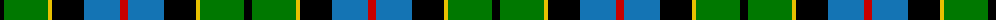

In pattern [KGYKBR](/patterns/kgykbr/).

This was sourced from register-of-tartans.  It is a [6 stripes tartan](/stripes/stripes6/).

Original link https://www.tartanregister.gov.uk/tartanDetails.aspx?ref=1236

## Attestations

This cloth appears in 2 source records; the oldest owns this page.

- 01/01/1795 — Forsyth (1795) (register-of-tartans, [record](https://www.tartanregister.gov.uk/tartanDetails.aspx?ref=1236))
- 1795 — Forsyth (Clan) (tartans-authority, [record](http://www.tartansauthority.com/tartan-ferret/display/1122/))

## Thread count
K/8 G44 Y4 K32 B36 R/8

## Palette
Each colour and its ΔE from the base-6 reference it is a variant of.

| Colour | Shade | Base | ΔE (OKLab) |
|---|---|---|---|
| B | <code style="background-color:#1474B4;">#1474B4</code> `#1474B4` | B <code style="background-color:#2C4084;">#2C4084</code> | 0.15 |
| G | <code style="background-color:#007800;">#007800</code> `#007800` | G <code style="background-color:#006400;">#006400</code> | 0.06 |
| K | <code style="background-color:#000000;">#000000</code> `#000000` | K <code style="background-color:#000000;">#000000</code> | 0.00 |
| R | <code style="background-color:#C80000;">#C80000</code> `#C80000` | R <code style="background-color:#C80000;">#C80000</code> | 0.00 |
| Y | <code style="background-color:#E8C000;">#E8C000</code> `#E8C000` | Y <code style="background-color:#E8C000;">#E8C000</code> | 0.00 |

# Sample pattern

ID: /setts/s6/k8g44y4k32b36r8-b1474b4-g007800-k000000-rc80000-ye8c000/
