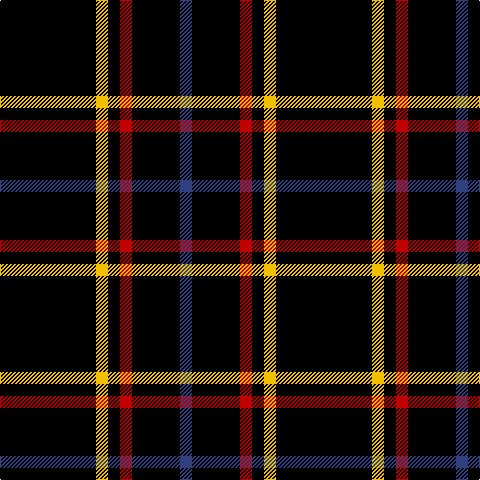

In pattern [BKRKYK](/stripes/bkrkyk/).

This was sourced from weddslist.  It is a [6 stripe tartan](/stripes/stripes6/).

Original link http://www.weddslist.com/cgi-bin/tartans/pg.pl?source=sts

## Thread count
K/96 Y12 K12 R12 K48 B/12

## Palette
Each colour and the base-6 reference it is a variant of.

| Colour | Shade | Base |
|---|---|---|
| B | <code style="background-color:#304080;">#304080</code> `oklch(39.4% 0.109 270.2)` <small>#304080</small> | B <code style="background-color:#2A418A;">#2A418A</code> |
| K | <code style="background-color:#000000;">#000000</code> `oklch(0.0% 0.000 0.0)` <small>#000000</small> | K <code style="background-color:#000000;">#000000</code> |
| R | <code style="background-color:#C00000;">#C00000</code> `oklch(50.7% 0.208 29.2)` <small>#C00000</small> | R <code style="background-color:#CC0000;">#CC0000</code> |
| Y | <code style="background-color:#F0C000;">#F0C000</code> `oklch(82.7% 0.169 90.5)` <small>#F0C000</small> | Y <code style="background-color:#F2BF00;">#F2BF00</code> |

# Sample pattern

## Nearest tartans

The nearest existing variants by ΔTartan distance.

1. [Unidentified 11](/setts/s7/k24g3r3k24r2k2r2/) — ΔT 1.37
1. [New Zealand (2000)](/setts/s6/k21lb2k5lb9k13g2~x4/) — ΔT 1.73
1. [Hebridean 7](/setts/s14/k2r1k10r1k2r1k10r2k10r2g2r2k10db2~x2/) — ΔT 1.89
1. [Dhillon (Personal)](/setts/s4/k35lo3w3g3~x4/) — ΔT 1.95
1. [Gwynn](/setts/s8/k45ly4k4ly9k4ly4k45r4~x2/) — ΔT 1.96
1. [Benson (New England)](/setts/s7/k16b2k8r3lr3r3k8~x2/) — ΔT 2.04
1. [Lanoir](/setts/s6/k4r4k20r1k20w4~x6/) — ΔT 2.14
1. [Believe - Colette](/setts/s7/n3k31w6k8n3k12w2~x2/) — ΔT 2.18
1. [Cowe (Personal)](/setts/s7/k8t3k32b14w3k25t3~x2/) — ΔT 2.19
1. [Gold-Smith (Personal)](/setts/s13/r2k25dy2k20do5k2do4k3do3k4do2k6ly2~x2/) — ΔT 2.19

## Neighbour map

Every grey dot is one of 14299 variants placed by the first two principal components of the ΔTartan feature space (44% of its variance). Red is this tartan; blue dots are its nearest — click one to open its page.

<svg viewBox="0 0 640 380" role="img" style="max-width:100%;height:auto;border:1px solid #e0e0e0;border-radius:4px;display:block" xmlns="http://www.w3.org/2000/svg"><image href="/nn/cloud.v1.png" width="640" height="380"/><a href="/setts/s7/k24g3r3k24r2k2r2/"><circle cx="548.8" cy="218.4" r="4" fill="#3465a4"><title>Unidentified 11</title></circle></a><a href="/setts/s6/k21lb2k5lb9k13g2~x4/"><circle cx="415.9" cy="233.9" r="4" fill="#3465a4"><title>New Zealand (2000)</title></circle></a><a href="/setts/s14/k2r1k10r1k2r1k10r2k10r2g2r2k10db2~x2/"><circle cx="437.5" cy="186.4" r="4" fill="#3465a4"><title>Hebridean 7</title></circle></a><a href="/setts/s4/k35lo3w3g3~x4/"><circle cx="490.0" cy="202.4" r="4" fill="#3465a4"><title>Dhillon (Personal)</title></circle></a><a href="/setts/s8/k45ly4k4ly9k4ly4k45r4~x2/"><circle cx="516.8" cy="195.4" r="4" fill="#3465a4"><title>Gwynn</title></circle></a><a href="/setts/s7/k16b2k8r3lr3r3k8~x2/"><circle cx="403.6" cy="228.2" r="4" fill="#3465a4"><title>Benson (New England)</title></circle></a><a href="/setts/s6/k4r4k20r1k20w4~x6/"><circle cx="538.4" cy="209.3" r="4" fill="#3465a4"><title>Lanoir</title></circle></a><a href="/setts/s7/n3k31w6k8n3k12w2~x2/"><circle cx="475.5" cy="194.2" r="4" fill="#3465a4"><title>Believe - Colette</title></circle></a><a href="/setts/s7/k8t3k32b14w3k25t3~x2/"><circle cx="412.6" cy="212.7" r="4" fill="#3465a4"><title>Cowe (Personal)</title></circle></a><a href="/setts/s13/r2k25dy2k20do5k2do4k3do3k4do2k6ly2~x2/"><circle cx="429.8" cy="154.6" r="4" fill="#3465a4"><title>Gold-Smith (Personal)</title></circle></a><circle cx="472.4" cy="225.3" r="5" fill="#c00000"/></svg>

ID: /setts/s6/k8ly1k1r1k4db1~x12/
