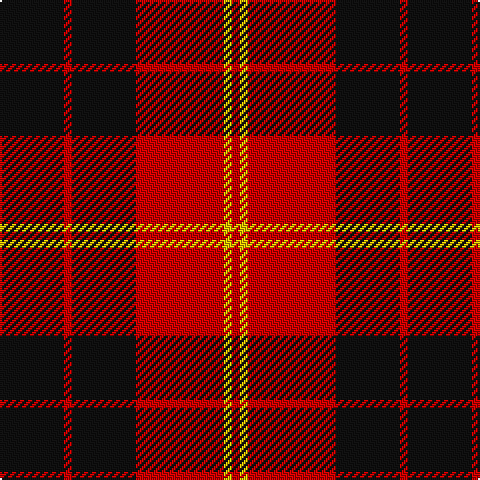

In pattern [KRKRYR](/stripes/krkryr/).

This was sourced from register-of-tartans.  It is a [6 stripe tartan](/stripes/stripes6/).

Original link https://www.tartanregister.gov.uk/tartanDetails.aspx?ref=4052

## Attestations

This cloth appears in 2 source records; the oldest owns this page.

- 01/06/2007 — Swanstrom (Personal) (register-of-tartans, [record](https://www.tartanregister.gov.uk/tartanDetails.aspx?ref=4052))
- June 2007 — Swanstrom (Personal) (tartans-authority, [record](http://www.tartansauthority.com/tartan-ferret/display/7222/))

## Register references

External register numbers recorded for this tartan.

- Scottish Register of Tartans: [4052](https://www.tartanregister.gov.uk/tartanDetails.aspx?ref=4052)
- Scottish Tartans Authority (ITI): 7222

## Thread count
K/32 R4 K32 R44 Y4 R/4

## Palette
Each colour and the base-6 reference it is a variant of.

| Colour | Shade | Base |
|---|---|---|
| K | <code style="background-color:#101010;">#101010</code> `oklch(17.3% 0.000 89.9)` <small>#101010</small> | K <code style="background-color:#000000;">#000000</code> |
| R | <code style="background-color:#C80000;">#C80000</code> `oklch(52.3% 0.215 29.2)` <small>#C80000</small> | R <code style="background-color:#CC0000;">#CC0000</code> |
| Y | <code style="background-color:#E8C000;">#E8C000</code> `oklch(81.9% 0.168 93.7)` <small>#E8C000</small> | Y <code style="background-color:#F2BF00;">#F2BF00</code> |

# Sample pattern

## Nearest tartans

The nearest existing variants by ΔTartan distance, with this tartan at the top so the swatches line up against it.

ΔTartan

Tartan

Sett

—

<a href="/ttd/edit/#slug=k8r1k8r11ly1r1~x4">Swanstrom (Personal)</a> <a class="nn-out" href="/setts/s6/k8r1k8r11ly1r1~x4/" title="open its dictionary page">↗</a>

0.28

<a href="/ttd/edit/#slug=k2r6k2r6k12ly1~x4">MacQueen</a> <a class="nn-out" href="/setts/s6/k2r6k2r6k12ly1~x4/" title="open its dictionary page">↗</a>

0.64

<a href="/ttd/edit/#slug=r3k25r25k10lb3~x2">Bodog.com</a> <a class="nn-out" href="/setts/s5/r3k25r25k10lb3~x2/" title="open its dictionary page">↗</a>

0.73

<a href="/ttd/edit/#slug=k2r16k8ly1k8r2~x4">Brodie (Clan)</a> <a class="nn-out" href="/setts/s6/k2r16k8ly1k8r2~x4/" title="open its dictionary page">↗</a>

0.76

<a href="/ttd/edit/#slug=r4k8r4k8r12k1ly1~x2">MacKeane (Clan?)</a> <a class="nn-out" href="/setts/s7/r4k8r4k8r12k1ly1~x2/" title="open its dictionary page">↗</a>

0.79

<a href="/ttd/edit/#slug=k4r33k24w3k4r3~x2">Monmouth College</a> <a class="nn-out" href="/setts/s6/k4r33k24w3k4r3~x2/" title="open its dictionary page">↗</a>

0.80

<a href="/ttd/edit/#slug=k18r4k18r32w3~x2">Munro (Black and Red)</a> <a class="nn-out" href="/setts/s5/k18r4k18r32w3~x2/" title="open its dictionary page">↗</a>

0.84

<a href="/ttd/edit/#slug=k16r2k2r12w1~x2">MacIver</a> <a class="nn-out" href="/setts/s5/k16r2k2r12w1~x2/" title="open its dictionary page">↗</a>

0.86

<a href="/ttd/edit/#slug=k3r15k11ly2k4r3~x2">Brodie (Clan)</a> <a class="nn-out" href="/setts/s6/k3r15k11ly2k4r3~x2/" title="open its dictionary page">↗</a>

0.94

<a href="/ttd/edit/#slug=r4k8r4k8r12k1ly2~x4">MacDonald of Ardnamurchan (Clan?)</a> <a class="nn-out" href="/setts/s7/r4k8r4k8r12k1ly2~x4/" title="open its dictionary page">↗</a>

1.04

<a href="/ttd/edit/#slug=dg24r3dg16r33w4">Unidentified Plaid #3</a> <a class="nn-out" href="/setts/s5/dg24r3dg16r33w4/" title="open its dictionary page">↗</a>

## Neighbour map

Every grey dot is one of 14299 variants placed by the first two principal components of the ΔTartan feature space (44% of its variance). Red is this tartan; blue dots are its nearest — click one to open its page.

<svg viewBox="0 0 640 380" role="img" style="max-width:100%;height:auto;border:1px solid #e0e0e0;border-radius:4px;display:block" xmlns="http://www.w3.org/2000/svg"><image href="/nn/cloud.v1.png" width="640" height="380"/><a href="/setts/s6/k2r6k2r6k12ly1~x4/"><circle cx="342.4" cy="216.7" r="4" fill="#3465a4"><title>MacQueen</title></circle></a><a href="/setts/s5/r3k25r25k10lb3~x2/"><circle cx="317.5" cy="237.3" r="4" fill="#3465a4"><title>Bodog.com</title></circle></a><a href="/setts/s6/k2r16k8ly1k8r2~x4/"><circle cx="341.2" cy="198.6" r="4" fill="#3465a4"><title>Brodie (Clan)</title></circle></a><a href="/setts/s7/r4k8r4k8r12k1ly1~x2/"><circle cx="327.8" cy="213.9" r="4" fill="#3465a4"><title>MacKeane (Clan?)</title></circle></a><a href="/setts/s6/k4r33k24w3k4r3~x2/"><circle cx="335.4" cy="193.5" r="4" fill="#3465a4"><title>Monmouth College</title></circle></a><a href="/setts/s5/k18r4k18r32w3~x2/"><circle cx="301.7" cy="227.1" r="4" fill="#3465a4"><title>Munro (Black and Red)</title></circle></a><a href="/setts/s5/k16r2k2r12w1~x2/"><circle cx="360.3" cy="195.2" r="4" fill="#3465a4"><title>MacIver</title></circle></a><a href="/setts/s6/k3r15k11ly2k4r3~x2/"><circle cx="287.9" cy="227.7" r="4" fill="#3465a4"><title>Brodie (Clan)</title></circle></a><a href="/setts/s7/r4k8r4k8r12k1ly2~x4/"><circle cx="306.0" cy="215.4" r="4" fill="#3465a4"><title>MacDonald of Ardnamurchan (Clan?)</title></circle></a><a href="/setts/s5/dg24r3dg16r33w4/"><circle cx="308.3" cy="231.1" r="4" fill="#3465a4"><title>Unidentified Plaid #3</title></circle></a><circle cx="336.5" cy="214.7" r="5" fill="#c00000"/></svg>

ID: /setts/s6/k8r1k8r11ly1r1~x4/
