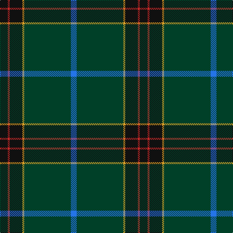

**Bands:** [KRKYGB](/stripes/krkygb/) · **Stripes:** [K R K LO DG B](/stripes/stripes6/) K R K LO DG B

This was sourced from register-of-tartans.  It is a [6 band tartan](/bands/bands6/).

Original link https://www.tartanregister.gov.uk/tartanDetails.aspx?ref=11272

## Register references

External register numbers recorded for this tartan.

- Scottish Register of Tartans: [11272](https://www.tartanregister.gov.uk/tartanDetails.aspx?ref=11272)

## Thread count
K/16 R4 K26 Y4 DG96 B/12

## Palette
Each colour and its ΔE from the base-6 reference it is a variant of.

| Colour | Shade | Base | ΔE (OKLab) |
|---|---|---|---|
| B | <code style="background-color:#2474E8;">#2474E8</code> `#2474E8` | B <code style="background-color:#2A418A;">#2A418A</code> | 0.19 |
| DG | <code style="background-color:#004028;">#004028</code> `#004028` | G <code style="background-color:#006100;">#006100</code> | 0.13 |
| K | <code style="background-color:#101010;">#101010</code> `#101010` | K <code style="background-color:#000000;">#000000</code> | 0.17 |
| R | <code style="background-color:#C82828;">#C82828</code> `#C82828` | R <code style="background-color:#CC0000;">#CC0000</code> | 0.03 |
| Y | <code style="background-color:#E0A126;">#E0A126</code> `#E0A126` | Y <code style="background-color:#F2BF00;">#F2BF00</code> | 0.08 |

# Sample pattern

## Nearest tartans

The nearest existing variants by ΔTartan distance.

1. [Unidentified, Toy Bear](/setts/s8/dg47ly2dg5ly2dg4k15db19r2~x2/) — ΔT 1.11
1. [Green Swamp Youth Campers](/setts/s6/k8r2k13ly2dg48db6~x2/) — ΔT 1.18
1. [MacWilliam Hunting](/setts/s6/dy2dg44k10r1db16r1~x2/) — ΔT 1.19
1. [Mounth,The Rejected](/setts/s7/dg36dg5db17w2dg14o3dp2~x2/) — ΔT 1.25
1. [Raymond of Doune](/setts/s8/r4dg10lo1lb1dt4lb1dt25r2~x2/) — ΔT 1.28
1. [Hall, from Springbrook and Newtown (Personal)](/setts/s8/w3m11db4m6dg48o2dg3o2~x2/) — ΔT 1.29
1. [St Andrews Old Course Hotel Corporate Tartan Tartan Number: 2332. Earliest known date: 1994 St Andrews Old Course Hotel, Golf Resort, and SPA See products available Copyright © Blair Urquhart, Comrie, 2015](/setts/s6/g50db20k3db2dy2db5~x2/) — ΔT 1.35
1. [Suttle (Personal)](/setts/s8/n36k18n5dt7n5k7r1g2~x2/) — ΔT 1.36
1. [Edinburgh, The University of](/setts/s7/k8m26k22dt110w4k5w4/) — ΔT 1.47
1. [Connecticut State Police Pipe Band](/setts/s6/k42n2k2n17db8lo4~x2/) — ΔT 1.48

## Neighbour map

Every grey dot is one of 14299 variants placed by the first two principal components of the ΔTartan feature space (44% of its variance). Red is this tartan; blue dots are its nearest — click one to open its page.

<svg viewBox="0 0 640 380" role="img" style="max-width:100%;height:auto;border:1px solid #e0e0e0;border-radius:4px;display:block" xmlns="http://www.w3.org/2000/svg"><image href="/nn/cloud.v1.png" width="640" height="380"/><a href="/setts/s8/dg47ly2dg5ly2dg4k15db19r2~x2/"><circle cx="391.9" cy="172.1" r="4" fill="#3465a4"><title>Unidentified, Toy Bear</title></circle></a><a href="/setts/s6/k8r2k13ly2dg48db6~x2/"><circle cx="438.2" cy="192.6" r="4" fill="#3465a4"><title>Green Swamp Youth Campers</title></circle></a><a href="/setts/s6/dy2dg44k10r1db16r1~x2/"><circle cx="428.1" cy="155.3" r="4" fill="#3465a4"><title>MacWilliam Hunting</title></circle></a><a href="/setts/s7/dg36dg5db17w2dg14o3dp2~x2/"><circle cx="367.1" cy="173.2" r="4" fill="#3465a4"><title>Mounth,The Rejected</title></circle></a><a href="/setts/s8/r4dg10lo1lb1dt4lb1dt25r2~x2/"><circle cx="416.3" cy="162.5" r="4" fill="#3465a4"><title>Raymond of Doune</title></circle></a><a href="/setts/s8/w3m11db4m6dg48o2dg3o2~x2/"><circle cx="427.3" cy="137.9" r="4" fill="#3465a4"><title>Hall, from Springbrook and Newtown (Personal)</title></circle></a><a href="/setts/s6/g50db20k3db2dy2db5~x2/"><circle cx="447.4" cy="189.0" r="4" fill="#3465a4"><title>St Andrews Old Course Hotel Corporate Tartan Tartan Number: 2332. Earliest known date: 1994 St Andrews Old Course Hotel, Golf Resort, and SPA See products available Copyright © Blair Urquhart, Comrie, 2015</title></circle></a><a href="/setts/s8/n36k18n5dt7n5k7r1g2~x2/"><circle cx="397.5" cy="152.7" r="4" fill="#3465a4"><title>Suttle (Personal)</title></circle></a><a href="/setts/s7/k8m26k22dt110w4k5w4/"><circle cx="427.5" cy="159.7" r="4" fill="#3465a4"><title>Edinburgh, The University of</title></circle></a><a href="/setts/s6/k42n2k2n17db8lo4~x2/"><circle cx="388.3" cy="187.1" r="4" fill="#3465a4"><title>Connecticut State Police Pipe Band</title></circle></a><circle cx="408.3" cy="175.3" r="5" fill="#c00000"/></svg>

ID: /setts/s6/k8r2k13lo2dg48b6~x2/
