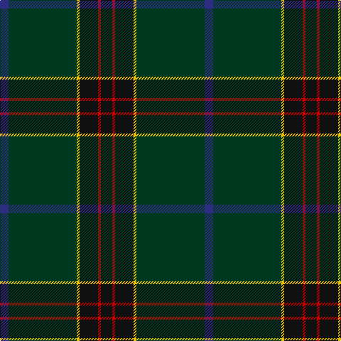

**Bands:** [BGYKRK](/stripes/bgykrk/) · **Stripes:** [DB DG LY K R K](/stripes/stripes6/) DB DG LY K R K

This was sourced from tartans-authority.  It is a [6 band tartan](/bands/bands6/).

Original link http://www.tartansauthority.com/tartan-ferret/display/11272/

## Thread count
DB/12 DG96 Y4 K26 R4 K/16

## Palette
Each colour and its ΔE from the base-6 reference it is a variant of.

| Colour | Shade | Base | ΔE (OKLab) |
|---|---|---|---|
| DB | <code style="background-color:#2C2C80;">#2C2C80</code> `#2C2C80` | B <code style="background-color:#2A418A;">#2A418A</code> | 0.06 |
| DG | <code style="background-color:#003820;">#003820</code> `#003820` | G <code style="background-color:#006100;">#006100</code> | 0.15 |
| K | <code style="background-color:#101010;">#101010</code> `#101010` | K <code style="background-color:#000000;">#000000</code> | 0.17 |
| R | <code style="background-color:#C80000;">#C80000</code> `#C80000` | R <code style="background-color:#CC0000;">#CC0000</code> | 0.01 |
| Y | <code style="background-color:#E8C000;">#E8C000</code> `#E8C000` | Y <code style="background-color:#F2BF00;">#F2BF00</code> | 0.02 |

# Sample pattern

## Nearest tartans

The nearest existing variants by ΔTartan distance.

1. [Unidentified, Toy Bear](/setts/s8/dg47ly2dg5ly2dg4k15db19r2~x2/) — ΔT 0.92
1. [Raymond of Doune](/setts/s8/r4dg10lo1lb1dt4lb1dt25r2~x2/) — ΔT 1.13
1. [Green Swamp Youth Campers](/setts/s6/k8r2k13lo2dg48b6~x2/) — ΔT 1.18
1. [Barrance, Paul and Kelly (Personal)](/setts/s7/dp3dt42k2dg17dt9dp3w2~x2/) — ΔT 1.33
1. [US Army Regimental Tartan Tartan Number: 6307. Earliest known date: 2004 The Army was the only arm of the U.S. Forces not to have its own tartan. The colours were chosen to represent the uniforms - black for the beret, khaki for the summer uniform, light green for the original sniper and now part of the summer uniform, dark blue for the original dress uniform, olive for the combat uniform and gold for the cavalry. See products available Copyright © Blair Urquhart, Comrie, 2015](/setts/s6/dt12k17y4dg51ly3g4~x2/) — ΔT 1.37
1. [Silver Thistle (Fashion)](/setts/s7/g4db3k6db20k46o2k4~x2/) — ΔT 1.42
1. [Java St Andrew Society hunting](/setts/s7/db50dg26k9dg4w2r2dg10~x2/) — ΔT 1.43
1. [Round Table (1997)](/setts/s6/db47dg14dp5do2r3dg7~x2/) — ΔT 1.44
1. [MacWilliam Hunting](/setts/s6/dy2dg44k10r1db16r1~x2/) — ΔT 1.45
1. [Scottish Chieftain (Universal)](/setts/s8/k20r1dg3k8dg2k2dg20w2~x2/) — ΔT 1.49

## Neighbour map

Every grey dot is one of 14313 variants placed by the first two principal components of the ΔTartan feature space (44% of its variance). Red is this tartan; blue dots are its nearest — click one to open its page.

<svg viewBox="0 0 640 380" role="img" style="max-width:100%;height:auto;border:1px solid #e0e0e0;border-radius:4px;display:block" xmlns="http://www.w3.org/2000/svg"><image href="/nn/cloud.v1.png" width="640" height="380"/><a href="/setts/s8/dg47ly2dg5ly2dg4k15db19r2~x2/"><circle cx="391.9" cy="172.1" r="4" fill="#3465a4"><title>Unidentified, Toy Bear</title></circle></a><a href="/setts/s8/r4dg10lo1lb1dt4lb1dt25r2~x2/"><circle cx="416.4" cy="162.4" r="4" fill="#3465a4"><title>Raymond of Doune</title></circle></a><a href="/setts/s6/k8r2k13lo2dg48b6~x2/"><circle cx="408.4" cy="175.3" r="4" fill="#3465a4"><title>Green Swamp Youth Campers</title></circle></a><a href="/setts/s7/dp3dt42k2dg17dt9dp3w2~x2/"><circle cx="450.7" cy="186.0" r="4" fill="#3465a4"><title>Barrance, Paul and Kelly (Personal)</title></circle></a><a href="/setts/s6/dt12k17y4dg51ly3g4~x2/"><circle cx="351.6" cy="191.3" r="4" fill="#3465a4"><title>US Army Regimental Tartan Tartan Number: 6307. Earliest known date: 2004 The Army was the only arm of the U.S. Forces not to have its own tartan. The colours were chosen to represent the uniforms - black for the beret, khaki for the summer uniform, light green for the original sniper and now part of the summer uniform, dark blue for the original dress uniform, olive for the combat uniform and gold for the cavalry. See products available Copyright © Blair Urquhart, Comrie, 2015</title></circle></a><a href="/setts/s7/g4db3k6db20k46o2k4~x2/"><circle cx="474.9" cy="187.4" r="4" fill="#3465a4"><title>Silver Thistle (Fashion)</title></circle></a><a href="/setts/s7/db50dg26k9dg4w2r2dg10~x2/"><circle cx="381.6" cy="196.0" r="4" fill="#3465a4"><title>Java St Andrew Society hunting</title></circle></a><a href="/setts/s6/db47dg14dp5do2r3dg7~x2/"><circle cx="442.4" cy="192.0" r="4" fill="#3465a4"><title>Round Table (1997)</title></circle></a><a href="/setts/s6/dy2dg44k10r1db16r1~x2/"><circle cx="428.2" cy="155.3" r="4" fill="#3465a4"><title>MacWilliam Hunting</title></circle></a><a href="/setts/s8/k20r1dg3k8dg2k2dg20w2~x2/"><circle cx="393.1" cy="205.7" r="4" fill="#3465a4"><title>Scottish Chieftain (Universal)</title></circle></a><circle cx="438.3" cy="192.6" r="5" fill="#c00000"/></svg>

ID: /setts/s6/k8r2k13ly2dg48db6~x2/
