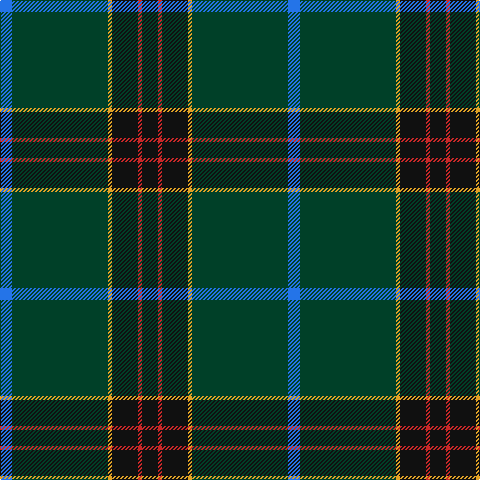

In pattern [BGYKRK](/patterns/bgykrk/).

This was sourced from register-of-tartans.  It is a [6 stripes tartan](/stripes/stripes6/).

Original link https://www.tartanregister.gov.uk/tartanDetails.aspx?ref=11272

## Register references

External register numbers recorded for this tartan.

- Scottish Register of Tartans: [11272](https://www.tartanregister.gov.uk/tartanDetails.aspx?ref=11272)

## Thread count
B/12 DG96 Y4 K26 R4 K/16

## Palette
Each colour and its ΔE from the base-6 reference it is a variant of.

| Colour | Shade | Base | ΔE (OKLab) |
|---|---|---|---|
| B | <code style="background-color:#2474E8;">#2474E8</code> `#2474E8` | B <code style="background-color:#2A418A;">#2A418A</code> | 0.19 |
| DG | <code style="background-color:#004028;">#004028</code> `#004028` | G <code style="background-color:#006100;">#006100</code> | 0.13 |
| K | <code style="background-color:#101010;">#101010</code> `#101010` | K <code style="background-color:#000000;">#000000</code> | 0.17 |
| R | <code style="background-color:#C82828;">#C82828</code> `#C82828` | R <code style="background-color:#CC0000;">#CC0000</code> | 0.03 |
| Y | <code style="background-color:#E0A126;">#E0A126</code> `#E0A126` | Y <code style="background-color:#F2BF00;">#F2BF00</code> | 0.08 |

# Sample pattern

## Nearest tartans

The nearest existing variants by ΔTartan distance.

1. [Unidentified, Toy Bear](/setts/s8/g47y2g5y2g4k15b19r2~b141e46-g003c14-k101010-rdc0000-ye8c000~x2/) — ΔT 1.11
1. [Green Swamp Youth Campers](/setts/s6/k8r2k13y2g48b6~b2c2c80-g003820-k101010-rc80000-ye8c000~x2/) — ΔT 1.18
1. [MacWilliam Hunting](/setts/s6/g2ga44k10r1b16r1~b2c2c80-g604000-ga285800-k101010-rc80000~x2/) — ΔT 1.19
1. [Mounth,The Rejected](/setts/s7/g36ga5b17w2g14r3ba2~b080848-ba5a008c-g005020-ga002814-r888888-we0e0e0~x2/) — ΔT 1.24
1. [Raymond of Doune](/setts/s8/r4g10y1w1b4w1b25r2~b14283c-g003820-r880000-wc0c0c0-yd09800~x2/) — ΔT 1.28
1. [Hall, from Springbrook and Newtown (Personal)](/setts/s8/w3r11b4r6g48ra2g3ra2~b141e46-g003c14-r781c38-rac87814-we0e0e0~x2/) — ΔT 1.29
1. [St Andrews Old Course Hotel Corporate Tartan Tartan Number: 2332. Earliest known date: 1994 St Andrews Old Course Hotel, Golf Resort, and SPA See products available Copyright © Blair Urquhart, Comrie, 2015](/setts/s6/g50b20k3b2ga2b5~b2c2c80-g006818-ga604000-k101010~x2/) — ΔT 1.35
1. [Suttle (Personal)](/setts/s8/b36k18b5ba7b5k7r1g2~b5c5c5c-ba003c64-g006818-k101010-rc80000~x2/) — ΔT 1.35
1. [Edinburgh, The University of](/setts/s7/k8r26k22b110w4k5w4~b145064-k101010-r781c38-we0e0e0/) — ΔT 1.47
1. [Connecticut State Police Pipe Band](/setts/s6/k42b2k2b17ba8y4~b5c5c5c-ba00008c-k141414-yc88c00~x2/) — ΔT 1.48

## Neighbour map

Every grey dot is one of 15726 variants placed by the first two principal components of the ΔTartan feature space (44% of its variance). Red is this tartan; blue dots are its nearest — click one to open its page.

<svg viewBox="0 0 640 380" role="img" style="max-width:100%;height:auto;border:1px solid #e0e0e0;border-radius:4px;display:block" xmlns="http://www.w3.org/2000/svg"><image href="/nn/cloud.v1.png" width="640" height="380"/><a href="/setts/s8/g47y2g5y2g4k15b19r2~b141e46-g003c14-k101010-rdc0000-ye8c000~x2/"><circle cx="389.7" cy="164.1" r="4" fill="#3465a4"><title>Unidentified, Toy Bear</title></circle></a><a href="/setts/s6/k8r2k13y2g48b6~b2c2c80-g003820-k101010-rc80000-ye8c000~x2/"><circle cx="436.3" cy="183.9" r="4" fill="#3465a4"><title>Green Swamp Youth Campers</title></circle></a><a href="/setts/s6/g2ga44k10r1b16r1~b2c2c80-g604000-ga285800-k101010-rc80000~x2/"><circle cx="426.1" cy="148.8" r="4" fill="#3465a4"><title>MacWilliam Hunting</title></circle></a><a href="/setts/s7/g36ga5b17w2g14r3ba2~b080848-ba5a008c-g005020-ga002814-r888888-we0e0e0~x2/"><circle cx="364.5" cy="168.0" r="4" fill="#3465a4"><title>Mounth,The Rejected</title></circle></a><a href="/setts/s8/r4g10y1w1b4w1b25r2~b14283c-g003820-r880000-wc0c0c0-yd09800~x2/"><circle cx="414.5" cy="155.3" r="4" fill="#3465a4"><title>Raymond of Doune</title></circle></a><a href="/setts/s8/w3r11b4r6g48ra2g3ra2~b141e46-g003c14-r781c38-rac87814-we0e0e0~x2/"><circle cx="425.5" cy="135.2" r="4" fill="#3465a4"><title>Hall, from Springbrook and Newtown (Personal)</title></circle></a><a href="/setts/s6/g50b20k3b2ga2b5~b2c2c80-g006818-ga604000-k101010~x2/"><circle cx="444.9" cy="184.0" r="4" fill="#3465a4"><title>St Andrews Old Course Hotel Corporate Tartan Tartan Number: 2332. Earliest known date: 1994 St Andrews Old Course Hotel, Golf Resort, and SPA See products available Copyright © Blair Urquhart, Comrie, 2015</title></circle></a><a href="/setts/s8/b36k18b5ba7b5k7r1g2~b5c5c5c-ba003c64-g006818-k101010-rc80000~x2/"><circle cx="395.7" cy="147.1" r="4" fill="#3465a4"><title>Suttle (Personal)</title></circle></a><a href="/setts/s7/k8r26k22b110w4k5w4~b145064-k101010-r781c38-we0e0e0/"><circle cx="425.2" cy="156.6" r="4" fill="#3465a4"><title>Edinburgh, The University of</title></circle></a><a href="/setts/s6/k42b2k2b17ba8y4~b5c5c5c-ba00008c-k141414-yc88c00~x2/"><circle cx="386.0" cy="185.0" r="4" fill="#3465a4"><title>Connecticut State Police Pipe Band</title></circle></a><circle cx="405.9" cy="170.2" r="5" fill="#c00000"/></svg>

ID: /setts/s6/k8r2k13y2g48b6~b2474e8-g004028-k101010-rc82828-ye0a126~x2/
