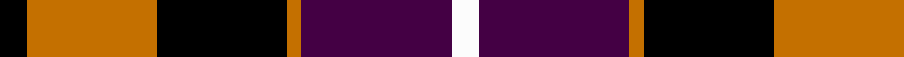
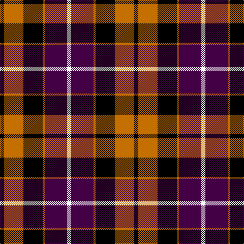

In pattern [KRKRBW](/patterns/krkrbw/).

This was sourced from register-of-tartans.  It is a [6 stripes tartan](/stripes/stripes6/).

Original link https://www.tartanregister.gov.uk/tartanDetails.aspx?ref=1054

## Thread count
K/8 O38 K38 O4 DP44 W/8

## Palette
Each colour and its ΔE from the base-6 reference it is a variant of.

| Colour | Shade | Base | ΔE (OKLab) |
|---|---|---|---|
| DP | <code style="background-color:#440044;">#440044</code> `#440044` | B <code style="background-color:#2A418A;">#2A418A</code> | 0.18 |
| K | <code style="background-color:#000000;">#000000</code> `#000000` | K <code style="background-color:#000000;">#000000</code> | 0.00 |
| O | <code style="background-color:#C47000;">#C47000</code> `#C47000` | R <code style="background-color:#CC0000;">#CC0000</code> | 0.16 |
| W | <code style="background-color:#FCFCFC;">#FCFCFC</code> `#FCFCFC` | W <code style="background-color:#F7F7F7;">#F7F7F7</code> | 0.01 |

# Sample pattern

## Nearest tartans

The nearest existing variants by ΔTartan distance.

1. [Dutch (District)](/setts/s6/k8r38k38r4b44w8-b440044-k000000-rb84c00-wfcfcfc/) — ΔT 0.37
1. [Dutch](/setts/s6/w4b24y2k24y24k2-b304080-k000000-we0e0e0-yff8500/) — ΔT 0.84
1. [Wallace Red Dress Tartan Tartan Number: 8186. Earliest known date: See products available Copyright © Blair Urquhart, Comrie, 2015](/setts/s5/b6k58ka22r58ka6-b2888c4-k000000-ka101010-rc80000/) — ΔT 1.13
1. [Unidentified #65](/setts/s6/g6k40ka40r40k6r6-g005020-k000028-ka101010-rdc0000/) — ΔT 1.13
1. [Baillie](/setts/s7/b6k2b16k12g16k2w4-b800080-g008000-k000000-we0e0e0/) — ΔT 1.14
1. [Dutch District Tartan Tartan Number: 1134. Earliest known date: 1965 The late Sir Iain Moncrieffe of that Ilk, Albany Herald said, "It should be based on Mackay tartan because of the association with the Chiefs of the Clan Mackay. Baron Aeneas Mackay was Prime Minister of the Netherlands in 1889 and his great grandson Lord Reay, the present Chief, is also a Dutch Baron." The sett chosen was John Cargill's proposal of a simple colour change in respect of the two tartans, Dutch and Dutch Dress. See products available Copyright © Blair Urquhart, Comrie, 2015](/setts/s6/w4b24y2k24y24k2-b2c2c80-k101010-we0e0e0-yd87c00/) — ΔT 1.14
1. [MacTavish](/setts/s6/b4r24ba4b12k12b2-b4367ae-ba000052-k000000-raa0000/) — ΔT 1.14
1. [MacTavish](/setts/s6/b2r12ba2b6k6b1-b4367ae-ba000052-k000000-raa0000/) — ΔT 1.14
1. [Graham of Menteith, (Red)](/setts/s6/r52b6r8k32ba32k8-b5480b0-ba304080-k000000-rc00000/) — ΔT 1.17
1. [Biffy Clyro](/setts/s7/y6b44k6b6k22r40y6-b1c0070-k000000-rdc0000-yffcc00/) — ΔT 1.17

## Neighbour map

Every grey dot is one of 15726 variants placed by the first two principal components of the ΔTartan feature space (44% of its variance). Red is this tartan; blue dots are its nearest — click one to open its page.

<svg viewBox="0 0 640 380" role="img" style="max-width:100%;height:auto;border:1px solid #e0e0e0;border-radius:4px;display:block" xmlns="http://www.w3.org/2000/svg"><image href="/nn/cloud.v1.png" width="640" height="380"/><a href="/setts/s6/k8r38k38r4b44w8-b440044-k000000-rb84c00-wfcfcfc/"><circle cx="157.5" cy="200.7" r="4" fill="#3465a4"><title>Dutch (District)</title></circle></a><a href="/setts/s6/w4b24y2k24y24k2-b304080-k000000-we0e0e0-yff8500/"><circle cx="150.2" cy="184.3" r="4" fill="#3465a4"><title>Dutch</title></circle></a><a href="/setts/s5/b6k58ka22r58ka6-b2888c4-k000000-ka101010-rc80000/"><circle cx="203.2" cy="212.3" r="4" fill="#3465a4"><title>Wallace Red Dress Tartan Tartan Number: 8186. Earliest known date: See products available Copyright © Blair Urquhart, Comrie, 2015</title></circle></a><a href="/setts/s6/g6k40ka40r40k6r6-g005020-k000028-ka101010-rdc0000/"><circle cx="163.1" cy="226.4" r="4" fill="#3465a4"><title>Unidentified #65</title></circle></a><a href="/setts/s7/b6k2b16k12g16k2w4-b800080-g008000-k000000-we0e0e0/"><circle cx="145.7" cy="208.2" r="4" fill="#3465a4"><title>Baillie</title></circle></a><a href="/setts/s6/w4b24y2k24y24k2-b2c2c80-k101010-we0e0e0-yd87c00/"><circle cx="165.1" cy="191.2" r="4" fill="#3465a4"><title>Dutch District Tartan Tartan Number: 1134. Earliest known date: 1965 The late Sir Iain Moncrieffe of that Ilk, Albany Herald said, &quot;It should be based on Mackay tartan because of the association with the Chiefs of the Clan Mackay. Baron Aeneas Mackay was Prime Minister of the Netherlands in 1889 and his great grandson Lord Reay, the present Chief, is also a Dutch Baron.&quot; The sett chosen was John Cargill's proposal of a simple colour change in respect of the two tartans, Dutch and Dutch Dress. See products available Copyright © Blair Urquhart, Comrie, 2015</title></circle></a><a href="/setts/s6/b4r24ba4b12k12b2-b4367ae-ba000052-k000000-raa0000/"><circle cx="208.6" cy="196.0" r="4" fill="#3465a4"><title>MacTavish</title></circle></a><a href="/setts/s6/b2r12ba2b6k6b1-b4367ae-ba000052-k000000-raa0000/"><circle cx="208.6" cy="196.0" r="4" fill="#3465a4"><title>MacTavish</title></circle></a><a href="/setts/s6/r52b6r8k32ba32k8-b5480b0-ba304080-k000000-rc00000/"><circle cx="204.9" cy="208.8" r="4" fill="#3465a4"><title>Graham of Menteith, (Red)</title></circle></a><a href="/setts/s7/y6b44k6b6k22r40y6-b1c0070-k000000-rdc0000-yffcc00/"><circle cx="161.8" cy="192.9" r="4" fill="#3465a4"><title>Biffy Clyro</title></circle></a><circle cx="150.6" cy="198.7" r="5" fill="#c00000"/></svg>

ID: /setts/s6/k8r38k38r4b44w8-b440044-k000000-rc47000-wfcfcfc/
