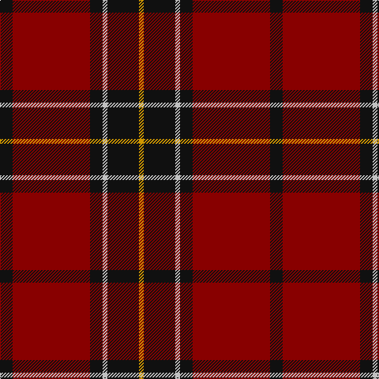

**Bands:** [KRKWKY](/stripes/krkwky/) · **Stripes:** [K R K LB K LO](/stripes/stripes6/) K R K LB K LO

This was sourced from tartans-authority.  It is a [6 band tartan](/bands/bands6/).

Original link http://www.tartansauthority.com/tartan-ferret/display/2011/

## Variants

Other setts woven to the same stripe pattern.

- [Black (symmetrical)](/setts/s6/k17r6k2lb6k17lo2~x2/)

## Thread count
K/16 DR98 K16 N6 K40 DY/6

## Palette
Each colour and its ΔE from the base-6 reference it is a variant of.

| Colour | Shade | Base | ΔE (OKLab) |
|---|---|---|---|
| DR | <code style="background-color:#880000;">#880000</code> `#880000` | R <code style="background-color:#CC0000;">#CC0000</code> | 0.15 |
| DY | <code style="background-color:#D09800;">#D09800</code> `#D09800` | Y <code style="background-color:#F2BF00;">#F2BF00</code> | 0.12 |
| K | <code style="background-color:#101010;">#101010</code> `#101010` | K <code style="background-color:#000000;">#000000</code> | 0.17 |
| N | <code style="background-color:#C0C0C0;">#C0C0C0</code> `#C0C0C0` | W <code style="background-color:#F7F7F7;">#F7F7F7</code> | 0.17 |

# Sample pattern

## Nearest tartans

The nearest existing variants by ΔTartan distance.

1. [Gallmore (Fashion)](/setts/s9/o3k14r3k14t3r32k2r6k2~x2/) — ΔT 0.87
1. [Hungerford RFC](/setts/s6/k50dt3ly3r50~x2/) — ΔT 0.98
1. [MacAulay](/setts/s6/k2r16dg6r3dg8lr1~x2/) — ΔT 1.13
1. [MacAulay](/setts/s6/k2r16dg6r3dg8lr1/) — ΔT 1.13
1. [Ramsay Red Clan Tartan Tartan Number: 1238. Earliest known date: 1842 Ramsay was one of the names adopted by members of the Clan MacGregor when their own was proscribed. It is not surprising then that an early MacGregor sett was used as a basis for the Ramsay tartan. It is possible that the tartan was in existance long before the earliest recorded date given. See products available Copyright © Blair Urquhart, Comrie, 2015](/setts/s6/r5m2r30k28w2k4~x2/) — ΔT 1.18
1. [MacGregor of Cardney](/setts/s6/m18g9m2g3k1w1~x4/) — ΔT 1.21
1. [Hungerford RFC (Corporate)](/setts/s4/k50dt3ly3r50~x2/) — ΔT 1.23
1. [Carrick (Strathmore) District Tartan Tartan Number: 3216. Earliest known date: c.1999 Sales help Princess Diana Memorial Trust See products available Copyright © Blair Urquhart, Comrie, 2015](/setts/s7/r28db12r3dg20t2dg2r7~x2/) — ΔT 1.23
1. [Fraser VS](/setts/s6/r1db6r1dg6r12lr1~x2/) — ΔT 1.23
1. [Menzies of Culdares](/setts/s7/k4r2k22r22k3r4lb2~x2/) — ΔT 1.29

## Neighbour map

Every grey dot is one of 14299 variants placed by the first two principal components of the ΔTartan feature space (44% of its variance). Red is this tartan; blue dots are its nearest — click one to open its page.

<svg viewBox="0 0 640 380" role="img" style="max-width:100%;height:auto;border:1px solid #e0e0e0;border-radius:4px;display:block" xmlns="http://www.w3.org/2000/svg"><image href="/nn/cloud.v1.png" width="640" height="380"/><a href="/setts/s9/o3k14r3k14t3r32k2r6k2~x2/"><circle cx="357.6" cy="168.3" r="4" fill="#3465a4"><title>Gallmore (Fashion)</title></circle></a><a href="/setts/s6/k50dt3ly3r50~x2/"><circle cx="328.8" cy="175.0" r="4" fill="#3465a4"><title>Hungerford RFC</title></circle></a><a href="/setts/s6/k2r16dg6r3dg8lr1~x2/"><circle cx="343.1" cy="197.6" r="4" fill="#3465a4"><title>MacAulay</title></circle></a><a href="/setts/s6/k2r16dg6r3dg8lr1/"><circle cx="343.1" cy="197.6" r="4" fill="#3465a4"><title>MacAulay</title></circle></a><a href="/setts/s6/r5m2r30k28w2k4~x2/"><circle cx="325.6" cy="168.7" r="4" fill="#3465a4"><title>Ramsay Red Clan Tartan Tartan Number: 1238. Earliest known date: 1842 Ramsay was one of the names adopted by members of the Clan MacGregor when their own was proscribed. It is not surprising then that an early MacGregor sett was used as a basis for the Ramsay tartan. It is possible that the tartan was in existance long before the earliest recorded date given. See products available Copyright © Blair Urquhart, Comrie, 2015</title></circle></a><a href="/setts/s6/m18g9m2g3k1w1~x4/"><circle cx="396.4" cy="173.1" r="4" fill="#3465a4"><title>MacGregor of Cardney</title></circle></a><a href="/setts/s4/k50dt3ly3r50~x2/"><circle cx="355.9" cy="221.0" r="4" fill="#3465a4"><title>Hungerford RFC (Corporate)</title></circle></a><a href="/setts/s7/r28db12r3dg20t2dg2r7~x2/"><circle cx="308.9" cy="185.2" r="4" fill="#3465a4"><title>Carrick (Strathmore) District Tartan Tartan Number: 3216. Earliest known date: c.1999 Sales help Princess Diana Memorial Trust See products available Copyright © Blair Urquhart, Comrie, 2015</title></circle></a><a href="/setts/s6/r1db6r1dg6r12lr1~x2/"><circle cx="298.9" cy="196.9" r="4" fill="#3465a4"><title>Fraser VS</title></circle></a><a href="/setts/s7/k4r2k22r22k3r4lb2~x2/"><circle cx="371.1" cy="218.2" r="4" fill="#3465a4"><title>Menzies of Culdares</title></circle></a><circle cx="371.7" cy="182.9" r="5" fill="#c00000"/></svg>

ID: /setts/s6/k8r49k8lb3k20lo3~x2/
