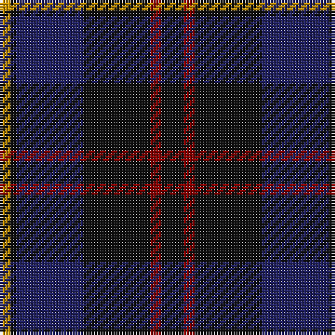

In pattern [KRKBKY](/patterns/krkbky/).

This was sourced from register-of-tartans.  It is a [6 stripes tartan](/stripes/stripes6/).

Original link https://www.tartanregister.gov.uk/tartanDetails.aspx?ref=3519

## Attestations

This cloth appears in 3 source records; the oldest owns this page.

- 01/01/1997 — Robert Gordon University (register-of-tartans, [record](https://www.tartanregister.gov.uk/tartanDetails.aspx?ref=3519))
- pre 1998 — Robert Gordon University (Corporate) (tartans-authority, [record](http://www.tartansauthority.com/tartan-ferret/display/2450/))
- undated — Robert Gordon University University Tartan Tartan Number: 2450. Earliest known date: pre 2002 Designed by Mike King of Philip King Kiltmakers in Aberdeen. See products available Copyright © Blair Urquhart, Comrie, 2015 (house-of-tartan, [record](http://www.house-of-tartan.scotland.net/house/TartanViewjs.asp?colr=Def&tnam=2450))

## Thread count
DY/4 K2 DB24 K24 DR4 K/8

## Palette
Each colour and its ΔE from the base-6 reference it is a variant of.

| Colour | Shade | Base | ΔE (OKLab) |
|---|---|---|---|
| DB | <code style="background-color:#202060;">#202060</code> `#202060` | B <code style="background-color:#2C4084;">#2C4084</code> | 0.11 |
| DR | <code style="background-color:#880000;">#880000</code> `#880000` | R <code style="background-color:#C80000;">#C80000</code> | 0.14 |
| DY | <code style="background-color:#D09800;">#D09800</code> `#D09800` | Y <code style="background-color:#E8C000;">#E8C000</code> | 0.11 |
| K | <code style="background-color:#101010;">#101010</code> `#101010` | K <code style="background-color:#000000;">#000000</code> | 0.17 |

# Sample pattern

ID: /setts/s6/k8r4k24b24k2y4-b202060-k101010-r880000-yd09800/
