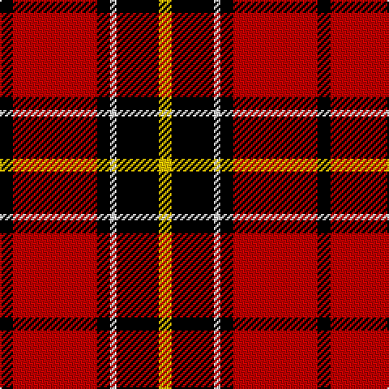

In pattern [KRKWKY](/patterns/krkwky/).

This was sourced from weddslist.  It is a [6 stripes tartan](/stripes/stripes6/).

Original link http://www.weddslist.com/cgi-bin/tartans/pg.pl?source=sts

## Thread count
K/8 R52 K8 LN4 K26 Y/8

## Palette
Each colour and its ΔE from the base-6 reference it is a variant of.

| Colour | Shade | Base | ΔE (OKLab) |
|---|---|---|---|
| K | <code style="background-color:#000000;">#000000</code> `#000000` | K <code style="background-color:#000000;">#000000</code> | 0.00 |
| LN | <code style="background-color:#E0E0E0;">#E0E0E0</code> `#E0E0E0` | W <code style="background-color:#F7F7F7;">#F7F7F7</code> | 0.07 |
| R | <code style="background-color:#C00000;">#C00000</code> `#C00000` | R <code style="background-color:#CC0000;">#CC0000</code> | 0.03 |
| Y | <code style="background-color:#F0C000;">#F0C000</code> `#F0C000` | Y <code style="background-color:#F2BF00;">#F2BF00</code> | 0.00 |

# Sample pattern

## Nearest tartans

The nearest existing variants by ΔTartan distance.

1. [MacPherson, Red Cluny](/setts/s7/r12k6r58k46w8k14y6-k000000-rc00000-we0e0e0-yf0c000/) — ΔT 0.67
1. [Dunbar #2](/setts/s6/k8r52k8w4k26y8-k101010-rdc0000-we0e0e0-ye8c000/) — ΔT 0.92
1. [MacPherson Red Cluny](/setts/s7/r12k6r58k46w8k14y6-k101010-rdc0000-we0e0e0-ye8c000/) — ΔT 0.95
1. [Ramsay Red Clan Tartan Tartan Number: 1238. Earliest known date: 1842 Ramsay was one of the names adopted by members of the Clan MacGregor when their own was proscribed. It is not surprising then that an early MacGregor sett was used as a basis for the Ramsay tartan. It is possible that the tartan was in existance long before the earliest recorded date given. See products available Copyright © Blair Urquhart, Comrie, 2015](/setts/s6/r10ra4r60k56w4k8-k101010-rc80000-raa00048-we0e0e0/) — ΔT 1.08
1. [Cetoloni (Personal)](/setts/s6/b4r48k24y4k24b4-b2c2c80-k101010-rc80000-ye8c000/) — ΔT 1.09
1. [Dean Brae](/setts/s8/k44r8k8g8k32ra72ga6ra12-g447438-ga789484-k000000-rb07430-rafc2020/) — ΔT 1.11
1. [MacIver](/setts/s9/w4r36k8r8k48r8k8r36y4-k000000-rc00000-we0e0e0-yf0c000/) — ΔT 1.16
1. [Skinner](/setts/s4/b4r64k64y4-b304080-k000000-rc00000-yf0c000/) — ΔT 1.21
1. [Totté (from Hofstade de Baerebeeck) (Personal)](/setts/s7/k102r42y8r24g16b8r10-b0000cd-g008b00-k101010-rff0000-yffe600/) — ΔT 1.23
1. [MacKintosh 6](/setts/s6/r10w4r56k24g32r6-g008000-k000000-rc00000-we0e0e0/) — ΔT 1.23

## Neighbour map

Every grey dot is one of 15726 variants placed by the first two principal components of the ΔTartan feature space (44% of its variance). Red is this tartan; blue dots are its nearest — click one to open its page.

<svg viewBox="0 0 640 380" role="img" style="max-width:100%;height:auto;border:1px solid #e0e0e0;border-radius:4px;display:block" xmlns="http://www.w3.org/2000/svg"><image href="/nn/cloud.v1.png" width="640" height="380"/><a href="/setts/s7/r12k6r58k46w8k14y6-k000000-rc00000-we0e0e0-yf0c000/"><circle cx="252.4" cy="179.7" r="4" fill="#3465a4"><title>MacPherson, Red Cluny</title></circle></a><a href="/setts/s6/k8r52k8w4k26y8-k101010-rdc0000-we0e0e0-ye8c000/"><circle cx="281.7" cy="168.7" r="4" fill="#3465a4"><title>Dunbar #2</title></circle></a><a href="/setts/s7/r12k6r58k46w8k14y6-k101010-rdc0000-we0e0e0-ye8c000/"><circle cx="261.4" cy="177.4" r="4" fill="#3465a4"><title>MacPherson Red Cluny</title></circle></a><a href="/setts/s6/r10ra4r60k56w4k8-k101010-rc80000-raa00048-we0e0e0/"><circle cx="325.3" cy="170.3" r="4" fill="#3465a4"><title>Ramsay Red Clan Tartan Tartan Number: 1238. Earliest known date: 1842 Ramsay was one of the names adopted by members of the Clan MacGregor when their own was proscribed. It is not surprising then that an early MacGregor sett was used as a basis for the Ramsay tartan. It is possible that the tartan was in existance long before the earliest recorded date given. See products available Copyright © Blair Urquhart, Comrie, 2015</title></circle></a><a href="/setts/s6/b4r48k24y4k24b4-b2c2c80-k101010-rc80000-ye8c000/"><circle cx="272.8" cy="188.6" r="4" fill="#3465a4"><title>Cetoloni (Personal)</title></circle></a><a href="/setts/s8/k44r8k8g8k32ra72ga6ra12-g447438-ga789484-k000000-rb07430-rafc2020/"><circle cx="223.9" cy="145.5" r="4" fill="#3465a4"><title>Dean Brae</title></circle></a><a href="/setts/s9/w4r36k8r8k48r8k8r36y4-k000000-rc00000-we0e0e0-yf0c000/"><circle cx="305.2" cy="164.3" r="4" fill="#3465a4"><title>MacIver</title></circle></a><a href="/setts/s4/b4r64k64y4-b304080-k000000-rc00000-yf0c000/"><circle cx="299.1" cy="194.7" r="4" fill="#3465a4"><title>Skinner</title></circle></a><a href="/setts/s7/k102r42y8r24g16b8r10-b0000cd-g008b00-k101010-rff0000-yffe600/"><circle cx="244.9" cy="143.6" r="4" fill="#3465a4"><title>Totté (from Hofstade de Baerebeeck) (Personal)</title></circle></a><a href="/setts/s6/r10w4r56k24g32r6-g008000-k000000-rc00000-we0e0e0/"><circle cx="284.2" cy="180.2" r="4" fill="#3465a4"><title>MacKintosh 6</title></circle></a><circle cx="272.2" cy="170.6" r="5" fill="#c00000"/></svg>

ID: /setts/s6/k8r52k8w4k26y8-k000000-rc00000-we0e0e0-yf0c000/
