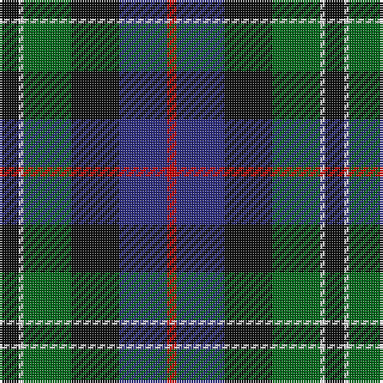

In pattern [KWGKBR](/patterns/kwgkbr/).

This was sourced from house-of-tartan.  It is a [6 stripes tartan](/stripes/stripes6/).

Original link http://www.house-of-tartan.scotland.net/house/TartanViewjs.asp?colr=Def&tnam=1226

## Thread count
K/8 LN2 G20 K20 DB20 R/4

## Palette
Each colour and its ΔE from the base-6 reference it is a variant of.

| Colour | Shade | Base | ΔE (OKLab) |
|---|---|---|---|
| DB | <code style="background-color:#2C2C80;">#2C2C80</code> `#2C2C80` | B <code style="background-color:#2C4084;">#2C4084</code> | 0.05 |
| G | <code style="background-color:#006818;">#006818</code> `#006818` | G <code style="background-color:#006400;">#006400</code> | 0.02 |
| K | <code style="background-color:#101010;">#101010</code> `#101010` | K <code style="background-color:#000000;">#000000</code> | 0.17 |
| LN | <code style="background-color:#E0E0E0;">#E0E0E0</code> `#E0E0E0` | W <code style="background-color:#F4F4F0;">#F4F4F0</code> | 0.06 |
| R | <code style="background-color:#C80000;">#C80000</code> `#C80000` | R <code style="background-color:#C80000;">#C80000</code> | 0.00 |

# Sample pattern

## Nearest tartans

The nearest existing variants by ΔTartan distance.

1. [Rose Hunting](/setts/s6/k16w4g40k40b40r8-b2c2c80-g006818-k101010-rc80000-wfcfcfc/) — ΔT 0.14
1. [Forsyth Clan Tartan Tartan Number: 1122. Earliest known date: 1872 (1830) This sett has a close resemblance to the the Leslie tartan in which white replaces yellow. A description of the tartan appears in Jennie Forsyth Jeffrie's 'History of the Forsyth Family' (1918). Clan Chief, Alistair Forsyth, was recognised by Lord Lyon in 1978 - the first for over 300 years. See products available Copyright © Blair Urquhart, Comrie, 2015](/setts/s6/k8g44y4k32b36r8-b2c2c80-g006818-k101010-rc80000-ye8c000/) — ΔT 0.60
1. [Russell Clan Tartan Tartan Number: 1094. Earliest known date: c.1815 It seems certain that the tartan was first known as Galbraith. William Wilson and Sons of Bannockburn recorded the pattern as Russell in their pattern book of 1847, although it was named Hunter in the earlier book of 1819. See products available Copyright © Blair Urquhart, Comrie, 2015](/setts/s6/k4g24k24r2b24w4-b2c2c80-g006818-k101010-rc80000-we0e0e0/) — ΔT 0.69
1. [Russell or Mitchell or Hunter or Galbraith](/setts/s6/k4g24k24r2b24w4-b2c4084-g005020-k101010-rdc0000-we0e0e0/) — ΔT 0.70
1. [New York Firemen's Pipe Band Corporate Tartan Tartan Number: 60. Earliest known date: 1964 Nothing See products available Copyright © Blair Urquhart, Comrie, 2015](/setts/s6/k14w3g42k36b40ba10-b2c2c80-ba5c8ca8-g006818-k101010-we0e0e0/) — ΔT 0.70
1. [Leslie Hunting Clan Tartan Tartan Number: 1113. Earliest known date: 1810-15 Said to have been worn by George 14th Earl of Rothes who died in 1841. This sett is shown by Smibert (1850) and by W & A Smith (1850) but without the definition of 'Hunting'. This sett is very similar to Duncan, the difference lies in the broad black present in the Leslie Hunting which is green in the Duncan See products available Copyright © Blair Urquhart, Comrie, 2015](/setts/s6/r4b16k16w2g16k2-b2c2c80-g006818-k101010-rc80000-we0e0e0/) — ΔT 0.71
1. [MacLeod of Assynt Clan Tartan Tartan Number: 1582. Earliest known date: 1906 In a portrait of the 24th chief, John Norman, painted posthumously (perhaps by Julius Jacobson, born 1811) in 1835, John Norman is shown in the costume worn for the visit of George IV to Edinburgh in 1822. The snuff-box may be evidence that the Vestiarium 'loud' design, which is very similar to that of the snuff box, had particular significance for John Norman or his wife, Ann Stephenson. (Ruairidh MacLeod, Tartans of Clan MacLeod, 1990.) See products available Copyright © Blair Urquhart, Comrie, 2015](/setts/s6/r6k4g30k20b40y4-b2c2c80-g006818-k101010-rc80000-ye8c000/) — ΔT 0.71
1. [New York Fire Department Pipe Band](/setts/s6/k16w4g52k44b44wa12-b2c2c80-g006818-k101010-wf8f8f8-waa8ace8/) — ΔT 0.72
1. [MacPhail Hunting #2](/setts/s6/r8b48k24g28k8w6-b2c2c80-g006818-k101010-rc80000-wc0c0c0/) — ΔT 0.73
1. [Leslie Hunting](/setts/s6/k4g32w4k32b32r4-b202060-g006818-k101010-rc80000-we0e0e0/) — ΔT 0.76

## Neighbour map

Every grey dot is one of 15726 variants placed by the first two principal components of the ΔTartan feature space (44% of its variance). Red is this tartan; blue dots are its nearest — click one to open its page.

<svg viewBox="0 0 640 380" role="img" style="max-width:100%;height:auto;border:1px solid #e0e0e0;border-radius:4px;display:block" xmlns="http://www.w3.org/2000/svg"><image href="/nn/cloud.v1.png" width="640" height="380"/><a href="/setts/s6/k16w4g40k40b40r8-b2c2c80-g006818-k101010-rc80000-wfcfcfc/"><circle cx="162.8" cy="220.1" r="4" fill="#3465a4"><title>Rose Hunting</title></circle></a><a href="/setts/s6/k8g44y4k32b36r8-b2c2c80-g006818-k101010-rc80000-ye8c000/"><circle cx="159.0" cy="209.7" r="4" fill="#3465a4"><title>Forsyth Clan Tartan Tartan Number: 1122. Earliest known date: 1872 (1830) This sett has a close resemblance to the the Leslie tartan in which white replaces yellow. A description of the tartan appears in Jennie Forsyth Jeffrie's 'History of the Forsyth Family' (1918). Clan Chief, Alistair Forsyth, was recognised by Lord Lyon in 1978 - the first for over 300 years. See products available Copyright © Blair Urquhart, Comrie, 2015</title></circle></a><a href="/setts/s6/k4g24k24r2b24w4-b2c2c80-g006818-k101010-rc80000-we0e0e0/"><circle cx="163.8" cy="201.0" r="4" fill="#3465a4"><title>Russell Clan Tartan Tartan Number: 1094. Earliest known date: c.1815 It seems certain that the tartan was first known as Galbraith. William Wilson and Sons of Bannockburn recorded the pattern as Russell in their pattern book of 1847, although it was named Hunter in the earlier book of 1819. See products available Copyright © Blair Urquhart, Comrie, 2015</title></circle></a><a href="/setts/s6/k4g24k24r2b24w4-b2c4084-g005020-k101010-rdc0000-we0e0e0/"><circle cx="176.0" cy="206.9" r="4" fill="#3465a4"><title>Russell or Mitchell or Hunter or Galbraith</title></circle></a><a href="/setts/s6/k14w3g42k36b40ba10-b2c2c80-ba5c8ca8-g006818-k101010-we0e0e0/"><circle cx="166.3" cy="211.6" r="4" fill="#3465a4"><title>New York Firemen's Pipe Band Corporate Tartan Tartan Number: 60. Earliest known date: 1964 Nothing See products available Copyright © Blair Urquhart, Comrie, 2015</title></circle></a><a href="/setts/s6/r4b16k16w2g16k2-b2c2c80-g006818-k101010-rc80000-we0e0e0/"><circle cx="135.1" cy="217.5" r="4" fill="#3465a4"><title>Leslie Hunting Clan Tartan Tartan Number: 1113. Earliest known date: 1810-15 Said to have been worn by George 14th Earl of Rothes who died in 1841. This sett is shown by Smibert (1850) and by W &amp; A Smith (1850) but without the definition of 'Hunting'. This sett is very similar to Duncan, the difference lies in the broad black present in the Leslie Hunting which is green in the Duncan See products available Copyright © Blair Urquhart, Comrie, 2015</title></circle></a><a href="/setts/s6/r6k4g30k20b40y4-b2c2c80-g006818-k101010-rc80000-ye8c000/"><circle cx="182.0" cy="204.6" r="4" fill="#3465a4"><title>MacLeod of Assynt Clan Tartan Tartan Number: 1582. Earliest known date: 1906 In a portrait of the 24th chief, John Norman, painted posthumously (perhaps by Julius Jacobson, born 1811) in 1835, John Norman is shown in the costume worn for the visit of George IV to Edinburgh in 1822. The snuff-box may be evidence that the Vestiarium 'loud' design, which is very similar to that of the snuff box, had particular significance for John Norman or his wife, Ann Stephenson. (Ruairidh MacLeod, Tartans of Clan MacLeod, 1990.) See products available Copyright © Blair Urquhart, Comrie, 2015</title></circle></a><a href="/setts/s6/k16w4g52k44b44wa12-b2c2c80-g006818-k101010-wf8f8f8-waa8ace8/"><circle cx="149.5" cy="206.3" r="4" fill="#3465a4"><title>New York Fire Department Pipe Band</title></circle></a><a href="/setts/s6/r8b48k24g28k8w6-b2c2c80-g006818-k101010-rc80000-wc0c0c0/"><circle cx="168.7" cy="217.5" r="4" fill="#3465a4"><title>MacPhail Hunting #2</title></circle></a><a href="/setts/s6/k4g32w4k32b32r4-b202060-g006818-k101010-rc80000-we0e0e0/"><circle cx="156.3" cy="217.7" r="4" fill="#3465a4"><title>Leslie Hunting</title></circle></a><circle cx="166.9" cy="221.9" r="5" fill="#c00000"/></svg>

ID: /setts/s6/k8w2g20k20b20r4-b2c2c80-g006818-k101010-rc80000-we0e0e0/
